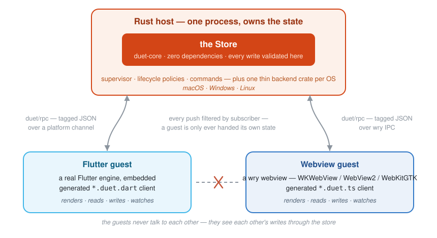
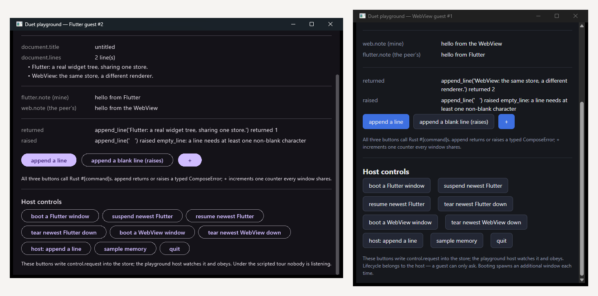

<p align="center">
  <picture>
    <source media="(prefers-color-scheme: dark)" srcset="assets/banner-dark.svg">
    
  </picture>
</p>

<p align="center">
  <a href="https://github.com/rkishan516/duet/actions/workflows/duet.yml"></a>
</p>

One Rust type definition. Typed clients in Rust, Dart and TypeScript, sharing
one store over one wire format.

A Duet host is a Rust process that owns the application state. A Flutter engine
and a `wry` webview are **guests**: they render, they read and write the store,
and they see each other's writes. Neither owns state; neither talks to the
other.

<p align="center">
  
</p>

Two real renderers, one store — the playground
(`cargo run -p duet-showcase --bin playground`), a Flutter window and a
WebKit/WebView2 window side by side, each showing its own note as `mine` and
the other guest's as `the peer's`, both live over the same document:

<p align="center">
  
</p>

```
#[derive(SharedState)]  ──▶  schema.json  ──▶  duet generate  ──▶  Dart client
    on a Rust struct         the contract       the CLI            TypeScript client
                                   │
                                   └──────────────────────────────▶ Rust client
```

The schema document in the middle is the contract, and it has two independent
producers — a human writing the JSON, and the derive macro. Neither can bless
the format on its own; `crates/duet-derive/tests/schema_proof.rs` holds the
derive to reproducing the hand-written specification byte for byte.

---

## 1. Define the state

```rust
use duet::SharedState;

#[derive(Debug, Clone, PartialEq, SharedState)]
struct App {
    counter: i64,
    editor: Editor,
    title: String,
}

#[derive(Debug, Clone, PartialEq, SharedState)]
struct Editor {
    zoom: f64,
    theme: String,
}
```

```toml
[dependencies]
duet = { version = "0.1", features = ["derive"] }
```

Types with no faithful spelling on the wire are refused **at compile time**,
with a message naming the fix: `u64` and `usize` (no representation in a signed
64-bit integer), `f32` (guests have no 32-bit float), `HashSet` (its iteration
order would make generated files unstable), `Option<Option<T>>` (both spellings
of "absent" collapse to one), `Rc`/`Mutex` (two handles become two copies),
`PathBuf` (WTF-8 against UTF-8), and time and UUID types (no canonical
spelling — pick one yourself). Use `duet::Bytes` for binary data.

## 2. Write the schema out

```rust
// src/bin/schema.rs — `cargo run --bin schema > schema/app.json`
fn main() -> Result<(), Box<dyn std::error::Error>> {
    print!("{}", duet::Schema::of::<myapp::App>()?.render());
    Ok(())
}
```

Commit `schema/app.json`. It is the contract, and it is what everything
downstream reads:

```json
{
  "commands": [],
  "root": {"kind": "named", "name": "App"},
  "types": [
    {
      "fields": [
        {"key": "counter", "type": {"kind": "int"}},
        {"key": "editor", "type": {"kind": "named", "name": "Editor"}},
        {"key": "title", "type": {"kind": "string"}}
      ],
      "name": "App"
    },
    {
      "fields": [
        {"key": "zoom", "type": {"kind": "float"}},
        {"key": "theme", "type": {"kind": "string"}}
      ],
      "name": "Editor"
    }
  ],
  "version": 2
}
```

`"commands"` is where `#[command]` functions are described; it is emitted even
when empty, so a version-2 document always carries the key.

## 3. Generate the guest clients

```console
$ cargo install duet-cli
$ duet generate --schema schema/app.json \
    --dart lib/src/app.duet.dart \
    --ts web/src/app.duet.ts
wrote lib/src/app.duet.dart
wrote web/src/app.duet.ts
```

Commit the output. Every path inside it is a string literal minted and validated
when the file was generated, so generated code never assembles a path from a
runtime value — and a generated file is greppable for the exact wire string.

## 4. Use it

**Rust**, in the host:

```rust
use duet::{Reading, Runtime, install};
use duet::runtime::NullSink;

let runtime = Runtime::spawn(duet::Value::Null, NullSink);
let store = install(runtime.handle(), &App {
    counter: 0,
    editor: Editor { zoom: 1.0, theme: "light".to_string() },
    title: "untitled".to_string(),
})?;

let zoom = store.field::<f64>("editor.zoom")?;
zoom.set(&1.5)?;
assert_eq!(zoom.get()?, Reading::Present(1.5));
```

**Dart**, in a Flutter guest:

```dart
import 'package:duet_flutter/duet_flutter.dart';
import 'package:duet/typed.dart';

import 'src/app.duet.dart';

final client = DuetClient(DuetFlutterTransport())..start();
final app = AppClient(DuetRouter(client)..attach());

await app.editor.zoom.set(1.5);
final reading = await app.editor.zoom.get();   // DuetReading<double>

await app.counter.watch((reading) {
  if (reading case DuetPresent<int>(:final value)) print('counter = $value');
});
```

**TypeScript**, in a webview guest:

```ts
import { DuetClient } from 'duet-protocol';
import { DuetRouter, type DuetReading } from 'duet-protocol/typed';

import { AppClient } from './app.duet.ts';

const router = new DuetRouter(new DuetClient(transport));
router.attach();
const app = new AppClient(router);

await app.editor.zoom.set(1.5);
const reading: DuetReading<number> = await app.editor.zoom.get();

await app.counter.watch((reading) => {
  if (reading.kind === 'present') console.log(`counter = ${reading.value}`);
});
```

A read is a four-way `DuetReading`, never an exception: `present`, `none` (an
explicit null), `absent` (no node at all), and `mismatch` — because another
guest can write any type to any path, so a typed watcher *will* meet a value it
cannot decode, and that is a runtime state rather than a bug.

Accessor names are camel-cased; **wire keys never are**. A Dart guest reading
`editor.fontSize` while a Rust host writes `editor.font_size` is two names for
one field with no error anywhere, each guest seeing only its own writes.

## 5. Keep it honest

Generated code goes stale silently: the guests keep compiling and testing
against a shape the host no longer has. `--check` makes that a build failure.

```console
$ duet generate --schema schema/app.json \
    --dart lib/src/app.duet.dart --ts web/src/app.duet.ts --check
duet: 1 generated file(s) are out of date

lib/src/app.duet.dart:
     60 |   @override
     61 |   DuetValue encode(App value) {
     62 |     return DuetMap(<String, DuetValue>{
-    63 |       'countr': duetIntCodec.encode(value.counter),
+    63 |       'counter': duetIntCodec.encode(value.counter),
  … and 2 more line(s) differ.

Regenerate with:
    duet generate --schema schema/app.json --dart lib/src/app.duet.dart --ts web/src/app.duet.ts
```

Exit codes: `0` written or up to date, `1` the run failed, `2` the command line
was wrong, `3` a file is stale. `3` is separate from `1` so a CI job can tell a
schema that no longer parses from a client that merely needs regenerating.

## 6. Iterate on it

```console
$ duet dev --flutter ./flutter -- cargo run -p my-host
```

Starts the host, watches `flutter/lib/`, and on every save recompiles just what
changed and applies it to the running Dart isolate:

```
[duet dev] reloaded in 43 ms (recompile 7 ms, reload 21 ms, reassemble 13 ms) — 4 librar(y/ies) reloaded, 544 kept
```

**Nothing is lost.** The Rust host is never restarted, so the store keeps its
contents; `reloadSources` patches the isolate in place, so the Dart heap keeps
its `State` objects. That is measured rather than asserted — `cargo run -p
duet-backend-macos --example hot_reload` writes a value into the store, edits a
real `.dart` file, reloads ten times, and checks the value is still there.

A Dart file that does not compile is reported with the compiler's own
diagnostics and the host keeps running. A change hot reload cannot express — a
class's shape, an enum's values — is reported as needing a restart, rather than
silently not taking effect.

The host must be a debug/JIT build: a release/AOT engine has no Dart VM service
to reload through. Everything after `--` is the host command, passed through
unsplit.

## What is in the box

| Crate | What it is |
|---|---|
| `duet` | The front door. Depend on this and nothing else. |
| `duet-core` | `Value`, `Path`, `Store`, lifecycle, policy. **Zero dependencies**, asserted in CI. |
| `duet-runtime` | The store on its own thread; `StoreHandle`, `Sink`. |
| `duet-schema` | `SharedState`, `Schema`, `Field`, `install`. |
| `duet-derive` | `#[derive(SharedState)]`. |
| `duet-codec` / `duet-protocol` | The tagged JSON wire format and the host conversation. |
| `duet-supervisor` / `duet-host` / `duet-webview` | Surface lifecycle, window backends, the `wry` guest. |
| `duet-backend-macos` / `-windows` / `-linux` | The three platform backends: a real Flutter engine and a real webview on each OS, written to be read side by side. |
| `duet-codegen` | Schema in, Dart and TypeScript out. |
| `duet-dev` | Hot reload: `frontend_server`, the Dart VM service, a file watcher. |
| `duet-cli` | The `duet` command: `generate` and `dev`. |

| Package | What it is |
|---|---|
| `duet` (pub.dev) | The pure-Dart client and typed runtime. No Flutter dependency. |
| `duet_flutter` (pub.dev) | `DuetTransport` over a `BasicMessageChannel`. |
| `duet-protocol` (npm) | The TypeScript client and typed runtime. **Zero runtime dependencies.** |

## Status

Phase 5 complete: one derive yields typed clients in three languages, proven
byte-identical against a hand-written specification and against a live host over
a real process boundary — and `duet dev` hot-reloads a running Flutter guest
without losing the store. **macOS, Windows and Linux** are the implemented
backends, each with the same seven examples observed passing on real hardware
— outputs pasted in `crates/duet-backend-*/FINDINGS.md`, per the project's
never-claim-an-unobserved-pass rule.

Hot reload, measured against a real engine: **median 43 ms** on macOS from
saving a `.dart` file to the change being visible in a rendered frame *and*
readable back out of the Rust store, over 30 reloads in three runs (57 ms
median on Windows, 60 ms on Linux under WSLg's software renderer). The store's
contents survive every one — that is asserted, not assumed, by each backend's
`hot_reload` example.

Not yet: the web half of `duet dev` (Vite HMR), `#[command]` RPC codegen,
collection handles, and the wider type surface (narrowing integers, tuples,
data enums).

## Building it

```console
$ cargo test --workspace --exclude duet-backend-macos --exclude duet-backend-windows --exclude duet-backend-linux --exclude duet-showcase
$ cargo test -p duet-backend-macos               # macOS, with a Flutter SDK
$ cargo test -p duet-backend-windows             # Windows, with a Flutter SDK
$ cargo test -p duet-backend-linux               # Linux, with a Flutter SDK + GTK headers
$ cd packages/duet      && dart test
$ cd packages/duet-js   && npm ci && npm test
```

The excludes exist for the platforms you are *not* on: each backend crate
links its OS's real Flutter engine and webview, so only the one matching the
current machine builds (the showcase links whichever backend matches, so it
moves with them). CI covers the platform-free workspace on ubuntu, the Windows
backend on `windows-latest`, and the Linux backend plus the showcase on a GTK-
equipped ubuntu job; the examples themselves run on real hardware, with their
outputs recorded in each `crates/duet-backend-*/FINDINGS.md`.

## Licence

MIT OR Apache-2.0.
