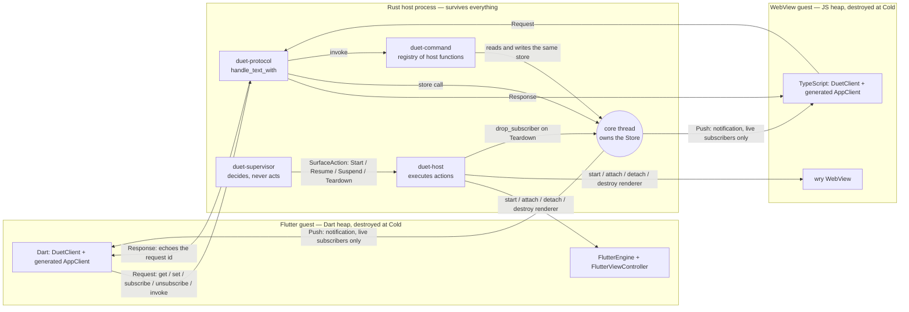
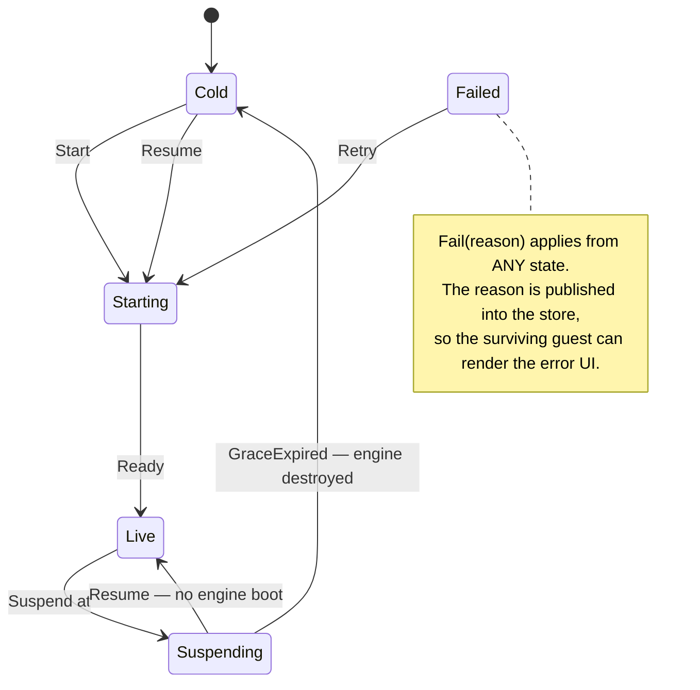
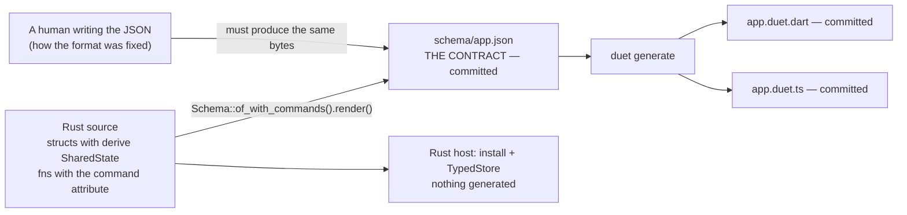
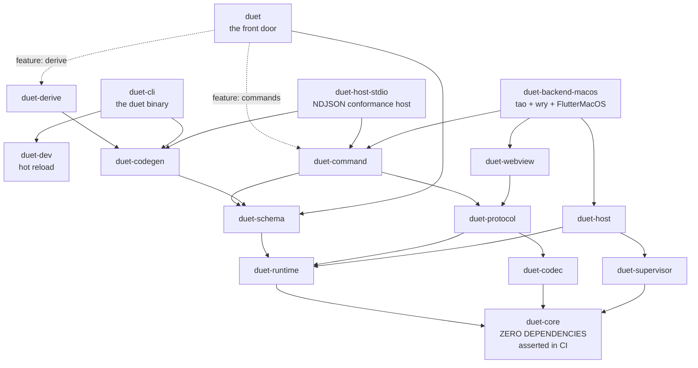

# 01 — What Duet is and why it exists

Duet is a framework for desktop applications whose UI is rendered partly by
Flutter and partly by web technology, in **separate top-level OS windows**,
where either renderer can be destroyed to reclaim its memory while the
application keeps running.

A Rust process is the **host**. It owns the windows and the application state.
A Flutter engine and a `wry` WebView are **guests**: they render, they read and
write the host's store, and they see each other's writes. Neither owns state,
and neither talks to the other.

---

## 1. The problem

Start from one requirement and almost everything else follows: **an idle
renderer must be able to release its memory.**

That was not an aesthetic goal. Spike A booted a real `FlutterEngine` on macOS
and measured the resident set at each stage
(`docs/superpowers/specs/2026-08-04-duet-design.md:214-236`,
restated on `crates/duet-supervisor/src/lib.rs:18-21`):

| Point | RSS |
|---|---|
| Process start | 14 MB |
| Engine booted, no view | 148 MB |
| View attached, rendering | 223 MB |
| View **detached**, engine alive | 223 MB |
| After `shutDownEngine` | 104 MB |

Two things fall out of that table.

**Detaching a view reclaims nothing.** The engine, its isolate and its caches
are the whole footprint. Only destroying the engine gives the memory back. So
"free the idle renderer" has to mean *destroy the renderer*, not *hide it* —
which is spelled out on the action that does it,
`crates/duet-supervisor/src/action.rs:44-47`.

**If a renderer can be destroyed, it cannot own state.** A Flutter widget's
`State` or a JavaScript closure holding the authoritative copy of a value would
lose that value the moment the engine went away. Since *either* renderer can go
away, *neither* can be the owner. State has to live in the host
(`crates/duet-core/src/lib.rs:5-12`).

Three goals, in the order the design ranks them
(`docs/superpowers/specs/2026-08-04-duet-design.md:16-20`):

1. **Resource reclamation** — an idle renderer releases its memory.
2. **Shared state** — both renderers observe and mutate one source of truth.
3. **Minimal API** — the framework should be explainable in a short document.

And three explicit non-goals: no compositing of Flutter and web content into a
single window surface, no mobile or web targets, and no direct
renderer-to-renderer channel.

---

## 2. The governing principle

> **State survives teardown. Events don't.**

It is stated at `crates/duet-core/src/lib.rs:16` and it is the rule that
decides the hard cases.

If a value must outlive a suspended renderer, it lives in the store — never in
a renderer's own memory. Events (notifications that something was written) are
delivered only to surfaces that are **currently live**. They are never queued
for a cold surface and never replayed later. A surface that comes back does not
receive a backlog; it asks the store what is there *now*.

`duet-core`'s own module doctest is the whole principle in one executable block
(`crates/duet-core/src/lib.rs:81-109`):

```rust
use duet_core::{Path, SubscriberId, Store, Value};

let mut store = Store::new(Value::map([("counter", Value::Int(0))]));
let surface = SubscriberId(1);
let path = Path::parse("counter").unwrap();
let (subscription, snapshot) = store.subscribe(surface, path.clone());
assert_eq!(snapshot, Some(Value::Int(0)));

// A write while the subscriber is live produces a notification.
let notes = store.set(&path, Value::Int(1)).unwrap();
assert_eq!(notes.len(), 1);
assert_eq!(notes[0].subscription, subscription);
assert_eq!(notes[0].patch.value, Value::Int(1));

// Teardown: the surface goes cold, dropping its subscriptions.
store.drop_subscriber(surface);

// A write while cold produces no notification for anyone -- events
// don't survive teardown.
let notes = store.set(&path, Value::Int(2)).unwrap();
assert!(notes.is_empty());

// But the write itself is durable: resubscribing after "resume" sees
// both writes made while the surface was gone, not just the last one.
let (_subscription, snapshot) = store.subscribe(surface, path);
assert_eq!(snapshot, Some(Value::Int(2)));
```

The consequence a user feels: **window geometry, position and visibility are
host state**, so a suspended window reappears at the right size and place with
no application-author effort. The consequence a user must design around: an
in-flight animation, a scroll offset and an unsubmitted form field are *not* in
the store, so they do not come back.

---

## 3. Host and guests



Three message kinds cross the boundary, and no others
(`crates/duet-protocol/src/lib.rs:8-12`):

| Kind | Direction | Correlated | Defined at |
|---|---|---|---|
| `Request` | guest → host | by `RequestId` | `crates/duet-protocol/src/message.rs:90` |
| `Response` | host → guest | echoes the id | `crates/duet-protocol/src/message.rs:162` |
| `Push` | host → guest | no | `crates/duet-protocol/src/message.rs:251` |

`Push` is a separate kind precisely because it answers nothing — it arrives
because something the guest subscribed to changed. That is the same
state/events split as the governing principle, expressed on the wire.

Five request kinds. Four of them address the store; the fifth runs host logic:

| Request | Answers |
|---|---|
| `Get` | `Value` |
| `Set` | `Done` |
| `Subscribe` | `Subscribed` (id + snapshot) |
| `Unsubscribe` | `Done` |
| `Invoke` | `Returned`, `Raised`, or `Failed` |

`Raised` and `Failed` are deliberately different kinds
(`crates/duet-protocol/src/lib.rs:29-31`): `Raised` carries the developer's own
typed error value, `Failed` means the host refused to run the command at all
(no such command, bad arguments, a body that panicked). Collapsing the first
into the second is not reversible, and the two say different things about
whether retrying is safe.

### The core thread

`duet_core::Store` is deliberately single-threaded plain data. `duet-runtime`
moves it onto a dedicated **core thread** and hands out cheap cloneable
`StoreHandle`s (`crates/duet-runtime/src/lib.rs:3-5`).

Why a thread and not a mutex (`crates/duet-runtime/src/lib.rs:9-13`): a write
returns its effects as data — a `Vec<Notification>` — which has to be delivered
somewhere. Under a mutex the writer would deliver either while holding the lock
(stalling every other writer) or after releasing it (allowing two writes'
notifications to be reordered relative to the writes themselves). One owning
thread makes write order and notification order the same order.

The main thread cannot do this work: `tao`'s event loop, Flutter's platform
thread and the WebView all require the OS main thread (Spike B), so the main
thread must never block on the store.

Because `Sink::deliver` runs synchronously *on* the core thread, a sink that
called back into a `StoreHandle` would deadlock on a reply only its own thread
can produce. A thread-local flag catches that and returns
`RuntimeError::ReentrantCall` instead of wedging
(`crates/duet-runtime/src/runtime.rs:16-20`).

### Why neither guest can disturb the other

Three separate mechanisms, all of them checkable:

**Subscription matching.** A subscriber at path `P` is notified about a write
at path `W` exactly when `P` and `W` overlap — when either is a prefix of the
other, compared **by path segment, not by string prefix**
(`crates/duet-core/src/path.rs:148`). Writing `editor.zoom` notifies
subscribers at `editor.zoom`, at `editor`, and at the root, but never a
subscriber at `editor.theme`.

**The host allocates identity.** `Request::Subscribe` deliberately carries no
`SubscriberId` — the host supplies it, so one guest cannot subscribe *as*
another. `Request::Invoke` carries no caller identity for the same reason
(`crates/duet-protocol/src/lib.rs:40-44`).

**Unsubscribe is scoped to its owner.** This one was a real, reproduced
vulnerability, not a hypothetical: `SubscriptionId`s are small sequential
integers allocated from zero, so a guest that could unsubscribe by id needed no
information at all, only a loop
(`crates/duet-backend-macos/examples/two_guests.rs:55-63`). The regression test
is a live one — the WebView guest fires raw `unsubscribe` requests across a
whole range of ids and the Dart guest must still receive its next push.

There is no guest-to-guest channel at all, and the reason is not purity: **the
peer may be `Cold`**, in which case a direct channel would have no endpoint.
Routing through the host means "write state" behaves identically whether the
peer is live, suspended, or has never started.

---

## 4. When a renderer is freed

The lifecycle is a pure function with no clock and no I/O
(`crates/duet-core/src/lifecycle.rs:144-155`):



| State | Meaning |
|---|---|
| `Cold` | No engine, no WebView, no renderer. The store retains everything. |
| `Starting` | Engine booting or WebView creating. |
| `Live` | Attached, rendering, receiving events. |
| `Suspending { since }` | Grace period. View detached, renderer still alive. |
| `Failed(reason)` | Creation failed or the guest crashed. The host stays alive. |

`Suspending` is a **latency state, not a memory state** — that is the correction
Spike A forced onto the original design
(`docs/superpowers/specs/2026-08-04-duet-design.md:214`). It exists so that
closing and immediately reopening a window does not pay a full engine boot
(measured at roughly 180 ms, debug build, warm cache). Every second of grace is
a second of full memory retention, so the grace period is a tuning knob, not a
saving.

Policy is likewise a pure function of `(state, windows, last interaction, now)`
with the clock passed in by the caller (`crates/duet-core/src/policy.rs:7-30`):

| Policy | Suspends when |
|---|---|
| `OnLastWindowClosed { grace_ms }` | every window for the surface is closed |
| `OnHidden { grace_ms }` | every window is hidden, even if still open |
| `IdleTimeout { after_ms }` | no interaction for that long |
| `Never` | never automatically |

The default is `OnLastWindowClosed { grace_ms: 5_000 }`
(`crates/duet-core/src/policy.rs:36-38`).

`duet-supervisor` drives those pure functions against real surfaces and returns
`SurfaceAction`s **as data** (`crates/duet-supervisor/src/action.rs:12`). It
never acts. Starting a renderer needs a window server; deciding that one
*should* start does not — and keeping the two apart is exactly what lets the
orchestration be tested on a machine with no display.

`duet-host` is the half that acts. It executes the actions against a
`WindowBackend` (`crates/duet-host/src/backend.rs:64`) and discharges the one
obligation the supervisor cannot: on `Teardown` it must also **drop the
surface's store subscriptions**, because the supervisor holds no store handle
and nothing else links a `SurfaceId` to a `SubscriberId`
(`crates/duet-host/src/lib.rs:9-15`). A missed drop leaves the store computing
and delivering notifications for a renderer that no longer exists.

---

## 5. What a developer writes, and what is generated



The schema document in the middle is the contract, and it has **two independent
producers**: a human who wrote `schema/app.json` by hand, and the derive macro.
`crates/duet-derive/tests/schema_proof.rs` holds the derive to reproducing the
hand-written specification byte for byte.

That ordering was deliberate, and it is the most easily-lost design decision in
the project (`crates/duet-codegen/src/lib.rs:12-14`): **the emitters came before
the derive.** Had the derive come first, the format would have been whatever the
macro happened to emit, the emitters would have been tested against that, and
nothing would independently check either side. The independence is built rather
than promised — `duet-schema`'s renderer is a hand-rolled writer with **no
`serde_json` dependency**, while `duet-codegen`'s reader is a `serde_json` one,
so `render → read → compare` is a cross-check between two implementations that
share no code.

### What you write

**1. The state, as Rust types.**

```rust
use duet::SharedState;

#[derive(Debug, Clone, PartialEq, SharedState)]
struct App {
    counter: i64,
    editor: Editor,
    title: String,
}

#[derive(Debug, Clone, PartialEq, SharedState)]
struct Editor {
    zoom: f64,
    theme: String,
}
```

Types with no faithful spelling on the wire are refused **at compile time**, and
the refusal mechanism matters: `duet-schema` simply implements `SharedState` for
none of them, so `<u64 as SharedState>::schema` does not resolve and the
compiler says so, with a `#[diagnostic::on_unimplemented]` note naming the fix
(`crates/duet-schema/src/lib.rs:35-46`, `crates/duet-derive/src/lib.rs:40-53`).

The alternative — having the derive inspect the field's tokens — is defeated by
`type Blob = Vec<u8>;`, silently, and in the direction of *accepting* what
should have been refused. A derive sees syntax and never resolved types; trait
resolution happens after type resolution and cannot be fooled that way.

| Refused | Because |
|---|---|
| `u64` `u128` `i128` `usize` `isize` | `Value::Int` is an `i64`; `u64 > i64::MAX` has no representation, and `usize`/`isize` are platform-width |
| `f32` | lossless out, lossy in; Dart and TypeScript have no 32-bit float |
| `HashSet<T>` | iteration order is not a function of the value, so the output would not be byte-stable |
| `HashMap<K, V>` where `K != String` | `Value::Map` is keyed by `String`; a list of pairs would destroy path addressing |
| `&str`, `&[T]`, any borrow | the store owns a `'static` tree |
| `Rc` `RefCell` `Cell` `Mutex` `RwLock` | two handles to one node become two independent copies once they are values in the tree |
| `PathBuf` `OsString` | `OsString` is WTF-8 on Windows; `Value::Str` is UTF-8 only |
| `Duration` `SystemTime` `Instant` | no canonical wire spelling — choosing one silently is worse than making the developer choose |
| `Option<Option<T>>` | `Some(None)` and `None` both lower to `Null`; the collapse is unrepresentable |

**2. Host commands, if the guest needs logic it cannot perform itself.** Real
code from `crates/duet-derive/tests/commands.rs:39-94`:

```rust
#[command]
fn subtract(a: i64, b: i64) -> i64 {
    a.saturating_sub(b)
}

#[command]
fn raise() -> Result<(), Refusal> {
    Err(Refusal { code: "unlucky".to_string(), short_by: 42 })
}

#[command]
fn bump(ctx: &CommandContext, by: i64) -> Result<i64, Refusal> {
    // ... reads and writes the same store the guests read
}

#[command(rename = "documents.reset")]
fn reset(ctx: &CommandContext) { /* ... */ }

static COMMANDS: [CommandEntry; 6] = commands![subtract, raise, width, bump, reset, label];
```

What a guest may reach is exactly what is in that table. Authorization is by
construction — the surface is built with a registry — not by a claim the guest
makes (`crates/duet/src/lib.rs:64-68`).

**3. A four-line binary that writes the schema out.**

```rust
// src/bin/schema.rs — `cargo run --bin schema > schema/app.json`
fn main() -> Result<(), Box<dyn std::error::Error>> {
    print!("{}", duet::Schema::of::<myapp::App>()?.render());
    Ok(())
}
```

`Schema::of_with_commands` (`crates/duet-schema/src/schema.rs:69`) is the
variant that also describes the command table.

**4. The host program.** Real, and CI-executed as a doctest
(`crates/duet-schema/src/typed/store.rs:97-108`):

```rust
use duet_core::{Path, Value};
use duet_runtime::{NullSink, Runtime};
use duet_schema::{Reading, install};

let runtime = Runtime::spawn(Value::Null, NullSink);
let store = install(runtime.handle(), &7i64).expect("a bare i64 is a legal root");

let root = store.field::<i64>("").expect("the empty path is the root");
assert_eq!(root.get().unwrap(), Reading::Present(7));
runtime.shutdown().unwrap();
```

**5. The guest UI**, in Dart and/or TypeScript, calling the generated accessors.

### What is generated, and committed

`schema/app.json`, `lib/src/app.duet.dart` and `web/src/app.duet.ts`. All three
are checked in. Three properties hold of the emitted code
(`crates/duet-codegen/src/lib.rs:25-44`):

**Every path is a compile-time string literal**, minted once and validated
against the real path parser at generation time. Generated code never assembles
a path from a runtime value, and a generated file is greppable for the exact
wire string.

**A wire key is never rewritten; an accessor name always is.** `snake_case`
becomes `lowerCamelCase` in both target languages, and the path keeps the
schema's own spelling. Camel-casing a path would give a Dart guest
`editor.fontSize` while a Rust host writes `editor.font_size` — two names for
one field, no error anywhere, each guest reading only its own writes. That is
the worst class of bug this system could ship, so it is refused structurally.

**There are no algorithms in the output.** Decoding, merging, push routing and
the absent/null/mismatch distinction all live in the hand-written runtime the
generated code delegates to, so a reviewer can check a whole generated diff by
reading it.

A read is a four-way outcome, never an exception: `present`, `none` (an explicit
null), `absent` (no node at all), and `mismatch`. `mismatch` exists because
another guest can write any type to any path, so a typed watcher *will*
eventually meet a value it cannot decode — that is a runtime state, not a bug.

### Keeping it honest

Generated code goes stale silently: the guests keep compiling and testing
against a shape the host no longer has. `duet generate --check` makes that a
build failure, printing the differing line and the exact command that fixes it.
Exit codes are separated so CI can tell the two failure modes apart
(`crates/duet-cli/src/lib.rs:29-32`):

| Code | Meaning |
|---|---|
| 0 | written, or already up to date |
| 1 | the run failed |
| 2 | the command line was wrong |
| 3 | a generated file is stale |

---

## 6. The crates and packages

An arrow means **depends on**. The graph is *transitively reduced* — an edge not
drawn is still reachable along a path that is. Third-party dependencies
(`serde_json`, `syn`, `tao`, `wry`, `objc2`) are omitted.



`crates/duet-core/Cargo.toml` has an empty `[dependencies]` section, and CI
proves it stays that way rather than trusting it: `cargo tree -p duet-core
--all-features --edges all --locked` must print exactly one line, and
`--edges all` widens the check to dev- and build-dependencies so a test helper
cannot smuggle one in either (`.github/workflows/duet.yml:58-71`). The point is
not minimalism for its own sake — it is that a third party can embed the store
without inheriting Duet's dependency tree, and that is the kind of property
which erodes by accident.

### Crates

| Crate | Its job |
|---|---|
| `duet` | The front door. Re-exports core, runtime and schema; the derive and the command registry sit behind Cargo features. Depend on this and nothing else. |
| `duet-core` | `Value`, `Path`, `Store`, the lifecycle state machine, the teardown policy evaluator. Pure data and pure functions. Zero dependencies. |
| `duet-runtime` | Puts the `Store` on a dedicated core thread; hands out `StoreHandle`s; defines the `Sink` notifications leave through; guards against re-entrant calls. |
| `duet-codec` | The tagged-JSON encoding of a `Value`. Decodes untrusted input, totally — malformed bytes produce an error, never a panic. |
| `duet-protocol` | The message envelope (`Request`/`Response`/`Push`), `dispatch`, and the text entry points `handle_text` / `handle_text_with` / `push_text`. |
| `duet-command` | `Commands`, the registry of host functions a guest may invoke, built from closures or from a `#[command]` entry table. |
| `duet-schema` | The `SharedState` trait, the schema model, `install`, and the typed Rust handles (`TypedStore`, `Field`, `OptionalField`). |
| `duet-derive` | `#[derive(SharedState)]` and `#[command]`. Refuses by omitting an impl, never by inspecting tokens. |
| `duet-codegen` | Reads a schema document; emits the Dart and TypeScript clients. |
| `duet-cli` | The `duet` binary: `generate`, `generate --check`, `dev`. Deliberately thin — every transformation is a call into `duet-codegen` or `duet-dev`. |
| `duet-dev` | The hot-reload driver: a managed `frontend_server`, the Dart VM service, and a debounced file watcher. No `flutter_tools` process involved. |
| `duet-supervisor` | Decides when a surface starts, suspends or is torn down. Returns `SurfaceAction`s as data; never performs them. |
| `duet-host` | Executes those actions against a `WindowBackend`, and drops a torn-down surface's store subscriptions. |
| `duet-webview` | The transport-agnostic webview-guest half: the HTML/JS bootstrap and the JavaScript strings that carry a reply or a push into a `wry` `WebView`. |
| `duet-backend-macos` | The one implemented platform backend: `tao` windows, a real `FlutterEngine`, a real `wry` `WebView`, and a `Sink` over `tao`'s `EventLoopProxy`. The only crate in the workspace that is not `#![forbid(unsafe_code)]`. |
| `duet-host-stdio` | A host that speaks the protocol as NDJSON over stdin/stdout, so a Dart or JavaScript guest can be driven against the **real** host across a real process boundary on any CI machine. |

### Guest packages

| Package | Published as | Its job |
|---|---|---|
| `packages/duet` | `duet` (pub.dev) | The pure-Dart client: value codec, message codec, `DuetClient`, and the typed runtime the generated code delegates to. **No Flutter dependency.** |
| `packages/duet_flutter` | `duet_flutter` (pub.dev) | `DuetFlutterTransport` over a `BasicMessageChannel<String>` on `duet/rpc` (`packages/duet_flutter/lib/src/flutter_transport.dart:31`). A `BasicMessageChannel`, not a `MethodChannel`, because the protocol's own `kind` discriminator is already inside the text — there is no method name to carry. |
| `packages/duet-js` | `duet-protocol` (npm) | The TypeScript client and typed runtime. **Zero runtime dependencies.** |

Both guest runtimes are hand-written once and shared by every generated client.
That is why the emitted files contain no algorithms.

---

## 7. What is proven, and how

Duet's claims are backed by executable checks rather than prose. The counts
below were re-run while writing this document.

| Suite | Command | Result |
|---|---|---|
| Rust workspace | `cargo test --workspace --exclude duet-backend-macos` | 1481 passed |
| Pure Dart client | `cd packages/duet && dart test` | 469 passed |
| TypeScript client | `cd packages/duet-js && npm test` | 518 passed |
| Flutter binding | `cd packages/duet_flutter && flutter test` | 11 passed |
| Dart guest fixture | `cd fixtures/duet_guest && flutter test` | 5 passed |

Two shared corpora keep the three languages honest about the same bytes:
`corpus/wire-corpus.json` holds **63 accept cases and 37 reject cases**, and
`corpus/schema-corpus.json` restates every path in the committed schema. Rust,
Dart **and** TypeScript all consume them, so "the three clients agree" is a test
result rather than an intention.

A few wire rules exist because a disagreement between two guests is the worst
bug this format could ship:

| Rule | Reason |
|---|---|
| Every value is `{"t":"<tag>","v":…}`, tags `n` `bool` `i` `f` `s` `b` `l` `m` (`n` carries no `v`) | plain JSON would collapse `Bytes` into `Str`, and `Int(1)` into `Float(1.0)`; `NaN` has no JSON form at all (`crates/duet-codec/src/lib.rs:7-13`) |
| `Int` travels as a **decimal string**, not a JSON number | JavaScript numbers are IEEE-754 doubles; an `i64` above 2^53 would lose precision in the WebView while surviving intact in Dart (`crates/duet-codec/src/lib.rs:15-18`) |
| Ids are canonical decimal strings — no leading `+`, no leading zeros — in the domain `0..=i64::MAX` | non-canonical spellings would let `"007"` and `"7"` be two ids for one request (`crates/duet-protocol/src/wire.rs:31-38`) |
| `MAX_JSON_DEPTH = 127` containers, enforced in all three languages | 127 is what `serde_json`, the host's own parser, accepts (`crates/duet-codec/src/depth.rs:41`) |
| `MAX_VALUE_DEPTH = 61` | `crates/duet-core/src/value.rs:119` |

On real macOS hardware, seven example programs under
`crates/duet-backend-macos/examples/` drive the framework against a real engine
and a real WebView: `lifecycle` (the RSS proof), `webview_state` and
`flutter_state` (shared state per transport), `webview_commands` and
`flutter_commands` (command RPC per transport), `two_guests` (isolation), and
`hot_reload`. Two recorded results worth citing:

- **Two live guests, one store, 12/12 assertions PASS**, reproduced across two
  independent runs (`crates/duet-backend-macos/FINDINGS.md:872`, `:1008`). The
  assertions were verified by mutation, so they are known to be able to fail.
- **Hot reload: median 43 ms** from `fs::write` to the change being in a
  rendered frame *and* readable back out of the Rust store — 30 reloads across
  three runs — with the store's contents surviving every one, and 544 libraries
  kept (`README.md:217`, `:264-268`). The Rust host is never restarted, so the
  store keeps its contents; `reloadSources` patches the isolate in place, so the
  Dart heap keeps its `State` objects.

This project's documents are consistently careful about the difference between a
measured pass and an assumed one — `crates/duet-backend-macos/FINDINGS.md`
records "cannot verify here" verdicts alongside the passes, because the build
machine has no reachable on-screen WindowServer for spawned processes. Nothing
that requires a human looking at a display has been verified.

---

## 8. What is not there yet

- **Windows and Linux backends.** `WindowBackend` is the seam
  (`crates/duet-host/src/backend.rs:64`); macOS is the only implementation.
- **The web half of `duet dev`.** The Dart side hot-reloads; a Vite dev server
  for web HMR is not wired in (`crates/duet-dev/src/lib.rs:51-54`).
- **Collection handles**, and the wider type surface. The schema's type
  vocabulary is `bool`, `int`, `float`, `string`, `bytes`, `dynamic`,
  `optional`, `list`, `map`, `named` (`crates/duet-schema/src/ty.rs:18-51`) —
  no tuples, no unit enums, no data enums.
- **Buffering across the `Starting` gap.** `Store::subscribe` makes it the
  caller's obligation to buffer notifications arriving between a subscriber's
  snapshot and its surface becoming ready; `duet-runtime` does not yet do it,
  and the crate documents where it will live when it lands
  (`crates/duet-runtime/src/lib.rs:30-36`).
- **Release/AOT Flutter.** Every engine measurement in this project is from a
  debug/JIT build. `duet dev` requires one — a release/AOT engine has no Dart VM
  service to reload through.

`README.md`'s "Not yet" list additionally names `#[command]` RPC codegen; that
line is stale. The README's last commit predates `4c3cbf2 feat(codegen): emit
typed command clients from the schema`, and the generated command clients are
committed (`examples/generated/app.duet.dart:242`,
`examples/generated/app.duet.ts:225`).

The older design specification,
`docs/superpowers/specs/2026-08-04-duet-design.md`, is **history rather than
truth**. It was written before the spikes and amended several times afterwards.
Where it disagrees with the code, the code is right — notably: the webview is
`wry` directly, not Tauri v2 IPC; there is no `tokio` task pool (a command
handler runs synchronously on the thread that dispatched it and must not block,
`crates/duet-command/src/lib.rs:38-44`); the crate layout it sketches in §3.2
was superseded; and `Suspending` reclaims no memory, which §5.1's own inline
Spike A note already corrects.

---

## Where to go next

| Document | What it covers |
|---|---|
| `02-architecture.md` | The host process in detail: the three threads, the crate seams, and who is allowed to call whom. |
| `03-state.md` | `Value`, `Path`, the `Store`, the overlap rule, minimal patches, and the typed Rust handles. |
| `04-lifecycle.md` | Surfaces, the state machine, policy evaluation, the supervisor/host split, and what survives `Cold`. |
| `05-wire-protocol.md` | The tagged-JSON codec, the message envelope, the canonical-form rules, depth limits, and the shared corpora. |
| `06-codegen-and-commands.md` | Part A: the schema document, `#[derive(SharedState)]`, the Dart and TypeScript emitters, and `duet generate --check`. Part B: `#[command]`, the registry, `Returned` vs `Raised` vs `Failed`, and the threading contract for a handler. |
| `07-hot-reload.md` | `duet dev`: `frontend_server`, the VM service, `reloadSources` and `reassemble`, and why `force: true` is never used. |
| `08-testing.md` | The suites, the corpora, the live-host conformance runs, the macOS examples, and what this environment cannot verify. |
