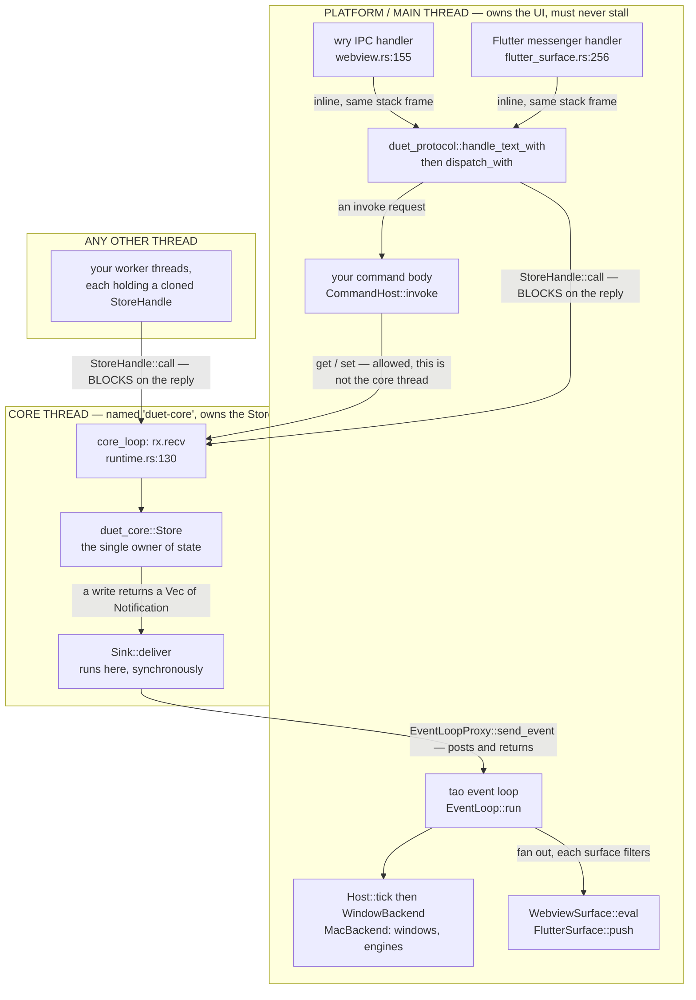
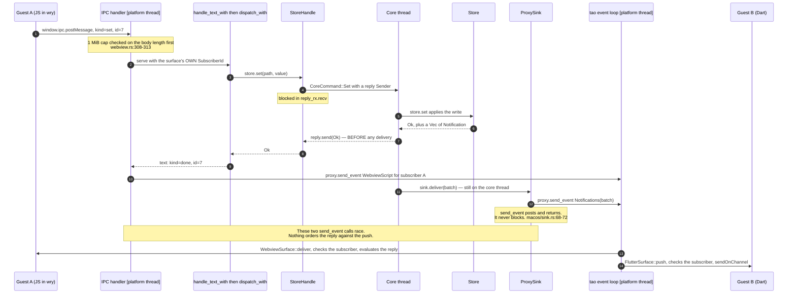
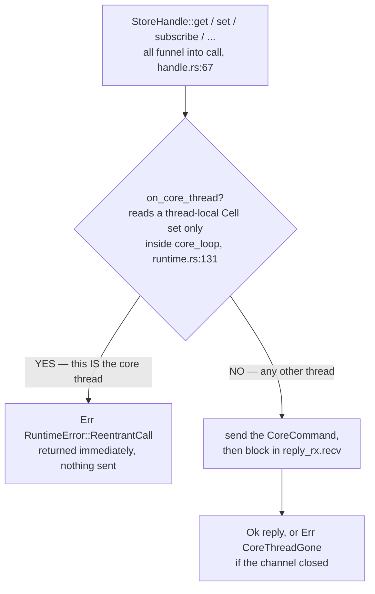
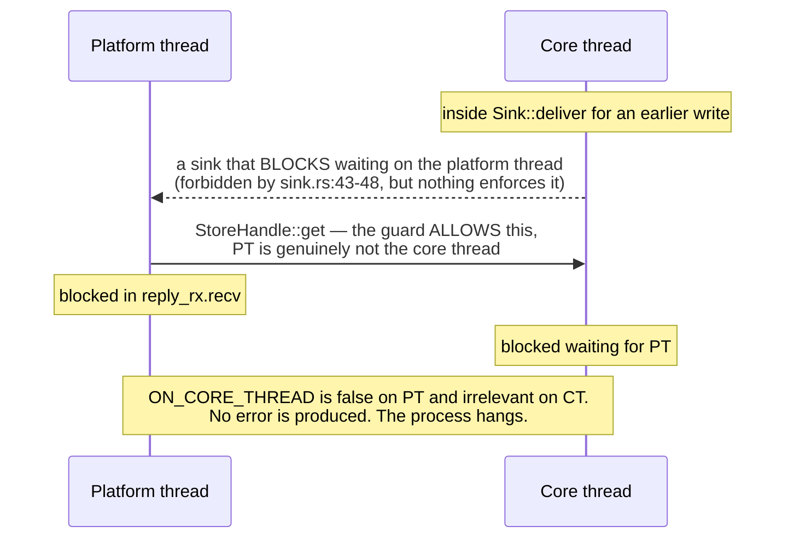
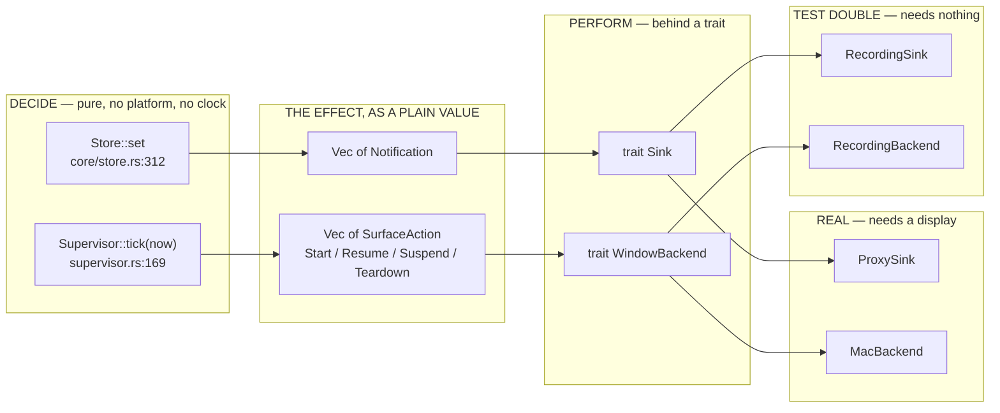

# How the pieces fit

A Rust host owns one store. A Flutter engine and a `wry` webview attach to it as
*guests*, and either can be torn down and rebuilt without the other noticing and
without the store losing anything. This document explains the machinery that
makes that true: which code runs on which thread, the two trait seams that keep
the platform out of the decision-making, and why almost all of it can be tested
on a machine with no display attached.

The governing sentence is **state survives teardown, events don't**. Everything
below is, in one way or another, a consequence of it.

---

## 1. Layers, and which way the arrows point

Duet is a stack of crates with a strict dependency direction. Nothing below the
last row knows what a window is.

| Crate | Depends on | Owns |
|---|---|---|
| `duet-core` | *nothing* (empty `[dependencies]`) | `Value`, `Path`, `Store`, lifecycle states, teardown policy |
| `duet-runtime` | `duet-core` | The core thread, `StoreHandle`, the `Sink` trait |
| `duet-supervisor` | `duet-core` | `Supervisor`, `SurfaceAction`, `HostEvent` |
| `duet-host` | `duet-core`, `duet-runtime`, `duet-supervisor` | `Host`, the `WindowBackend` trait |
| `duet-protocol` | `duet-core`, `duet-codec`, `duet-runtime` | `handle_text`, `dispatch`, `CommandHost` |
| `duet-command` | `duet-core`, `duet-protocol`, `duet-runtime`, `duet-schema` | The `Commands` registry |
| `duet-backend-macos` | all of the above, plus `tao`, `wry`, `objc2`, `block2` | The real platform |

Two of these are worth pausing on.

`duet-supervisor` depends on `duet-core` and **nothing else** — not on
`duet-runtime`, so it has no `StoreHandle` and cannot touch the store at all.
That is not an accident of layering; it is why `SurfaceAction::Teardown` has to
document dropping the surface's subscriptions as an obligation the *host* must
discharge (`crates/duet-supervisor/src/action.rs:51-57`). The supervisor decides
and never acts, stated in its own words at `action.rs:6-9`:

> The supervisor decides; it never acts. Starting a renderer needs a window
> server, but deciding that one *should* start does not — keeping the two apart
> is what lets this crate be tested on any machine.

`duet-host` sits one layer up and is the only crate that knows both halves. It
owns the `SurfaceId → SubscriberId` map, "which exists nowhere else: the
supervisor has no store handle and the store knows nothing of surfaces"
(`crates/duet-host/src/host.rs:17-19`, field at `host.rs:24`).

---

## 2. The threading model

### 2.1 The core thread

`duet_core::Store` is plain single-threaded data. `duet-runtime` moves it onto a
dedicated thread — literally named `duet-core` — and hands out cheap handles:

```rust
// crates/duet-runtime/src/runtime.rs:54-65
pub fn spawn<S: Sink>(root: Value, sink: S) -> Runtime {
    let (tx, rx) = mpsc::channel();
    let join = thread::Builder::new()
        .name("duet-core".to_string())
        .spawn(move || core_loop(Store::new(root), rx, sink))
        .expect("spawning the core thread should not fail");
    Runtime { tx, join, next_subscriber: Arc::new(AtomicU64::new(0)) }
}
```

The whole life of that thread is one loop over an `mpsc::Receiver<CoreCommand>`
(`runtime.rs:130-187`). Six command kinds: `Get`, `Set`, `Subscribe`,
`Unsubscribe`, `DropSubscriber`, `Shutdown`. Each carries a reply `Sender`.

**Why a thread and not a mutex.** The crate root answers this directly
(`crates/duet-runtime/src/lib.rs:7-13`): a write returns its effects as data —
`Store::set` returns `Result<Vec<Notification>, SetError>`
(`crates/duet-core/src/store.rs:312`) — and those notifications have to be
delivered somewhere. Under a mutex, the writer would deliver either while
holding the lock (stalling every other writer) or after releasing it (letting
two writes' notifications reorder relative to the writes themselves). One owning
thread makes write order and notification order the same order, for free.

One detail in `core_loop` is load-bearing enough that the source argues with a
lint about it. The receiver is owned by the function, not borrowed
(`runtime.rs:132-140`):

> `rx` is owned by this function, not borrowed, and that ownership is the
> anti-hang invariant of the whole crate: returning from this loop (on
> `Shutdown`, or on panic-driven unwind) drops `rx`, which drops every queued
> `CoreCommand`, which drops their reply `Sender`s, which wakes every blocked
> `StoreHandle::call` with a closed-channel error mapped to
> `RuntimeError::CoreThreadGone` — instead of leaving them waiting forever.

So a panicking sink kills the core thread, and the *next* caller gets
`Err(CoreThreadGone)` rather than a hang. That is asserted, not assumed:
`a_panicking_sink_does_not_hang_the_next_caller` (`runtime.rs:576-612`).

### 2.2 `StoreHandle` blocks, on purpose

Every `StoreHandle` method blocks the calling thread until the core thread
replies. There is exactly one place that round trip is implemented:

```rust
// crates/duet-runtime/src/handle.rs:67-76
fn call<T>(&self, make: impl FnOnce(Sender<T>) -> CoreCommand) -> Result<T, RuntimeError> {
    if crate::runtime::on_core_thread() {
        return Err(RuntimeError::ReentrantCall);
    }
    let (reply_tx, reply_rx) = mpsc::channel();
    self.tx
        .send(make(reply_tx))
        .map_err(|_| RuntimeError::CoreThreadGone)?;
    reply_rx.recv().map_err(|_| RuntimeError::CoreThreadGone)
}
```

Blocking is a deliberate API choice, stated at `handle.rs:16-19`: the operations
are microseconds of in-process work, and a blocking API "avoids forcing an async
executor choice on callers". There is no tokio anywhere in this workspace.

`get` returns an **owned** `Value`, not a reference — a reference into the core
thread's store cannot cross a thread boundary — and the handle's docs warn that
a read at `Path::root()` deep-clones the whole tree on the core thread and
blocks every other reader and writer while it does (`handle.rs:78-90`). Read at
the narrowest path that answers your question.

### 2.3 The platform thread

Guest messages arrive on the platform thread, which on macOS is the process's
main thread. Both transports land there:

- **Webview.** `wry`'s IPC handler is installed at
  `crates/duet-backend-macos/src/webview.rs:155` and invoked from a
  `WKScriptMessageHandler` callback (`webview.rs:160-165`).
- **Flutter.** The `FlutterBinaryMessageHandler` block is registered at
  `crates/duet-backend-macos/src/flutter_surface.rs:312-329`, and the engine
  "invokes this handler **inline on the platform thread**; there is no further
  thread hop" (`flutter_surface.rs:46-48`) — stated as a property of the
  specific checked-in `FlutterMacOS.framework`, whose `Info.plist` commit hash
  matches the local engine checkout.

Both handlers call `duet_protocol::handle_text_with` synchronously, in that same
stack frame, which is why a command body also runs on the platform thread — see
§4.

`tao`'s event loop also runs there, and so does everything the `WindowBackend`
does: "Implementations run on the main thread: Spike B established that `tao`'s
event loop, Flutter's platform thread and the webview all require it"
(`crates/duet-host/src/backend.rs:56-57`).

### 2.4 Diagram: which code runs where



The single crossing point between the two boxes in each direction is what makes
this tractable: **into** the core thread only via `StoreHandle::call`, **out of**
it only via `Sink::deliver`.

### 2.5 Reply first, deliver second

Inside `core_loop`'s `Set` arm, the order is deliberate and commented
(`runtime.rs:146-163`):

```rust
CoreCommand::Set { path, value, reply } => {
    match store.set(&path, value) {
        Ok(notifications) => {
            // Reply before delivering, so a slow sink cannot make
            // the writer wait. Delivery order still matches write
            // order because this thread is the only deliverer.
            let _ = reply.send(Ok(()));
            if !notifications.is_empty() {
                // A closed sink is not fatal: a dead UI must not
                // take the store down with it.
                let _ = sink.deliver(notifications);
            }
        }
        Err(e) => { let _ = reply.send(Err(e)); }
    }
}
```

Three consequences a developer will actually hit:

| Consequence | Where it is stated | What it means for you |
|---|---|---|
| A writer can observe its own write as complete before subscribers are notified | `handle.rs:98-103` | Do not treat a `set` reply as proof a push has landed |
| Delivery order still equals write order | `runtime.rs:150-151`; `Sink`'s contract at `sink.rs:35-37` | You never see notifications reordered relative to the writes that caused them |
| `Runtime::shutdown` is bounded by the slowest in-flight `deliver` | `runtime.rs:91-95` | A sink that blocks makes `shutdown` hang with it |
| A write matching no subscription calls `deliver` **not at all** | the `is_empty` guard, pinned by `successful_write_matching_no_subscription_delivers_no_batch` (`runtime.rs:553-573`) | Empty batches are not a thing you have to handle |

The reply/deliver race is real enough that the NDJSON conformance host has to
work around it. `duet-host-stdio` adds a "fence" — one extra round trip to the
core thread after `handle_text_with` returns — because "the reply to a `set` and
the pushes that `set` caused are produced by two threads with no ordering
between them, and a loop that wrote each as it appeared would emit a different
transcript on different runs" (`crates/duet-host-stdio/src/serve.rs:26-45`,
implementation at `serve.rs:154-161`). That crate is explicit that this is a
test-harness convenience and "no guest may require it".

---

## 3. A write, end to end

Here is one `set` from a JavaScript guest, travelling all the way to the store
and back out as a notification to a *different* guest. This is the shape
`crates/duet-backend-macos/examples/two_guests.rs` drives against a real webview
and a real Flutter engine.



Points worth reading off the diagram:

- **The subscriber is supplied by the host, never read from the message.** The
  IPC handler captured it at construction (`webview.rs:138`, `flutter_surface.rs:232`)
  and `Request::Subscribe` has no subscriber field at all — "so that a guest
  cannot subscribe as another guest" (`webview.rs:81-84`;
  `crates/duet-protocol/src/dispatch.rs:11-16`).
- **Replies are pushed, not returned.** The webview's reply travels as a
  `DuetEvent::WebviewScript` through the event loop rather than as a script
  return value, because `wry` runs a script's return value through
  `NSJSONSerialization` and would double-encode the JSON — "Spike B hit exactly
  that bug" (`webview.rs:178-184`). There is also a structural reason the
  handler cannot answer directly: `wry` installs the IPC handler *before*
  `build()` hands back the `WebView`, so the handler cannot hold the webview it
  replies through (`crates/duet-backend-macos/src/sink.rs:19-23`).
- **The event loop fans out and each surface filters.** `deliver_pushes` in the
  two-guest example hands *every* notification to *both* surfaces
  (`examples/two_guests.rs:728-753`), and each `push` compares the
  notification's subscriber against its own before doing anything
  (`flutter_surface.rs:356-359`, `webview.rs:240-243`). Both use the same
  one-line predicate, `serves` (`flutter_surface.rs:539-541`), deliberately:
  "answering it in two places is how they would come to disagree".
  `DuetEvent::WebviewScript` carries a `SubscriberId` for the same reason — with
  one webview a guess is always right, "with two it is right half the time, and
  the failure is a reply delivered to the **wrong guest**"
  (`macos/sink.rs:24-32`).

---

## 4. The reentrancy guard: exactly what it is

`Sink::deliver` runs on the core thread. If a sink implementation calls back
into a `StoreHandle`, that call cannot be served — the thread that would have to
serve it is the thread making it. The runtime turns that permanent hang into an
immediate error using a thread-local flag:

```rust
// crates/duet-runtime/src/runtime.rs:16-31
thread_local! {
    /// Set for the lifetime of `core_loop`, so `StoreHandle::call` can refuse a
    /// re-entrant request instead of deadlocking on a reply only this thread
    /// can produce. See [`RuntimeError::ReentrantCall`].
    static ON_CORE_THREAD: Cell<bool> = const { Cell::new(false) };
}

pub(crate) fn on_core_thread() -> bool {
    ON_CORE_THREAD.with(Cell::get)
}
```

The flag is set once, as the first statement of `core_loop` (`runtime.rs:131`),
and consulted as the first statement of `StoreHandle::call` (`handle.rs:68-70`).



The store keeps working afterwards. `a_sink_that_calls_back_into_the_store_gets_an_error_not_a_deadlock`
(`runtime.rs:369-434`) builds a sink whose `deliver` calls `handle.get(...)`,
and asserts three separate things: the write itself succeeds, the nested call
observes `RuntimeError::ReentrantCall`, and a normal call from a normal thread
still works — "the guard must leave the store working, not merely report the
problem".

### 4.1 What the guard cannot see

**It is a same-thread check, and nothing more.** It answers exactly one
question: "am I, right now, executing on the core thread?" A cycle that passes
through two threads sets no flag on either side and is completely invisible to
it. `duet-protocol` says this in as many words
(`crates/duet-protocol/src/command.rs:106-121`):

> `duet_runtime`'s `ON_CORE_THREAD` check refuses a `StoreHandle` call made
> *from* the core thread [...] It is a **same-thread** check, so:
>
> - An embedder that calls `dispatch_with` from inside a `Sink::deliver` — which
>   does run on the core thread — gets that error from every `StoreHandle` call
>   in the handler. Ugly, but reported rather than hung.
> - A cycle through *two* threads is invisible to it. A handler that blocks on
>   the main thread waiting for work only the main thread can do will hang, and
>   nothing in this crate can detect it. Hence: do not block.

The concrete two-thread cycle the contracts exist to forbid:



This is why `Sink::deliver`'s contract is written as a prohibition rather than
advice (`crates/duet-runtime/src/sink.rs:41-53`): implementations **must not
block**, and must not serialize, compress, or transform the batch either —
"everything done here is head-of-line latency for every subsequent reader and
writer. **Post the batch and return.**" `ProxySink` obeys it in three lines
(`macos/sink.rs:68-72`): one `send_event`, and an error mapped to
`SinkError::Closed`. `duet-host-stdio`'s `QueueSink` obeys it the same way, and
says so — it sends `Notification`s rather than their encoded text, and encodes
later, after the batch has left the core thread (`serve.rs:235-250`).

### 4.2 Why blocking in a command handler is *prohibited*, not discouraged

A command body runs "**synchronously, on the thread that called
`dispatch_with`**, inside that call's stack frame" — the platform thread, for
both shipped macOS surfaces (`command.rs:82-90`). It is **never** the core
thread, and that is precisely why a body may use the `StoreHandle` it is handed
(`command.rs:92-97`):

| A handler may | A handler must not |
|---|---|
| `get` / `set` / `subscribe` through the `StoreHandle` | block, sleep, or wait on I/O |
| compute for microseconds | wait for anything the main thread must produce |
| return a `Value` within `duet_core::MAX_VALUE_DEPTH` | assume it runs on a thread of its own |

The ordinary case is proven, not asserted:
`a_command_body_may_call_back_into_the_store` (`command.rs:516-560`) runs a body
that reads `count`, increments, writes it back, and checks *both* the returned
value and what actually landed in the store — "a body whose `set` silently
failed would still return 2". It runs the command twice, "because a guard that
let the first call through and wedged the core thread would still pass a
single-call assertion".

So the prohibition is not about the guard being strict. It is about the guard
being *absent* on this path. Blocking on the platform thread freezes the window
the call came from, and Duet has no async runtime to hand the work to instead —
deliberately, there is no tokio in the workspace. The prescribed pattern
(`command.rs:99-105`) is: spawn your own thread, return immediately, and publish
the result into the store when it arrives, where a subscription delivers it.

What the crate can guard, it does, at one choke point rather than per
implementor (`command.rs:19-32`): a panicking body becomes a `failed` reply, and
an over-deep return becomes one too — and is dismantled iteratively before being
dropped, because dropping it is itself recursive. Both macOS surfaces add a
second `catch_unwind` around the whole handler body anyway
(`webview.rs:166-177`, `flutter_surface.rs:275-306`), because on that path a
Rust panic unwinds into Objective-C frames, which is not survivable.

---

## 5. The `Sink` seam

```rust
// crates/duet-runtime/src/sink.rs:38-65
pub trait Sink: Send + 'static {
    fn deliver(&self, batch: Vec<Notification>) -> Result<(), SinkError>;
}
```

One method, one error variant (`SinkError::Closed`, `sink.rs:10-16`). The trait
exists rather than a direct `tao::EventLoopProxy` dependency for one stated
reason (`sink.rs:30-33`): "keeping this a trait is what lets the runtime be
tested with no window system present."

`SinkError::Closed` is explicitly non-fatal. The core thread logs nothing and
keeps serving: "a dead UI must not take the store down with it"
(`runtime.rs:154-155`), pinned by `a_closed_sink_does_not_stop_the_core_thread`
(`runtime.rs:614-644`).

Four implementations ship, and the variety is the point:

| Implementation | Where | What it does |
|---|---|---|
| `NullSink` | `runtime/sink.rs:71-77` | Discards. For tests that only care about store state. |
| `RecordingSink` | `runtime/sink.rs:84-125` | Records every batch; clones share one recording, so a clone goes to the runtime while the original asserts. |
| `ProxySink` | `macos/sink.rs:47-73` | `EventLoopProxy::send_event`. Spike B measured this at 709 events sent, 709 received over 180 s. |
| `QueueSink` | `host-stdio/serve.rs:241-250` | `mpsc::Sender`. Parks batches for the NDJSON loop to drain. |

Two of those four need no platform at all, and one of them (`RecordingSink`) is
what the runtime's own delivery tests assert against.

---

## 6. The `WindowBackend` seam

The other seam, one layer up. Four methods, each taking only a `SurfaceId`:

```rust
// crates/duet-host/src/backend.rs:64-102
pub trait WindowBackend {
    fn start_renderer(&mut self, surface: SurfaceId) -> Result<Readiness, BackendError>;
    fn attach_view(&mut self, surface: SurfaceId) -> Result<(), BackendError>;
    fn detach_view(&mut self, surface: SurfaceId) -> Result<(), BackendError>;
    fn destroy_renderer(&mut self, surface: SurfaceId) -> Result<(), BackendError>;
}
```

The rationale is the same as `Sink`'s, and stated at `backend.rs:49-54`: "a trait
rather than a direct `tao`/`wry` dependency so that every orchestration decision
is testable with no window server present".

**`detach_view` and `destroy_renderer` are separate methods because they do
completely different things to memory.** Spike A measured 223 MB before and
after a detach — essentially nothing reclaimed (`backend.rs:85-87`) — and 223 MB
before, 104 MB after a destroy (`backend.rs:96-97`). `destroy_renderer` is where
`shutDownEngine` happens (`macos/backend.rs:249-254`). Detaching a view is the
cheap, cheaply-reversed operation the grace period exists to exploit; only
destroying gives the memory back.

**`Readiness` exists because renderers do not all boot synchronously**
(`backend.rs:27-47`). A Flutter engine's `runWithEntrypoint:` returns only once
the isolate is running, so `MacBackend::start_renderer` returns
`Readiness::Ready` and the host attaches immediately
(`macos/backend.rs:157-184`). A webview's load is asynchronous and would warrant
`Readiness::Pending`, where the backend takes on the obligation of reporting
`HostEvent::Ready` (or `Failed`) itself later, through `Host::handle_at`
(`backend.rs:39-46`; the host's `Pending` arm at `host.rs:149-151` does nothing
at all, deliberately).

**Windows are managed outside the trait**, and the reason is a lifetime, not an
oversight (`macos/backend.rs:21-33`): creating a `tao` window needs an
`EventLoopWindowTarget`, which only exists for the duration of a callback inside
the event loop, so it cannot be threaded through a four-argument trait method or
captured ahead of time. `MacBackend::open_window` / `close_window` are inherent
methods for a driver inside the loop to call directly.

### 6.1 How host and supervisor close the loop

```rust
// crates/duet-host/src/host.rs:93-99
pub fn tick(&mut self, now: Instant) -> Vec<SurfaceAction> {
    let actions = self.supervisor.tick(now);
    for action in &actions {
        self.perform(*action, now);
    }
    actions
}
```

`Supervisor::tick` evaluates every surface's policy and returns actions in
`SurfaceId` order, "which makes tests and logs reproducible"
(`supervisor.rs:162-177`). The host performs each one, and — because the
supervisor cannot know whether a renderer actually came up — reports the outcome
back as a `HostEvent` (`host.rs:101-114`, `perform_start` at `host.rs:143-154`).

Two orderings inside `perform` are decisions, not incidental:

- **Teardown drops subscriptions *before* destroying the renderer**
  (`host.rs:180-186`): "reversing that order opens a window in which the store
  can still produce notifications for a surface whose renderer is already gone."
  This is observable only from inside the backend, so the test uses a backend
  that probes the store from within `destroy_renderer`
  (`teardown_drops_subscriptions_before_destroying_the_renderer`, `host.rs:895-935`).
- **A failed detach still attempts a destroy** (`host.rs:167-172`): the policy
  fired specifically to reclaim memory, and a renderer left alive after a detach
  the host could not complete is a renderer whose memory is never reclaimed.

`Host::perform`'s catch-all arm ignores unrecognised actions rather than
panicking (`host.rs:130-137`), because `SurfaceAction` is `#[non_exhaustive]` and
"panicking here would take down every surface in the process because a newer
`duet-supervisor` grew a variant this build does not know about."

---

## 7. Effects as data — why none of this needs a window server

The pattern repeats at every layer: **the component that decides returns a
value describing what should happen; a separate component performs it behind a
trait.**



Three properties make the test doubles sufficient rather than merely convenient:

1. **Time is a parameter, never a clock read.** `duet_core::Instant(pub u64)`
   (`core/lifecycle.rs:8`) is supplied on every call: "the supervisor never
   reads a clock, which is what makes every time-dependent behaviour
   deterministic in tests" (`supervisor.rs:49-50`). A grace period expiring is
   `h.tick(Instant(11))`, not a `sleep`.
2. **`now` is an argument to `handle_at`, not separate state.** An earlier
   version split this into `set_now` plus `handle`, and forgetting the `set_now`
   silently timestamped events with whatever a previous `tick` left behind
   (`supervisor.rs:120-126`). The parameter closes that.
3. **The recorders assert on the effect, not on a side effect.**
   `BackendCall` (`backend.rs:107-116`) is a plain enum, so a test can say
   exactly this:

```rust
// crates/duet-host/src/host.rs:438-446
assert_eq!(
    b.calls(),
    vec![
        BackendCall::StartRenderer(id),
        BackendCall::AttachView(id),
        BackendCall::DetachView(id),
    ],
    "suspend detaches only — Spike A measured that destroying is what frees memory"
);
```

Verified on this machine, with no display involved:

```console
$ cargo test -p duet-runtime -p duet-host -p duet-supervisor
duet-host       unittests   27 passed    tests/orchestration.rs   5 passed
duet-runtime    unittests   42 passed    tests/threading.rs       6 passed
duet-supervisor unittests   54 passed    tests/scenarios.rs       8 passed
```

`duet-runtime`'s `tests/threading.rs` deserves a mention on its own. It covers
lost updates under concurrent writes, one-batch-per-write, per-writer ordering,
a write queued ahead of `Shutdown`, and a handle moved to another thread — and
no test in it sleeps-then-asserts. Every wait that could hang goes through a
`bounded` helper that fails loudly after 30 seconds, "because this crate's
entire risk surface is 'does anything hang', so a hang here must show up as a
fast, diagnosable test failure" (`tests/threading.rs:1-35`).

### 7.1 Where the seam ends, honestly

The seam does not make everything testable, and the code says so where it stops.

- `WebviewSurface` and `FlutterSurface` have no unit tests of their own and
  cannot: `new`, `push`, `eval` and `Drop` all need a live `WebView` or a live
  `FlutterEngine`. What *is* tested is everything deliberately factored out of
  the handler closures so it is reachable without one — the 1 MiB cap boundary,
  the inbound UTF-8 decode, the subscriber filter, and the two const failure
  replies (`webview.rs:331-337`, `flutter_surface.rs:550-561`). "Tests that
  merely assert the struct has fields are worse than no test, so there are
  none."
- `ProxySink`'s closed-loop test is `#[ignore]`d, with the exact panic location
  recorded: `tao`'s `EventLoop` must be built on the main thread, which the
  default `cargo test` harness does not provide (`macos/sink.rs:92-104`).
  "Marked `#[ignore]` rather than deleted or weakened [...] this is a real
  constraint, not a gap in coverage we chose not to fill."
- `duet-backend-macos` is excluded from CI entirely — it links
  `FlutterMacOS.framework` and needs a window server. It is verified by seven
  example programs run on real macOS hardware
  (`crates/duet-backend-macos/examples/`).
- **Nothing visual is ever claimed.** The crate root states that this machine
  has no reachable on-screen WindowServer for spawned processes: windows are
  created and render into, but nothing appears on a display and no human
  interacts with them (`macos/lib.rs:25-35`). What is verified without a display
  — linking, in-process rasterization, RSS before and after teardown — is, and
  the rest is reported as out of scope rather than asserted.

---

## 8. Where the constraints actually bite

A short list of things that will surprise you, each with the code that explains
it.

| You might expect | What actually happens | Why |
|---|---|---|
| A `set` reply means subscribers were notified | It does not; the reply is sent first | `runtime.rs:150-152`; `handle.rs:98-103` |
| Reading the whole tree is cheap | `get(&Path::root())` deep-clones on the core thread and blocks everyone | `handle.rs:80-85` |
| A sink can enrich a batch by reading the store | It gets `RuntimeError::ReentrantCall` | `handle.rs:68-70`; test at `runtime.rs:369` |
| A command handler is on its own thread | It is on the platform thread, in `dispatch_with`'s stack frame | `command.rs:82-90` |
| Detaching a view frees the engine's memory | It frees ~nothing; `destroy_renderer` is what frees it | `backend.rs:83-102` |
| Dropping the `Runtime` stops the core thread | It survives while any `StoreHandle` lives | `runtime.rs:35-37`; test at `runtime.rs:436-449` |
| A `SubscriberId` can be invented | Always allocate one; a collision cross-delivers across a trust boundary | `runtime.rs:75-83` |
| `shutdown` can be called twice | It takes `self` by value, so that is a compile error | `runtime.rs:96-99` |

That last group of rows is the architecture restated from the other side. **State
survives teardown**: the store lives on the core thread, whose lifetime is tied
to handles rather than to any surface, and `perform_teardown` destroys renderers
and drops subscriptions without touching a single stored value. **Events don't**:
a notification is addressed to a `SubscriberId`, and when that subscriber is
dropped, the events addressed to it stop existing — which is exactly what you
want, because the renderer they described no longer does either.
