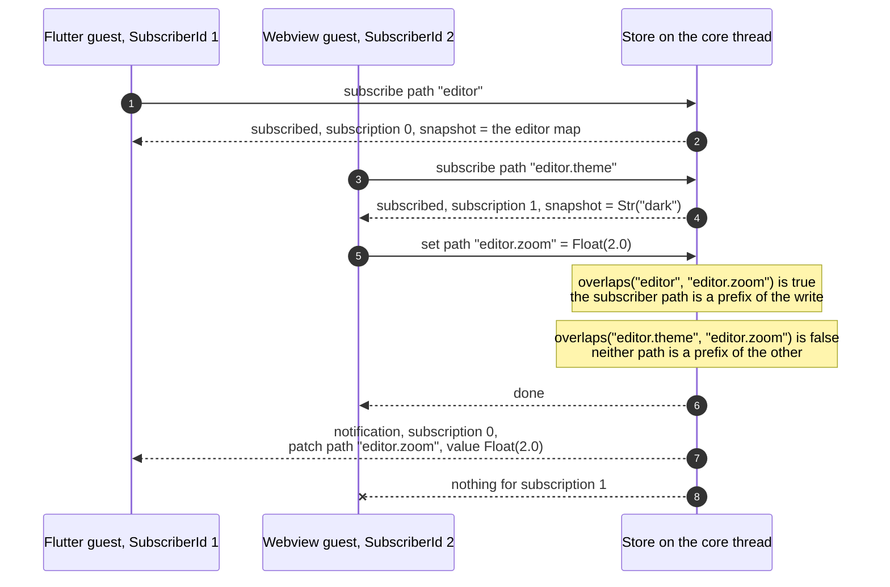
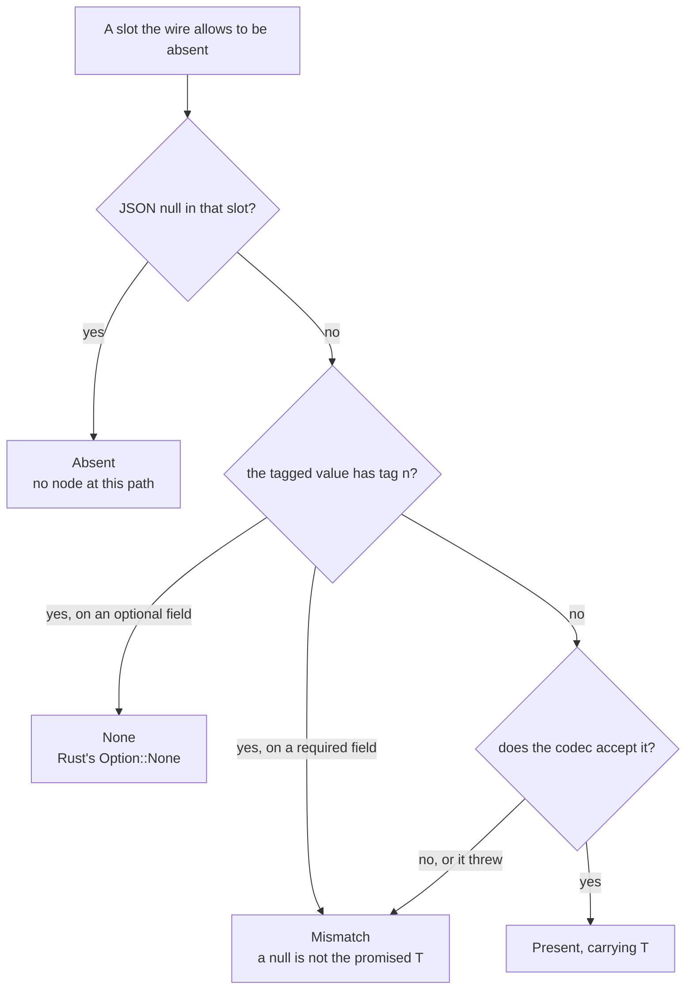

# The shared store

Duet's governing principle is **state survives teardown; events don't**. The store is the half of that sentence that survives. It is one `Value` tree owned by the Rust host, addressed by `Path`, and observed by subscriptions. A Flutter engine and a wry webview attach to it, mirror parts of it, and can be torn down and rebuilt without the tree noticing.

This document covers the value model, the path grammar, read and write semantics, how notifications are computed, the four states a path can be in, and the depth bound that keeps the whole thing encodable.

Everything here lives in `duet-core`, which has **zero dependencies** — its `[dependencies]` section in `crates/duet-core/Cargo.toml` is empty, and CI asserts it stays that way. The wire encoding lives one crate up in `duet-codec`, and the two guest packages (`packages/duet`, `packages/duet-js`) reimplement the same rules from the same corpus.

---

## 1. Where the store lives

| Layer | Type | File |
|---|---|---|
| The tree and its subscription registry | `Store` | `crates/duet-core/src/store.rs:89` |
| A dedicated thread that owns the `Store` | `Runtime` | `crates/duet-runtime/src/runtime.rs:39` |
| The handle every other thread uses | `StoreHandle` | `crates/duet-runtime/src/handle.rs:25` |
| Guest-facing request/response | `dispatch_with` | `crates/duet-protocol/src/dispatch.rs:57` |

`Store::root` is private and `Store` is the only owner of it (`crates/duet-core/src/store.rs:91`). Every write goes through `Store::set`, which is what lets the depth bound in §7 be a guarantee rather than a convention.

`Store` is deliberately **not** `Clone`: two clones would mint colliding `SubscriptionId`s from the same `next_id` counter, silently breaking the uniqueness `unsubscribe` depends on (`crates/duet-core/src/store.rs:84-87`).

A complete cycle, taken from the crate's own doctest (`crates/duet-core/src/lib.rs:79-108`) — this compiles and runs as written:

```rust
use duet_core::{Path, SubscriberId, Store, Value};

// Create a store and subscribe to a path.
let mut store = Store::new(Value::map([("counter", Value::Int(0))]));
let surface = SubscriberId(1);
let path = Path::parse("counter").unwrap();
let (subscription, snapshot) = store.subscribe(surface, path.clone());
assert_eq!(snapshot, Some(Value::Int(0)));

// A write while the subscriber is live produces a notification.
let notes = store.set(&path, Value::Int(1)).unwrap();
assert_eq!(notes.len(), 1);
assert_eq!(notes[0].subscription, subscription);
assert_eq!(notes[0].patch.value, Value::Int(1));

// Teardown: the surface goes cold, dropping its subscriptions.
store.drop_subscriber(surface);

// A write while cold produces no notification for anyone -- events
// don't survive teardown.
let notes = store.set(&path, Value::Int(2)).unwrap();
assert!(notes.is_empty());

// But the write itself is durable: resubscribing after "resume" sees
// both writes made while the surface was gone, not just the last one.
let (_subscription, snapshot) = store.subscribe(surface, path);
assert_eq!(snapshot, Some(Value::Int(2)));
```

The last four lines are the principle in executable form. The write that happened while the surface was cold is still there; the *notification* for it is gone forever.

---

## 2. The `Value` model

`Value` (`crates/duet-core/src/value.rs:13`) is a dynamically typed tree. Typed access is generated on top of it; keeping the runtime representation dynamic is what lets path addressing and minimal patches work without any knowledge of user types.

### Every variant

| Rust variant | Rust payload | Wire spelling | Dart (`DuetValue`) | TypeScript (`DuetValue`) |
|---|---|---|---|---|
| `Value::Null` | — | `{"t":"n"}` — **no** `"v"` field | `DuetNull()` | `{ kind: 'null' }` |
| `Value::Bool` | `bool` | `{"t":"bool","v":true}` | `DuetBool(bool value)` | `{ kind: 'bool', value: boolean }` |
| `Value::Int` | `i64` | `{"t":"i","v":"42"}` — canonical decimal **string** | `DuetInt(int value)` | `{ kind: 'int', value: bigint }` |
| `Value::Float` | `f64` | `{"t":"f","v":1.5}`, or one of four sentinel strings | `DuetFloat(double value)` | `{ kind: 'float', value: number }` |
| `Value::Str` | `String` | `{"t":"s","v":"hi"}` | `DuetStr(String value)` | `{ kind: 'str', value: string }` |
| `Value::Bytes` | `Vec<u8>` | `{"t":"b","v":"Zm9v"}` — base64 | `DuetBytes(List<int> value)` | `{ kind: 'bytes', value: Uint8Array }` |
| `Value::List` | `Vec<Value>` | `{"t":"l","v":[ … ]}` | `DuetList(List<DuetValue> items)` | `{ kind: 'list', items: readonly DuetValue[] }` |
| `Value::Map` | `BTreeMap<String, Value>` | `{"t":"m","v":{ … }}` — keys byte-sorted | `DuetMap(Map<String, DuetValue> entries)` | `{ kind: 'map', entries: ReadonlyMap<string, DuetValue> }` |

Sources: variants at `crates/duet-core/src/value.rs:24,26,37,54,56,58,60,65`; encoder at `crates/duet-codec/src/value.rs:23`; Dart classes at `packages/duet/lib/src/duet_value.dart:131,149,170,201,254,278,306,340`; TypeScript interfaces at `packages/duet-js/src/value.ts:34,39,54,60,66,78,84,98`.

The typed layer maps the same variants onto ordinary language types through codecs:

| Variant | Dart codec (`packages/duet/lib/src/typed/duet_codec.dart`) | Dart type | TypeScript codec (`packages/duet-js/src/typed/codec.ts`) | TS type |
|---|---|---|---|---|
| `Bool` | `duetBoolCodec` (line 52) | `bool` | `duetBoolCodec` (line 76) | `boolean` |
| `Int` | `duetIntCodec` (line 55) | `int` | `duetIntCodec` (line 89) | `bigint` |
| `Float` | `duetFloatCodec` (line 64) | `double` | `duetFloatCodec` (line 104) | `number` |
| `Str` | `duetStringCodec` (line 67) | `String` | `duetStringCodec` (line 111) | `string` |
| `Bytes` | `duetBytesCodec` (line 73) | `List<int>` | `duetBytesCodec` (line 123) | `Uint8Array` |
| any | `duetDynamicCodec` (line 86) | `DuetValue` | — | — |

### Why the encoding is tagged

`Value::Str("foo")` and `Value::Bytes(b"foo")` both encode to a JSON string. Untagged, they would be indistinguishable on the way back. So would `Int(1)` and `Float(1.0)`. Both pairs have a dedicated test (`crates/duet-codec/src/value.rs:427,437`).

### Why `Int` is a string

JSON numbers are IEEE-754 doubles in JavaScript. A JS guest can only represent integers exactly up to 2^53; above that, values silently lose precision on the way into the webview, while Dart's 64-bit `int` would still see the exact value — so the two guests would disagree about the same stored `Int` (`crates/duet-core/src/value.rs:29-36`). Encoding as a canonical decimal string sidesteps this in both directions. The corpus pins `9007199254740993` (2^53 + 1) as a value that must survive intact (`corpus/wire-corpus.json`), and `packages/duet-js` therefore uses `bigint`, not `number` — this is called out as non-negotiable at `packages/duet-js/src/value.ts:44-53`.

"Canonical" means: no leading `+`, no leading zeros, and `-0` is not a spelling of zero. `{"t":"i","v":"007"}`, `{"t":"i","v":"+5"}` and `{"t":"i","v":"-0"}` are all rejected (`crates/duet-codec/src/value.rs:455-458`).

### Why floats have four sentinels

| Value | Sentinel | Why a JSON number will not do |
|---|---|---|
| `NaN` | `"NaN"` | JSON has no literal; an untagged encoding decodes back as `Null` — a changed *variant*, not just a changed magnitude |
| `+∞` | `"Infinity"` | JSON has no literal |
| `−∞` | `"-Infinity"` | JSON has no literal |
| `−0.0` | `"-0"` | JSON *has* the literal `-0`, but `JSON.stringify(-0)` is `"0"`, so a JS guest cannot emit it |

Table transcribed from `crates/duet-codec/src/value.rs:47-67`. The negative-zero case is the one that hid: `-0.0 == 0.0` is true, so every equality assertion in the suite passed while the sign bit was being dropped. The sign is still observable (`1.0 / -0.0` is −∞), so the golden corpus compares floats **by their bits** rather than by equality (`packages/duet/lib/src/duet_value.dart:236-242`).

The decoder is deliberately **wider** than the encoder: any JSON number is accepted, so `{"t":"f","v":1}` decodes to `Float(1.0)`. A guest hand-building a value has no way to force a decimal point — `JSON.stringify(1.0)` is `"1"` (`crates/duet-codec/src/value.rs:213-238`).

### Why map keys are byte-sorted

`Value::Map` is a `BTreeMap`, not a `HashMap`, so ordering is deterministic and patch payloads and golden files stay stable (`crates/duet-core/src/value.rs:62-65`). The canonical order is UTF-8 byte order, equivalently **code-point** order.

That distinction is load-bearing. `U+1F600` is non-BMP, so UTF-16 encodes it as the surrogate pair `D83D DE00`, and `0xD83D` sorts *below* `U+E000`. Dart's `String.compareTo` and JavaScript's default `Array.prototype.sort` both compare UTF-16 code units and therefore put it first, where code-point order puts it last. A test using only ASCII keys cannot see this at all — which is exactly how the divergence survived (`crates/duet-codec/src/value.rs:377-424`). Rust gets the right order for free; Dart sorts at encode time (`packages/duet/lib/src/duet_value.dart:347-360`) and TypeScript uses a `Map` plus a sort in `encodeDuetJson`.

### `Value` equality is not reflexive

`Value` derives `PartialEq`, and IEEE 754 defines `NaN != NaN`. A `Value` containing a `NaN` is therefore not equal to a clone of itself. This is *pinned*, not worked around (`float_nan_is_not_equal_to_itself`, `crates/duet-core/src/value.rs:828`). It has one direct consequence on the store, in §5.

### How a struct becomes paths

A Rust struct lowers to a `Value::Map` keyed by its **wire keys**, and each nesting level adds one path segment. Nothing in the tree records "this map was an `App`" — the schema does, and the generated clients turn that into path literals.

```mermaid
flowchart TD
    R["Value::Map<br/>path: (empty) = root"]
    C["Value::Int<br/>path: counter"]
    E["Value::Map<br/>path: editor"]
    Z["Value::Float<br/>path: editor.zoom"]
    T["Value::Str<br/>path: editor.theme"]
    D["Value::List<br/>path: documents"]
    D0["Value::Map<br/>path: documents&#91;0&#93;"]
    D0T["Value::Str<br/>path: documents&#91;0&#93;.title"]

    R -- "Segment::Key(counter)" --> C
    R -- "Segment::Key(editor)" --> E
    R -- "Segment::Key(documents)" --> D
    E -- "Segment::Key(zoom)" --> Z
    E -- "Segment::Key(theme)" --> T
    D -- "Segment::Index(0)" --> D0
    D0 -- "Segment::Key(title)" --> D0T
```



A path is the concatenation of the edge labels from the root. The `editor`/`counter` half of that tree is the real `schema/app.json`, and the generated Dart client binds exactly those strings:

```dart
/// `Editor.zoom` at `editor.zoom`.
DuetField<double> get zoom =>
    DuetField<double>(router, 'editor.zoom', duetFloatCodec);
```

(`examples/generated/app.duet.dart:234-235`; the TypeScript emitter produces the identical path string at `examples/generated/app.duet.ts:208`.)

**Path segments are wire keys, never camel-cased.** The generated file's header states the rule and the reason: accessor *names* are camel-cased and paths are not, deliberately, "because two guests that disagree about a wire key silently stop seeing each other's writes" (`examples/generated/app.duet.dart:6-11`). A schema field `short_by` is reached at `short_by`, and the Dart accessor happens to be called `shortBy`.

---

## 3. Paths

A `Path` is a `Vec<Segment>` (`crates/duet-core/src/path.rs:14`); a `Segment` is either `Key(String)` or `Index(usize)` (`crates/duet-core/src/path.rs:5`). The empty path is the root.

### The grammar

From `Path::parse` (`crates/duet-core/src/path.rs:97`):

- A dot-separated sequence of keys, where a key may be followed by one or more bracketed indices.
- An index may **not** immediately follow a `.`. `a.[0]` is not legal; write `a[0]`.
- A leading index with no preceding key (`[0]`) *is* legal.
- The empty string parses to the root.
- A key is any run of characters other than `.`, `[`, `]` — including whitespace, which is not trimmed.
- An index must be a canonical decimal integer: digits only, no `+` or `-`, no leading zero unless the index is exactly `0`.

| Input | Result |
|---|---|
| `""` | root (no segments) |
| `editor.zoom` | `Key("editor")`, `Key("zoom")` |
| `documents[3].title` | `Key("documents")`, `Index(3)`, `Key("title")` |
| `a[0][1].b` | `Key("a")`, `Index(0)`, `Index(1)`, `Key("b")` |
| `[0]` | `Index(0)` |
| `café.zoom` | `Key("café")`, `Key("zoom")` |
| `.foo` | `EmptySegment(0)` |
| `a..b` | `EmptySegment(2)` |
| `foo.` | `TrailingDot` |
| `foo[3` | `UnclosedIndex(3)` |
| `foo]` | `UnexpectedChar { at: 3, ch: ']' }` |
| `foo[3]extra` | `UnexpectedChar { at: 6, ch: 'e' }` |
| `a.[0]` | `UnexpectedChar { at: 2, ch: '[' }` |
| `foo[bar]` | `InvalidIndex { at: 3, raw: "bar" }` |
| `a[007]` | `InvalidIndex { at: 1, raw: "007" }` |
| `a[+3]` | `InvalidIndex { at: 1, raw: "+3" }` |
| `foo[-1]` | `InvalidIndex { at: 3, raw: "-1" }` |
| `foo[]` | `InvalidIndex { at: 3, raw: "" }` |
| `a[18446744073709551616]` | `InvalidIndex` — all digits, but overflows `usize` |

Every row above is an assertion in `crates/duet-core/src/path.rs:344-520`.

### Why indices must be canonical

So that `parse` and `Display` are **mutually inverse**: there is exactly one string representation for any given path. If `[007]` parsed, `Display` would render it back as `[7]`, and a guest that keyed local state by the string it sent would never match the string it got back.

This is not asserted by example alone. `round_trip_is_total_over_short_inputs` (`crates/duet-core/src/path.rs:611`) enumerates every string of length 0..=5 over the alphabet `a . [ ] 0 1 é`, checks that every accepted input renders back to itself, and pins the accepted count at exactly **2405** so a regression that silently narrows the accepted language cannot pass unnoticed.

### `parse` versus `from_segments`

`Path::from_segments` performs no validation (`crates/duet-core/src/path.rs:38`). Its `debug_assert!` — that keys are non-empty and free of `.`, `[`, `]` — is compiled out in release. A key containing `.` supplied by a guest would panic a debug host and, in release, silently build a path whose `Display` re-parses into a *different* path (one segment in, two out).

**Any path built from data arriving over IPC must go through `Path::parse`.** The generated clients only ever pass string literals minted at generation time, which makes the unchecked constructor unreachable from generated code (`packages/duet/lib/src/typed/duet_field.dart:13-20`).

### Error offsets are byte offsets

Every offset in `PathParseError` is a **byte** offset into the input, not a `char` offset (`crates/duet-core/src/path.rs:91-96`). Because these paths arrive from Flutter and JavaScript, a caller translating an offset back into a UTF-16 (JavaScript) or Dart string index must convert; a byte offset does not line up with either.

### Guest-supplied text in errors is bounded

Both `SetError`'s and `PathParseError`'s `Display` cap the guest-chosen text they echo. Without the cap, a 1 MB path becomes a 1 MB error string, then a 1 MB log line, then a 1 MB protocol reply — scaling linearly with input the host does not control. The reproduction is recorded in the test: 1,000,061 bytes in produced 1,000,109 bytes out (`crates/duet-core/src/value.rs:872-884`). The cap is `MAX_ECHO_CHARS = 48` **characters**, never bytes — slicing a `&str` mid-character panics, and a guest picks the characters (`crates/duet-core/src/echo.rs:49`). The struct *fields* still carry the whole path; only the rendered message is bounded (`crates/duet-core/src/value.rs:927`).

### The overlap rule

Two operations drive every subscription decision (`crates/duet-core/src/path.rs:137,148`):

```rust
pub fn is_prefix_of(&self, other: &Path) -> bool {
    self.0.len() <= other.0.len() && self.0.iter().zip(other.0.iter()).all(|(a, b)| a == b)
}

pub fn overlaps(&self, other: &Path) -> bool {
    self.is_prefix_of(other) || other.is_prefix_of(self)
}
```

Comparison is by **`Segment` equality**, not by string prefix. A subscriber at `edit` is not notified about a write to `editor` — pinned at `crates/duet-core/src/path.rs:684`. Distinct indices do not overlap either: `docs[0].title` and `docs[1].title` are unrelated (`crates/duet-core/src/path.rs:679`).

The relation's algebraic properties are checked over a generated corpus of every path of depth 0..=3 over `a`, `ab`, `[0]`, `[1]`: `overlaps` is symmetric and reflexive, root overlaps everything, and `is_prefix_of` is transitive and antisymmetric (`crates/duet-core/src/path.rs:751-801`). The alphabet deliberately includes both `a` and `ab` so that a bug using `str::starts_with` instead of `==` is detectable — a corpus of single-character keys could not tell the two implementations apart (`crates/duet-core/src/path.rs:706-720`).

---

## 4. Reading and writing

### `get`

```rust
pub fn get(&self, path: &Path) -> Option<&Value>
```

`Value::get` (`crates/duet-core/src/value.rs:183`) walks the segments and returns `None` on any of three conditions, indistinguishably:

| Condition | Example against a tree with `editor: {zoom, theme}`, `documents: [3 items]` |
|---|---|
| a map key is absent | `editor.missing` |
| a list index is out of range | `documents[9].title` |
| a segment addresses the wrong kind of node | `editor[0]`, `editor.zoom.deeper` |

Collapsing all three into one `None` is deliberate and asymmetric with `set`: `get` is the read hot path, and `Option` keeps it allocation-free with no error type to construct, while `set` is comparatively rare and its callers benefit from knowing why a write was rejected (`crates/duet-core/src/value.rs:177-182`).

`Store::get` delegates straight through (`crates/duet-core/src/store.rs:141`). A guest's `get` for a missing path receives `Response::Value { value: None }`, which encodes as JSON `null` in the `value` slot (`crates/duet-protocol/src/wire.rs:196-206`).

### `set`

```rust
pub fn set(&mut self, path: &Path, value: Value) -> Result<(), SetError>
```

| Position | Map key | List index | Root (empty path) |
|---|---|---|---|
| **intermediate** segment | must already exist, else `MissingKey` | must be `< len()`, else `IndexOutOfBounds` | — |
| **final** segment | **inserted if absent** — adding a new key to an existing map succeeds | must be `< len()`, else `IndexOutOfBounds`; **never appends** | replaces the whole tree, cannot fail |
| wrong node kind | `TypeMismatch` | `TypeMismatch` | — |

`TypeMismatch` covers a key segment against a `List`, an index segment against a `Map`, and any segment at all against a scalar (`crates/duet-core/src/value.rs:219-222`).

### `set` does not create intermediate nodes

Writing to `a.b` when `a` does not exist is a `MissingKey` error, not an implicit insert (`crates/duet-core/src/value.rs:196-201`). The consequences are visible from a guest and the typed clients refuse to hide them:

- `DuetField.set` documents that writing to a path whose parent is absent or is a scalar "genuinely fails on the host — `Value::set` never creates intermediate nodes — and this method surfaces that rather than quietly succeeding locally" (`packages/duet/lib/src/typed/duet_field.dart:50-55`).
- Measured against the real host with `Option<Editor> = None`, a child path such as `editor.zoom` behaves three different ways at once: `get` answers `null`, `subscribe` succeeds, and `set` **fails** with `path "editor.zoom" addresses the wrong kind of node`. Those three behaviours are transcribed and asserted in `packages/duet/test/typed/duet_option_test.dart:1-70`, first against a fake host and then, in the same shape, against the real one in `packages/duet/test/live_host_test.dart`.

The rule also means a guest cannot grow a list. An index exactly equal to `len()` is refused, and the rejected write leaves the list untouched (`set_index_one_past_end_is_out_of_bounds_not_append`, `crates/duet-core/src/value.rs:759`). To append, replace the whole list at its own path.

There is also **no `remove`**. `Option::None` is represented as `Value::Null`, never as an absent map key, and generated initializers must materialize every schema field — which makes an absent key a schema violation rather than a representable state, and the missing `remove` a non-issue rather than a gap (`crates/duet-core/src/value.rs:16-23`). `DuetOptionalField.set(null)` writes `Value::Null`; it does not make the path absent, and the wire has no way to (`packages/duet/lib/src/typed/duet_field.dart:119-126`).

### A failed write changes nothing

`Value::set` walks every intermediate segment before mutating anything, so a failure partway through never leaves a partial write (`crates/duet-core/src/value.rs:203-207`). This is checked as a genuine frame condition over eight distinct failing paths, comparing the *whole* tree against the fixture after each (`failed_writes_leave_the_tree_completely_untouched`, `crates/duet-core/src/value.rs:779`).

`Store::set` inherits that guarantee and adds one more: because the `Err` variant carries no `Vec<Notification>`, a failed write cannot produce notifications — that is a property of the return type, not of the code path (`crates/duet-core/src/store.rs:304-311`). The registry's survival across a *run* of consecutive failures is checked separately (`crates/duet-core/src/store.rs:854`).

The success path is checked as a frame condition too: for every reachable path in the fixture, writing a sentinel there and reading it back returns exactly that sentinel, and every other reachable path that does not overlap it retains its original value (`crates/duet-core/src/value.rs:639`).

---

## 5. Subscriptions and notifications

### Two kinds of id

| Type | Identifies | Notes |
|---|---|---|
| `SubscriberId(u64)` | one guest — a Flutter surface, a webview | supplied by the **host**, from its own `SurfaceId` mapping |
| `SubscriptionId(u64)` | one registration at one path | minted by `Store::subscribe` in increasing order, never reused |

(`crates/duet-core/src/store.rs:13,29`.) One subscriber may hold many subscriptions; each is created and removed independently.

**Neither id is a capability.** `SubscriptionId`s are sequential small integers from a counter starting at zero, so knowing one proves nothing and guessing another guest's is trivial (`crates/duet-core/src/store.rs:23-27`). Two rules follow, and both are enforced:

1. `Request::Subscribe` carries **no** `SubscriberId` (`crates/duet-protocol/src/message.rs:107-118`). The host supplies it in `dispatch_with` (`crates/duet-protocol/src/dispatch.rs:73`). If a guest could name one, the webview could subscribe as the Flutter surface and receive its notifications.
2. `Store::unsubscribe` matches on **both** the subscription id and its owner (`crates/duet-core/src/store.rs:209`). This is the removal-side counterpart of rule 1. It closes a vulnerability that was real and reproduced: earlier on the branch, a guest could destroy another guest's subscription by looping over small integers, and the reproduction printed `guest A subscriptions remaining: 0` (`crates/duet-backend-macos/examples/two_guests.rs:52-60`). A `false` return must not become a distinct guest-visible error, or it becomes an oracle for probing which ids exist (`crates/duet-core/src/store.rs:206-208`).

### `subscribe` returns a snapshot

```rust
pub fn subscribe(&mut self, subscriber: SubscriberId, path: Path)
    -> (SubscriptionId, Option<Value>)
```

The snapshot is why resuming from a cold surface needs no special path: a guest that restarts simply subscribes again and receives current state, rather than requiring the host to replay history. The returned `Value` is an independent clone — later writes never change a snapshot already handed out (`crates/duet-core/src/store.rs:148-152`, checked at `crates/duet-core/src/store.rs:1054`).

Subscribing to a path that does not currently exist is legal and returns `None`. The subscription is registered anyway, and a later write that creates the path notifies it normally (`crates/duet-core/src/store.rs:1038`).

**The `Starting` gap.** A subscription is live the instant `subscribe` returns, but the surface that just resubscribed may still be `SurfaceState::Starting` — not yet able to consume a delivered notification. A caller whose surface is still `Starting` must **buffer** notifications rather than discard them, so nothing goes missing between the snapshot and `Live` (`crates/duet-core/src/store.rs:154-171`). Nothing in the type system enforces this.

### Who gets notified

`Store::set` notifies a subscription exactly when its path **overlaps** the written path — the two-way prefix rule from §3.



Concretely, a write to `editor.zoom` notifies subscribers at `editor.zoom` (exact match), `editor` (an ancestor — its value changed because one of its fields did), and the root (every path's ancestor), but never `editor.theme` (`crates/duet-core/src/lib.rs:34-38`; tests at `crates/duet-core/src/store.rs:475-512`).

Note that the writer is not excluded. `set` filters purely on path overlap, so a guest that writes a path it also watches receives its own notification back.

The notified set is checked to be *exactly* the overlapping set, over three systematically enumerated corpora plus a hand-picked boundary corpus, against an oracle computed by a genuinely different formulation — prefix-closure membership rather than the implementation's zip-and-compare (`crates/duet-core/src/store.rs:644-845`). The oracle is itself cross-checked against `Path::overlaps` at `crates/duet-core/src/store.rs:681`, because an oracle bug would otherwise have made every property test vacuous — and an earlier draft of it did exactly that.

### The patch is minimal, and carries the *written* path

```rust
pub struct Patch {
    pub path: Path,   // always the path passed to Store::set
    pub value: Value, // the value now at that path
}
```

Every matching subscriber receives the **identical** patch, regardless of where it subscribed. It is not re-rooted to the subscriber's own path (`crates/duet-core/src/store.rs:43-59`). A subscriber watching the root of a 10,000-item list receives one patch naming the one path that changed, not the whole list (`patch_carries_written_path_not_subscriber_path`, `crates/duet-core/src/store.rs:515`).

A guest holding several overlapping subscriptions receives one `Notification` per matching *subscription*, not one per guest (`crates/duet-core/src/store.rs:66-72`, checked at `crates/duet-core/src/store.rs:914`).

### `set` always notifies; it never diffs

Every overlapping subscription is notified whether or not the value actually changed. Adding an `if old != new` check would be a bug, not an optimisation: `Value` derives `PartialEq`, and `NaN != NaN`, so a tree containing a `NaN` is not equal to a clone of itself. A diffing `set` would fire on every single write to such a subtree forever — including genuine no-op writes, the exact case diffing exists to prevent. Always notifying makes that failure mode unreachable rather than merely unlikely (`crates/duet-core/src/store.rs:272-281`).

### Effects as data

`Store::set` returns `Vec<Notification>` rather than invoking callbacks. This keeps the store pure enough to test directly and lets the caller decide which thread each notification is delivered on — which the three-thread runtime needs (`crates/duet-core/src/lib.rs:60-68`).

The **order of that `Vec` is unspecified** and callers must not depend on it. It follows subscribe order today only because it comes from a linear scan; the planned bucketed index would reorder it. Ordering within one `set` is meaningless anyway, since every notification from a single call carries an identical patch to a different subscription (`crates/duet-core/src/store.rs:241-250`).

The registry is a flat `Vec` scanned linearly on every write. That is a deliberate choice, not an oversight: it is cache-friendly and it makes `unsubscribe` and `drop_subscriber` one-line `retain` calls. The documented replacement, when it is needed, keeps root subscriptions in an always-notified list (root overlaps every write) and buckets the rest by their path's first segment (`crates/duet-core/src/store.rs:94-102`).

### Teardown

`Store::drop_subscriber(subscriber) -> usize` removes every subscription that guest holds, regardless of path, and reports how many (`crates/duet-core/src/store.rs:221`). This is what a surface going cold calls. After it, writes produce no notifications for that guest — and the tree is untouched. That is the whole of "state survives teardown; events don't", in two lines of `retain`.

---

## 6. Applying a patch on the guest side

Because the patch carries the *written* path rather than the subscriber's own, a watcher at path `W` can receive a patch whose path sits **at**, **below**, or **above** `W`. All three arrive through the same callback, and each needs different handling. The Dart runtime implements this as a pure function, `duetMergeMirror` (`packages/duet/lib/src/typed/duet_merge.dart:96`); the TypeScript runtime mirrors it in `packages/duet-js/src/typed/merge.ts`.

| Relative position | Condition | What the mirror becomes |
|---|---|---|
| **At** | `changed == watched` | the patch value, whole |
| **Below** | `watched` is a strict prefix of `changed` | the mirror with `changed - watched` replaced by the patch value; a resync if there is no mirror to fold into |
| **Above** | `changed` is a strict prefix of `watched` | whatever sits at `watched - changed` *inside* the patch value — possibly nothing |

The "above" arm is the one worth reading twice. The implementation that looks right assigns `value` to the mirror unconditionally: correct for *at*, obviously wrong for *below*, and quietly wrong for *above*, where the mirror silently becomes the **ancestor's** value. A subtler wrong version indexes the *absolute* path into the patch value instead of the relative one; those two agree exactly when `changed` is the root, so a test suite whose only ancestor case is a root write cannot tell them apart. The Dart test therefore uses a non-root ancestor (`packages/duet/lib/src/typed/duet_merge.dart:69-95`).

A merge that cannot be computed locally returns `DuetResync` rather than a guess. That is never an error: it is the correct outcome whenever the patch carries strictly less information than the mirror needs, and the only sound response is a fresh read (`packages/duet/lib/src/typed/duet_merge.dart:38-59`).

The two functions the merge is built from, `duetValueAt` and `duetValueWith` (`packages/duet/lib/src/typed/duet_value_path.dart:21,70`), mirror `Value::get` and `Value::set` exactly — including "intermediate nodes are never created" and "a list index must already be in range" — so a mirror updated locally stays in step with the host that produced the patch. Both are **iterative**, not recursive: they are public, so a caller may hand them a locally built tree that never passed the 127-container check, and a Dart stack overflow is not catchable and takes the isolate with it.

---

## 7. The four states a path can be in

The host can be in exactly four states with respect to one typed path, and the wire spends a distinct spelling on each.

| State | On the wire | Dart | TypeScript | Means |
|---|---|---|---|---|
| present | a tagged value the codec accepts | `DuetPresent<T>(value)` | `{ kind: 'present', value }` | the schema's type is there |
| explicit null | `{"t":"n"}` | `DuetNone<T>()` | `{ kind: 'none' }` | the node exists and holds `Value::Null` — Rust's `Option::None` |
| absent | JSON `null` where a value would go | `DuetAbsent<T>()` | `{ kind: 'absent' }` | there is no node at the path at all |
| type mismatch | a tagged value the codec refuses | `DuetMismatch<T>(found, reason)` | `{ kind: 'mismatch', found, reason }` | another guest wrote something else here |

(`packages/duet/lib/src/typed/duet_reading.dart:36,50,72,91,110`; `packages/duet-js/src/typed/reading.ts:96`.)



The two decision rules are `duetRequiredReading` and `duetOptionalReading` (`packages/duet/lib/src/typed/duet_reading.dart:159,175`). The only difference between them is the `{"t":"n"}` arm: an optional field reports `None` **without consulting the codec**, because `Option::None` lowers to `Value::Null` by definition and no codec for a non-nullable `T` may claim it; a required field reports `Mismatch`, because a null is not the `T` it was promised.

Using it looks like this (`packages/duet/README.md:64-78`):

```dart
final DuetRouter router = DuetRouter(DuetClient(myTransport))..attach();
final DuetField<double> zoom = DuetField(router, 'editor.zoom', duetFloatCodec);

final DuetWatch<double> watch = await zoom.watch((DuetReading<double> r) {
  switch (r) {
    case DuetPresent<double>(:final double value): repaint(value);
    case DuetNone<double>():     // the path holds Value::Null
    case DuetAbsent<double>():   // there is no node at the path
    case DuetMismatch<double>(:final DuetValue found): report(found);
  }
});
```

### Why four arms, and why it is a reading and not an exception

**Why four.** Collapsing any two would delete a distinction the protocol already pays for. `optional_value` in `crates/duet-protocol/src/wire.rs:250` spends JSON `null` on "the path is absent", specifically so it stays distinguishable from `{"t":"n"}`; the guest decoders make the same split at `packages/duet/lib/src/duet_value.dart:45` and `packages/duet-js/src/value.ts:273`. Absent and `None` genuinely behave differently on the host — see the `Option<Editor> = None` measurement in §4 — so a client that spelled them the same would be lying about which of the two it found.

**Why not an exception.** A type mismatch is a state the host can be in, not a failure of the call that found it. Another guest can write any value to any path — the two-guest example runs a wry webview and a Flutter engine against one store at the same time — so a typed watcher will eventually meet a value its codec refuses. That value arrives through a **push**, where there is no call stack to throw into and where throwing would take out the transport's message handler. Given that `watch` cannot throw, `get` must not either: two mechanisms for one condition would mean an application that handles a mismatch on its watcher still crashes the first time it reads the same path directly (`packages/duet/lib/src/typed/duet_reading.dart:11-35`).

One sealed type used by `get`, by `watch`, and by the router's mirror is also the smaller API, and Dart's exhaustiveness checking turns a forgotten arm into a compile error.

The decode itself is wrapped in a `catch` (`packages/duet/lib/src/typed/duet_reading.dart:198`). A hand-written or generated codec that throws is reported as a `Mismatch` carrying the thrown text rather than escaping onto the push path. This is deliberately the opposite of `DuetClient.onPush`'s policy, which lets an *application* handler's exception escape — the difference is whose bug it is and whether there is a channel to report it on.

Applications that only need "render it or render nothing" can use `valueOrNull` (`packages/duet/lib/src/typed/duet_reading.dart:43`) or `duetReadingValue` (`packages/duet-js/src/typed/reading.ts:124`) instead of switching.

---

## 8. `MAX_VALUE_DEPTH = 61`

```rust
pub const MAX_VALUE_DEPTH: usize = 61;
```

(`crates/duet-core/src/value.rs:119`.)

### What "depth" counts

Container nodes — `List` and `Map` — on the deepest root-to-leaf path.

| Value | Depth |
|---|---|
| any scalar (`Null`, `Bool`, `Int`, `Float`, `Str`, `Bytes`) | 0 |
| `List([])`, `Map({})` | 1 |
| `List([Int(1)])` | 1 |
| `List([Int(1); 10_000])` | 1 — nesting, not size |
| `List([Map({})])` | 2 |

An empty container is still a container: it costs two JSON containers to encode, not zero, and a `depth` that returned 0 for it would let a chain of empty containers past the bound (`crates/duet-core/src/value.rs:995`).

### Why the store bounds this at all

A `Value` deeper than the bound cannot be **encoded and read back**. The wire admits 127 nested JSON containers (`duet_codec::MAX_JSON_DEPTH`, `crates/duet-codec/src/depth.rs:41`), and the host that writes a value is also the host that has to serve a `get` for it. Without the bound, a host could write a value the store accepts happily and then answer every read of it with text no conforming client — including the host's own decoder — can parse.

That was measured, not hypothesised: a 200-deep `Value` produced a 3,251-byte reply that `serde_json` refused to re-parse, which reaches a guest as a parse failure or, worse, as silence (`crates/duet-core/src/value.rs:76-83`).

### Where 61 comes from

`Value` nesting and JSON container nesting are not 1:1. Every `Value` node encodes as a tagged object `{"t":…,"v":…}`, and every *container* node adds a second container for its array or object:

```text
List([Null])         {"t":"l","v":[{"t":"n"}]}                  3 containers
List([List([Null])]) {"t":"l","v":[{"t":"l","v":[{"t":"n"}]}]}  5 containers
```

So a value of depth `d` costs at most `2d + 1` JSON containers — the `+1` being the scalar leaf's own tagged object.

A value never travels alone. The deepest envelope carrying one is a notification push, which nests it three containers down:

```text
{"kind":"notification","notification":{ … ,"patch":{"path": … ,"value": … }}}
```

against one container for a `value` response, a `subscribed` snapshot, or a `set` request. That gives:

```text
2d + 1 + 3 <= 127   =>   d <= 61.5   =>   MAX_VALUE_DEPTH = 61
```

Measured against the real encoders rather than derived on paper: the deepest value whose *push* re-parses is 61, and the deepest whose *value response* re-parses is 62. The push is the binding constraint, so 61 is the number that holds for every message a stored value can appear in (`crates/duet-core/src/value.rs:85-113`).

The arithmetic is pinned by a test in `duet-protocol`, because that is the only crate that can see both `duet_core::MAX_VALUE_DEPTH` and `duet_codec::MAX_JSON_DEPTH` (`the_value_depth_bound_is_exactly_what_every_envelope_can_carry`, `crates/duet-protocol/src/text.rs:588`). `duet-core` will not gain a dependency to state a number. That test's own comment records why both sides are checked: "Stating 61 in `duet-core` and 127 in `duet-codec` and hoping they stay consistent is how the guests' off-by-one happened in the first place."

### Where the bound is enforced

Not in `Value::set`, and that is not an oversight. `Value::set`'s `self` is whatever `Value` the caller happens to hold — a subtree, in general — so it has no way to know how many containers already enclose it. A check there would pass a write that is over-deep in the store and refuse one that is not (`crates/duet-core/src/value.rs:229-240`).

It is enforced in `Store::set`, the one place `self` is known to be the root (`crates/duet-core/src/store.rs:312-320`):

```rust
let depth = path.segments().len() + value.depth();
if depth > crate::MAX_VALUE_DEPTH {
    return Err(SetError::TooDeep { path: path.clone(), depth, max: crate::MAX_VALUE_DEPTH });
}
```

Reaching a node `k` segments down means `k` containers already enclose it, so the path counts toward the bound as well as the value. Any part of the tree the write does not touch was already within the bound, so checking the written node alone is sufficient — no full-tree walk on the write path.

The check runs **before** any mutation, so it upholds the same guarantee every other rejection does: nothing written, nobody notified, subscription registry intact (`crates/duet-core/src/store.rs:1142`).

The boundary is tested at exactly the boundary, in both directions and with the path contributing (`crates/duet-core/src/store.rs:1098,1118`). A "rejects very deep writes" test at 200 levels would pass against any bound at all.

### The one remaining door, and its backstop

`Store::new`'s seed is not depth-checked (`crates/duet-core/src/store.rs:113-128`). It is infallible, and bounding there would mean returning a `Result` from a constructor that every embedder and every test calls, to guard against a value the embedder itself built.

The consequence is bounded and covered. `duet_protocol::handle_text` checks the depth of what it is about to emit as well as what it receives, so a host that seeds an over-deep root gets a well-formed `failed` response naming the limit, rather than unparseable text (`a_store_seeded_over_deep_still_answers_with_decodable_text`, `crates/duet-protocol/src/text.rs:660`). A **push** has no id and therefore no `failed` to send instead, so an over-deep push is emitted as the literal text `null`, which every guest's push handler already drops (`crates/duet-protocol/src/text.rs:700`).

### Why `Value::depth` is iterative

A recursive walk would overflow the stack on exactly the input this function exists to reject, and a Rust stack overflow is an abort, not a catchable error. The one function guarding against pathological nesting must not itself be pathological, so it uses an explicit stack holding at most one entry per node — which the caller has already paid for (`crates/duet-core/src/value.rs:126-133`).

The test that proves this builds a 100,000-deep value and then calls `std::mem::forget` on it. That is load-bearing, not a shortcut: `Value`'s derived `Drop` is **recursive**, so letting the value fall out of scope aborts the test process while proving nothing. That recursive `Drop` is a real pre-existing hazard in the type, and `MAX_VALUE_DEPTH` is what keeps it out of reach — nothing deeper than the bound can enter the store, so nothing deeper than it is ever dropped by the host on a guest's behalf (`crates/duet-core/src/value.rs:1025-1045`).

---

## 9. Error reference

`SetError` (`crates/duet-core/src/value.rs:307`). Every variant carries the **full** path originally passed to `set`, not the partial path walked so far — a guest relaying the error over IPC needs the whole address.

| Variant | Fields | Raised by | Rendered as |
|---|---|---|---|
| `MissingKey` | `path` | `Value::set` — a map key strictly *before* the last segment | `no key exists at path "…"` |
| `IndexOutOfBounds` | `path`, `index`, `len` | `Value::set` — any list index `>= len` | `index 9 is out of bounds at path "…" (length 3)` |
| `TypeMismatch` | `path` | `Value::set` — a segment against the wrong node kind | `path "…" addresses the wrong kind of node` |
| `TooDeep` | `path`, `depth`, `max` | `Store::set` only | `the value at path "…" would nest 62 containers, past the limit of 61` |

Rendered forms verified at `crates/duet-core/src/value.rs:841` and `crates/duet-core/src/store.rs:1166`. `index` and `len` are host-generated with fixed maximum width and are **not** truncated; only the guest-chosen path is.

`PathParseError` (`crates/duet-core/src/path.rs:221`): `EmptySegment(at)`, `UnclosedIndex(at)`, `InvalidIndex { at, raw }`, `TrailingDot`, `UnexpectedChar { at, ch }` — all offsets in bytes.

---

## 10. Conformance

The value encoding is not "whatever Rust does". It is pinned by `corpus/wire-corpus.json` — **63 accept cases and 37 reject cases**, generated by `cargo test -p duet-protocol --test wire_corpus -- --ignored regenerate_corpus` and consumed by all three implementations:

| Language | Test |
|---|---|
| Rust | `crates/duet-protocol/tests/wire_corpus.rs` |
| Dart | `packages/duet/test/wire_corpus_test.dart` |
| TypeScript | `packages/duet-js/test/wire-corpus.test.ts` |

Accept cases carry both the exact wire text and a witness describing the value it must decode to, plus a `reencode_byte_exact` flag — so a client cannot "pass" a decode test by echoing its input back.

---

## Source map

| Concept | File |
|---|---|
| `Value`, `SetError`, `MAX_VALUE_DEPTH` | `crates/duet-core/src/value.rs` |
| `Path`, `Segment`, `overlaps` | `crates/duet-core/src/path.rs` |
| `Store`, `Patch`, `Notification`, subscription ids | `crates/duet-core/src/store.rs` |
| Bounded echo of guest text | `crates/duet-core/src/echo.rs` |
| Tagged-JSON codec, float sentinels, key order | `crates/duet-codec/src/value.rs` |
| `MAX_JSON_DEPTH`, the pre-scan | `crates/duet-codec/src/depth.rs` |
| Envelope encoding, `optional_value` | `crates/duet-protocol/src/wire.rs` |
| Host supplies the `SubscriberId` | `crates/duet-protocol/src/dispatch.rs` |
| Depth arithmetic, over-deep envelopes | `crates/duet-protocol/src/text.rs` |
| Dart value tree | `packages/duet/lib/src/duet_value.dart` |
| Dart paths | `packages/duet/lib/src/duet_path.dart` |
| Dart four-arm reading | `packages/duet/lib/src/typed/duet_reading.dart` |
| Dart mirror merge | `packages/duet/lib/src/typed/duet_merge.dart` |
| Dart local get/set | `packages/duet/lib/src/typed/duet_value_path.dart` |
| TypeScript value tree | `packages/duet-js/src/value.ts` |
| TypeScript four-arm reading | `packages/duet-js/src/typed/reading.ts` |
| A generated typed client | `examples/generated/app.duet.dart`, `examples/generated/app.duet.ts` |
| The `Option` measurement | `packages/duet/test/typed/duet_option_test.dart` |
| Two guests, one store | `crates/duet-backend-macos/examples/two_guests.rs` |
