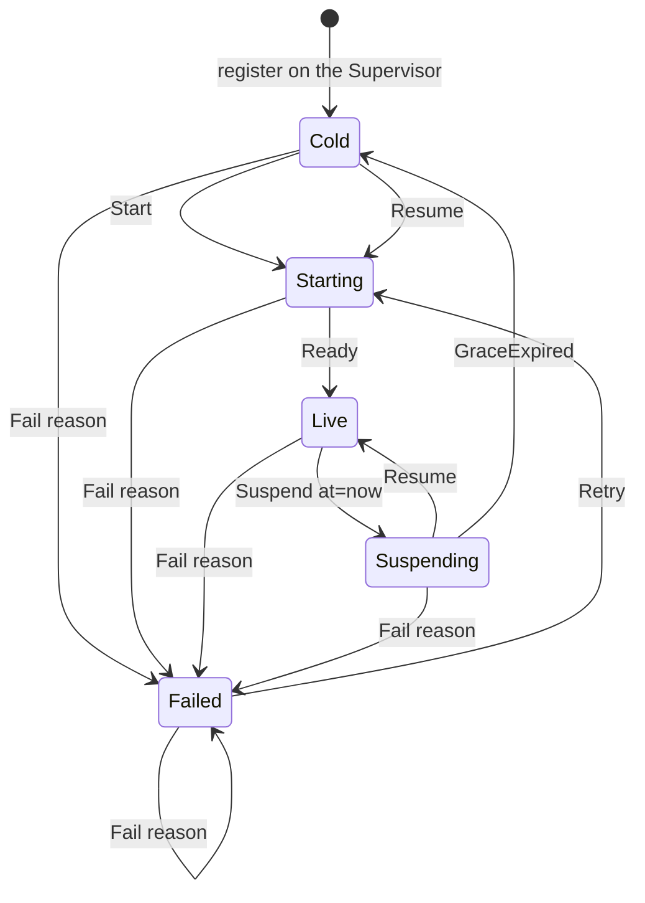
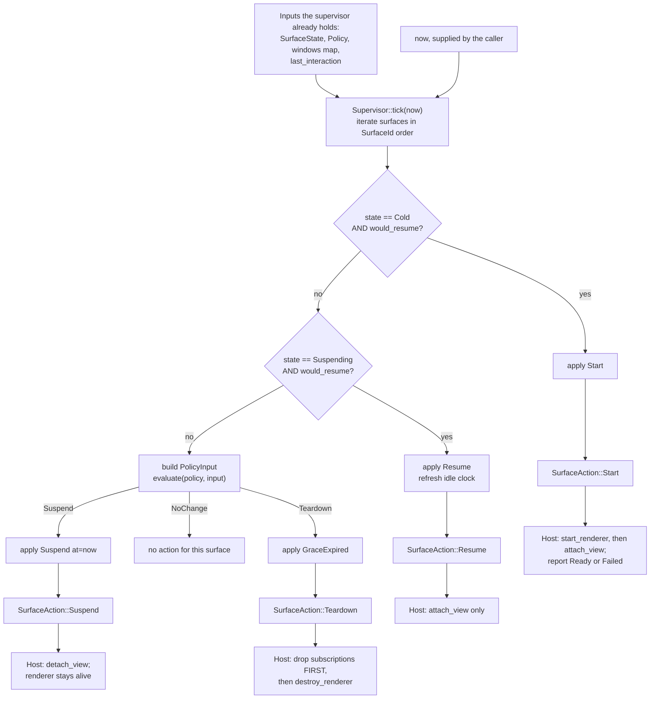
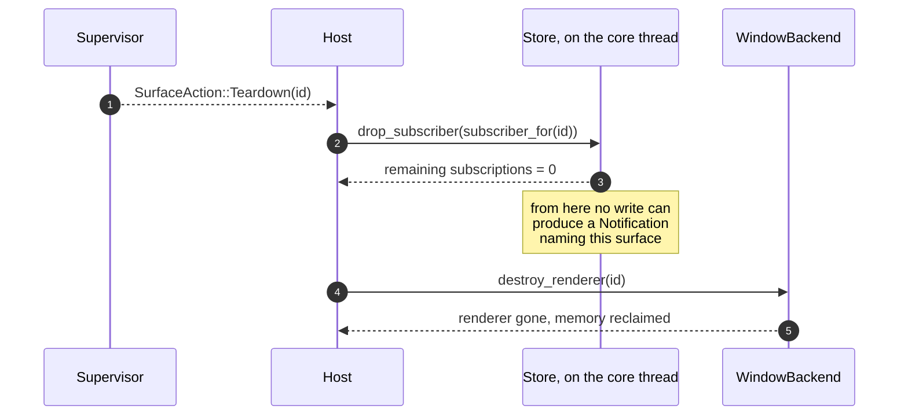
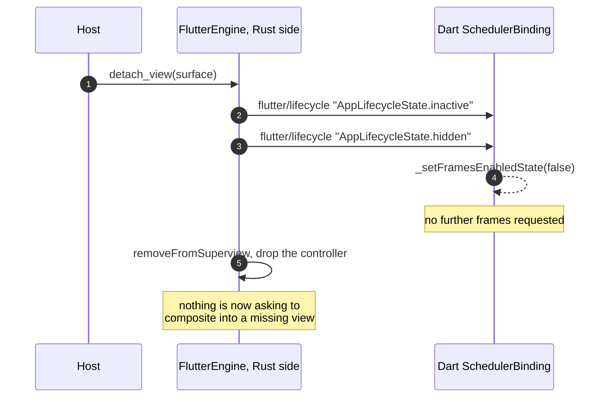

> **State survives teardown. Events don't.**
> — `crates/duet-core/src/lib.rs:16`

This is the chapter about the feature the rest of Duet exists to make possible: **either renderer can be freed while the other keeps running, and the application does not lose anything by it.**

A Flutter engine is expensive. On this machine, measured through the real orchestration, a booted engine with an attached view costs between 115 MB and 183 MB of resident memory depending on what the guest app builds (`crates/duet-backend-macos/FINDINGS.md`, F24). If a user is looking at the webview half of your app, that memory is doing nothing. Duet's answer is to destroy the engine and reclaim it — safely, because no renderer was ever allowed to own authoritative state in the first place.

Doing that safely needs four things, and this chapter covers each:

| Layer | Crate / file | Responsibility |
|---|---|---|
| The state machine | `crates/duet-core/src/lifecycle.rs` | Which transitions are legal. Pure function, no clock. |
| The policy | `crates/duet-core/src/policy.rs` | Whether a transition is warranted *right now*. Pure function, no clock. |
| The scheduler | `crates/duet-supervisor/src/supervisor.rs` | Tracks every surface, and returns work to do as **data**. |
| The executor | `crates/duet-host/src/host.rs` | Performs that work against a `WindowBackend`, and discharges the obligations the supervisor cannot. |

Only the fourth layer touches a platform. The first three are testable on a machine with no display at all, which is why they are tested exhaustively (a 35-cell transition matrix at `lifecycle.rs:354`, a 140-case policy matrix at `policy.rs:341`).

---

## 1. Vocabulary

Three words get used precisely throughout, and confusing them makes the rest incoherent.

| Term | Meaning |
|---|---|
| **Surface** | One renderer's worth of lifecycle — the Flutter side, or the webview side. Identified by a `SurfaceId` (`crates/duet-supervisor/src/id.rs:16`). |
| **Renderer** | The actual expensive thing: a `FlutterEngine`, or a `wry` `WebView`. A surface may or may not currently have one. |
| **Window** | An OS window belonging to a surface. Identified by a `WindowId`, supplied by the host — the supervisor never allocates one, because the window already exists before the supervisor hears about it (`crates/duet-supervisor/src/id.rs:70-78`). |

A surface can have zero, one or many windows. Window *identity* is tracked, not a count. An earlier version counted, and could not answer "was the window that just closed the one that was visible?" — so it guessed, and guessed wrong. Naming the window is what makes the invariant `visible_windows <= open_windows` true by construction rather than by convention (`crates/duet-supervisor/src/event.rs:11-17`, `supervisor.rs:20-23`).

---

## 2. `SurfaceState`: every state, every legal transition

`SurfaceState` (`crates/duet-core/src/lifecycle.rs:16`) has five variants.

| State | What is running | Why it exists |
|---|---|---|
| `Cold` | Nothing. No engine, no webview, no renderer process. | The store still holds everything, so resuming from here re-hydrates rather than starting fresh. |
| `Starting` | Engine booting, or webview creating. | A real boot is not instantaneous — Spike A measured a cold Flutter engine boot at roughly 180 ms (`crates/duet-supervisor/src/action.rs:16-19`). Requests are queued until `Live`. |
| `Live` | Attached, rendering, receiving events. | The normal case. |
| `Suspending { since: Instant }` | Renderer alive, view detached. | The **anti-thrash grace period**. A `Resume` here goes straight back to `Live` without paying an engine boot. |
| `Failed(String)` | Undefined; the guest crashed or never came up. | The host stays alive. The reason is a string so it can be published into the store for the *other* surface to render an error UI. |

`Suspending` carries the instant suspension began, in caller-supplied monotonic milliseconds. **The core never reads a system clock** — `Instant(u64)` (`lifecycle.rs:8`) is always passed in by the caller. That single decision is what makes every time-dependent behaviour in this system deterministic in a unit test, and it is also what let the F1 investigation (§10) test a hypothesis by ticking with an `Instant` already past a deadline while almost no real time had passed.

### The state diagram



Three things in that picture are worth stating out loud:

- **`Suspending --> Live` never passes through `Cold`.** That is the whole point of the state. It is pinned by its own test, `round_trip_resume_during_grace_never_reaches_cold` (`policy.rs:553`), which asserts `assert_ne!(state, SurfaceState::Cold)` explicitly.
- **`Cold --> Starting` on `Resume`.** Resuming a surface that already went cold is not an error; it just means a full boot instead of a reattach. The two are distinguished at the *action* layer, not here (§6).
- **`Fail` is matched first, from any state, including `Failed` itself.** `transition`'s match begins with `(_, E::Fail(why)) => S::Failed(why.clone())` (`lifecycle.rs:146`). A second failure replaces the reason rather than being rejected.

### The full transition matrix

Every one of the 5 × 7 = 35 pairs is specified. `✗` means `transition` returns `Err(InvalidTransition)`.

| from ＼ event | `Start` | `Ready` | `Suspend{at}` | `Resume` | `GraceExpired` | `Fail(why)` | `Retry` |
|---|---|---|---|---|---|---|---|
| `Cold` | `Starting` | ✗ | ✗ | `Starting` | ✗ | `Failed(why)` | ✗ |
| `Starting` | ✗ | `Live` | ✗ | ✗ | ✗ | `Failed(why)` | ✗ |
| `Live` | ✗ | ✗ | `Suspending{at}` | ✗ | ✗ | `Failed(why)` | ✗ |
| `Suspending{since}` | ✗ | ✗ | ✗ | `Live` | `Cold` | `Failed(why)` | ✗ |
| `Failed(_)` | ✗ | ✗ | ✗ | ✗ | ✗ | `Failed(why)` | `Starting` |

Source: `crates/duet-core/src/lifecycle.rs:144-165`. The table above is not a paraphrase — `transition_matrix_is_exhaustively_specified` (`lifecycle.rs:354`) re-derives the same 35 outcomes by hand and asserts `checked == 35`, so adding a state or an event variant fails that test until somebody writes down what the new cells mean.

### Why invalid transitions are an error rather than a no-op

`transition` returns `Result<SurfaceState, InvalidTransition>`. The supervisor then *absorbs* the error:

```rust
fn apply(entry: &mut Entry, event: &LifecycleEvent) {
    if let Ok(next) = transition(&entry.state, event) {
        entry.state = next;
    }
}
```

— `crates/duet-supervisor/src/supervisor.rs:220-224`

This looks redundant, and is not. The core answers "is this legal?" honestly, so a unit test can assert on the rejection; the supervisor decides what to do about a rejection, and its answer is "nothing, my state is the authority." A host reporting `Ready` for a surface that never started is a stale event racing a state change, not a reason to corrupt state or panic (`an_invalid_transition_leaves_the_state_unchanged`, `supervisor.rs:715`).

### One detail with a security shape

`SurfaceState::Failed` and `LifecycleEvent::Fail` both carry a guest-influenced, unbounded string. `InvalidTransition`'s `Display` truncates each embedded reason to 32 characters plus an ellipsis, using `.chars().take(32)` and never a byte slice (`lifecycle.rs:98-105`). The struct fields keep the full string; only the rendered message is bounded, so a guest cannot turn a pathological reason into a huge host log line. `invalid_transition_display_is_bounded_but_fields_are_not` (`lifecycle.rs:293`) pins both halves with a 10,000-character reason.

---

## 3. `Policy`: when a surface should give up its renderer

`Policy` (`crates/duet-core/src/policy.rs:7`) is declarative — four variants, chosen per surface at registration time.

| Variant | Suspends when | Grace before teardown |
|---|---|---|
| `OnLastWindowClosed { grace_ms }` | `open_windows == 0` | `grace_ms` |
| `OnHidden { grace_ms }` | `visible_windows == 0` (open but minimized or occluded counts) | `grace_ms` |
| `IdleTimeout { after_ms }` | `now - last_interaction >= after_ms` | none — see below |
| `Never` | never | never tears down either |

`Policy::default()` is `OnLastWindowClosed { grace_ms: 5_000 }` (`policy.rs:36-38`) — "long enough to survive a quick close-and-reopen, short enough to reclaim memory promptly."

`IdleTimeout` having no separate grace is deliberate, not an omission: the idle interval *already served* as the grace period before `Suspending` was entered, so `evaluate` substitutes `grace_ms = 0` for it (`policy.rs:106-108`). The practical consequence is that an idle-timeout surface tears down on the very next tick after suspending (`idle_timeout_reaches_teardown_without_oscillating`, `supervisor.rs:910`).

### How a decision is reached

`evaluate(&Policy, &PolicyInput) -> Decision` (`policy.rs:97`) is a pure function over five inputs (`PolicyInput`, `policy.rs:45`): the current `state`, `open_windows`, `visible_windows`, `last_interaction`, and `now`.

Its control flow is two guards and then a match:

1. **If `Suspending`** — the only question left is whether the grace elapsed. Window counts and idle time no longer matter, because the decision to suspend already happened. `Never` still returns `NoChange` (a `Never` surface that was suspended manually stays suspended).
2. **If not `Live`** — return `NoChange`. `Cold`, `Starting` and `Failed` are left alone regardless of policy: there is nothing to release yet, or the surface is mid-transition.
3. **Otherwise** — apply the per-policy suspend condition from the table above.

The result is one of three values:

| `Decision` | Meaning | `into_event(now)` yields |
|---|---|---|
| `NoChange` | Nothing warranted. | `None` |
| `Suspend` | `Live` → `Suspending` | `Some(LifecycleEvent::Suspend { at: now })` |
| `Teardown` | `Suspending` → `Cold` | `Some(LifecycleEvent::GraceExpired)` |

`Decision::into_event` (`policy.rs:81`) exists for one reason, and it is worth internalising because the same trap recurs one layer up. The `at` a `Suspend` event carries **must** be the same `now` that produced the decision; a caller constructing the event by hand can silently pass a different instant and corrupt the grace computation with no error anywhere. Converting through a function that takes `now` closes that. The naming discontinuity it also encodes — `Decision::Teardown` maps to `LifecycleEvent::GraceExpired`, because there is no `Teardown` event — has its own test with that explanation in it (`policy.rs:184`).

### The grace arithmetic, and three edge cases that are pinned

The comparison is `now - since >= grace_ms`, written as `input.now.0.saturating_sub(since.0) >= grace_ms` (`policy.rs:109`).

| Case | Behaviour | Why | Test |
|---|---|---|---|
| `now == since + grace_ms` | tears down | the boundary is inclusive | `policy.rs:397` |
| `now < since` (clock went backwards) | `NoChange` | `saturating_sub` clamps to zero. A spurious teardown loses renderer state; staying suspended a little longer costs only memory. The safer failure mode was chosen deliberately. | `policy.rs:438` |
| `since = 0`, `now = u64::MAX`, `grace_ms = u64::MAX` | tears down, no overflow | this is why the code compares `now - since >= grace_ms` and never `now >= since + grace_ms`, which would overflow | `policy.rs:483` |

---

## 4. The supervisor tick: decisions as data

`Supervisor::tick(now) -> Vec<SurfaceAction>` (`crates/duet-supervisor/src/supervisor.rs:169`) evaluates every registered surface and returns the work to be done. **It never acts.**

That separation is the crate's founding decision, and its rationale is one sentence: *starting a renderer needs a window server, but deciding that one should start does not* (`crates/duet-supervisor/src/action.rs:6-9`). Returning actions as data means every orchestration decision in this project is asserted directly in a test on a machine with no display, and the host gets to choose which thread performs the work.

`SurfaceAction` (`action.rs:12`) has four variants:

| Action | What the host must do | Cost |
|---|---|---|
| `Start(id)` | Create the renderer from nothing, then attach a view. | ~180 ms for a Flutter engine (Spike A, debug build, warm cache). |
| `Resume(id)` | Reattach a view to a renderer that never went away. | near-instant. |
| `Suspend(id)` | Detach the view; keep the renderer alive. | cheap, cheaply reversed, **reclaims almost nothing**. |
| `Teardown(id)` | Destroy the renderer — **and drop the surface's store subscriptions**. | this is the one that frees memory. |

The enum carries two predicates so a host can meter the distinction without re-deriving it: `reclaims_memory()` is true only for `Teardown` (`action.rs:75`), and `needs_new_renderer()` is true only for `Start` (`action.rs:85`).

### One tick, end to end



Two structural properties of that diagram are load-bearing elsewhere:

- **At most one action per surface per tick.** `decide` (`supervisor.rs:275`) is a chain of early returns; the first branch that applies returns immediately. `duet-backend-macos` depends on this — see §10.
- **Actions come back in `SurfaceId` order**, because `Supervisor` stores surfaces in a `BTreeMap`. That makes tests and logs reproducible, and is pinned by `actions_are_returned_in_surface_id_order` (`supervisor.rs:1280`).

### `would_resume`, and the two bugs it exists to prevent

The `Cold` and `Suspending` arms in that flowchart both ask `would_resume(entry, now)` rather than the obvious `open_windows > 0`. The reason is recorded at `supervisor.rs:246-258`, and it is the single best example in this codebase of a fix whose value lies entirely in *why*:

```rust
fn would_resume(entry: &Entry, now: Instant) -> bool {
    if entry.open_windows() == 0 {
        return false;
    }
    let probe = PolicyInput {
        state: SurfaceState::Live,
        open_windows: entry.open_windows(),
        visible_windows: entry.visible_windows(),
        last_interaction: entry.last_interaction,
        now,
    };
    evaluate(&entry.policy, &probe) != Decision::Suspend
}
```

It asks the policy a hypothetical: *if this surface were `Live` right now, would you immediately suspend it?* If yes, do not bring it up.

Two earlier versions used `open_windows > 0` directly — correct for `OnLastWindowClosed`, whose suspend condition *is* `open_windows == 0`, and wrong for the other two:

| Where the wrong condition was used | Symptom |
|---|---|
| The `Suspending` resume decision | Under `OnHidden`, a window that stayed open but hidden resumed the surface on every tick, so it oscillated `Live`/`Suspending` forever and never reached `Cold`. Memory was never reclaimed. |
| The `Cold` start decision | Under `OnHidden` or `IdleTimeout`, the surface booted only for policy to immediately suspend and tear it down — a full `Start`/`Suspend`/`Teardown` cycle repeating forever, **paying a real ~180 ms engine boot every cycle**. |

Both bugs were invisible to any test that stopped after the first action. The fix for that is `run_host_loop` (`supervisor.rs:355`), a helper that runs the realistic loop for 40 ticks and returns *every* action emitted, so tests can pin exact totals:

```rust
let actions = run_host_loop(&mut s, id, 40, 100);
assert_eq!(
    actions,
    vec![],
    "a surface OnHidden would immediately re-suspend must never be started"
);
```

— `host_loop_never_starts_a_cold_surface_whose_window_is_only_ever_hidden`, `supervisor.rs:954`. Note it pins **zero actions**, not a loose upper bound: a slow oscillation would satisfy a bound.

### `refresh_if_live`, and why a freshly-booted surface is not already idle

`refresh_if_live` (`supervisor.rs:234`) stamps `last_interaction = now` whenever a surface has just become `Live`. It runs after `Ready`, after the automatic resume inside `decide`, and after `request_resume`.

Without it, a surface that took a while to boot is *already* idle under `IdleTimeout` the moment it comes up, and gets suspended having never received any input as `Live`. That failure was found by mutation testing, and the real gap turned out to be worse than the mutant (`a_freshly_started_surface_is_not_immediately_idle`, `supervisor.rs:1151`).

### The same `now` trap, one layer up

`Supervisor::handle_at(now, event)` takes `now` on every call. An earlier version split this into `set_now` plus `handle`, and forgetting the `set_now` silently timestamped the event with whatever `now` a previous `tick` happened to leave behind — the same `at`-corruption trap `Decision::into_event` exists to close, reintroduced one layer up (`supervisor.rs:120-126`).

### Manual overrides

`request_suspend` and `request_resume` (`supervisor.rs:186`, `:202`) bypass policy entirely, **including `Policy::Never`**. Each returns `None` if the surface is unregistered or in the wrong state — suspending only applies to `Live`, resuming only cancels a pending suspension. `manual_suspend_and_resume_override_every_policy_including_never` (`supervisor.rs:1190`) drives all four policies.

---

## 5. The host executes

`Host::tick(now)` (`crates/duet-host/src/host.rs:93`) calls `supervisor.tick(now)` once, then performs every returned action synchronously, in order, within that same call.

| Action | `Host::perform_*` | Backend calls | Completion report |
|---|---|---|---|
| `Start` | `perform_start` (`host.rs:143`) | `start_renderer` → if `Readiness::Ready`, `attach_view` | host reports `HostEvent::Ready` itself |
| `Start` (pending) | same | `start_renderer` only | **nothing** — the backend must call `Host::handle_at` itself once the renderer settles |
| `Resume` | `perform_resume` (`host.rs:159`) | `attach_view` | none needed — the supervisor already moved the surface to `Live` when it emitted the action |
| `Suspend` | `perform_suspend` (`host.rs:167`) | `detach_view` | none |
| `Teardown` | `perform_teardown` (`host.rs:180`) | drop subscriptions, then `destroy_renderer` | none |

`Readiness` (`crates/duet-host/src/backend.rs:36`) exists because a real backend cannot always answer synchronously, and the alternative was a choice between blocking the main thread — freezing every other window — and reporting success before the renderer is usable. `MacBackend` returns `Ready` for Flutter and never `Pending`, because Spike A established `runWithEntrypoint:` is synchronous: it returns only once the isolate is actually running (`crates/duet-backend-macos/src/backend.rs:159-169`). A `wry` webview would warrant `Pending`, since `load_url` returns before the page finishes loading — that remains a documented hypothesis, not a measurement.

### Failure paths

| Failure | What the host does | Rationale |
|---|---|---|
| `start_renderer` fails | report `Failed`, **do not attach** | `a_failed_start_reports_failure_and_does_not_attach`, `host.rs:357` |
| `attach_view` fails after a successful start | report `Failed`; the renderer exists | `host.rs:385` |
| `detach_view` fails during `Suspend` | attempt `destroy_renderer`, then report `Failed` | the policy fired specifically to reclaim memory; a transient detach failure must not mean it is never freed (`host.rs:500`) |
| `destroy_renderer` fails during `Teardown` | retry the destroy **exactly once**, then report `Failed` | a renderer left alive after a destroy the host could not complete is memory that is never reclaimed, which is worse than a redundant destroy attempt (`host.rs:540`) |
| an unrecognised `SurfaceAction` variant | ignored | `SurfaceAction` is `#[non_exhaustive]`; panicking here would take down every surface in the process because a newer `duet-supervisor` grew a variant this build does not know (`host.rs:130-136`) |

A failed action is still included in `Host::tick`'s return value. The failure is reported separately, as a `HostEvent::Failed` into the supervisor.

### The `SurfaceId` → `SubscriberId` mapping lives here, and only here

`Host::register` (`host.rs:46`) allocates each surface its own `SubscriberId` from the store handle. The supervisor has no store handle; the store knows nothing of surfaces. Nothing else in the system links the two.

Giving each surface its own subscriber is a confidentiality boundary, not bookkeeping: two surfaces sharing one would have each other's notifications delivered to them, and the two surfaces are separate guests. This is the host-side half of the same rule that makes `Request::Subscribe` carry no `SubscriberId` on the wire — the host supplies it, so one guest cannot subscribe as another. The property was measured end to end for the first time in Phase 2b-6: a `wry` webview and a headless `FlutterEngine` live against one store, 6 notifications emitted, webview got 2, Flutter got 4, **0 misrouted**, 12/12 assertions (`crates/duet-backend-macos/FINDINGS.md`, F18).

---

## 6. The teardown-order rule

**Drop the surface's store subscriptions *before* destroying its renderer. This is a correctness requirement, not a style preference.**

```rust
fn perform_teardown(&mut self, id: SurfaceId, now: Instant) {
    self.drop_subscriptions(id);
    if let Err(e) = self.backend.destroy_renderer(id) {
        let _ = self.backend.destroy_renderer(id);
        self.report_failure(id, now, e);
    }
}
```

— `crates/duet-host/src/host.rs:180-186`



### Why reversing it is wrong

The store runs on its own thread (`duet-runtime`'s core thread owns the `Store`; everything else talks to it through a `StoreHandle`). A write arriving from *the other guest* — or from host code, or from a command — computes notifications for every subscription that overlaps the written path, and hands them to the `Sink`.

Destroy first, and there is a window between "the renderer is gone" and "the subscription is dropped" in which exactly that can happen. The store computes and delivers a notification addressed to a surface that no longer exists. What that costs depends on the sink: at best wasted work on the core thread and a delivery into nothing; at worst a sink that dereferences a renderer handle it believes is live.

Drop first, and the window does not exist. Once `drop_subscriber` returns, no subsequent write can name that surface.

### The test that actually proves it

This ordering is invisible from outside. By the time `tick` returns, both orderings look identical: `RecordingBackend` cannot see the store, and the store cannot see the backend. So the test uses a backend that **queries the store from inside `destroy_renderer`**:

```rust
fn destroy_renderer(&mut self, _surface: SurfaceId) -> Result<(), BackendError> {
    if let Some(subscriber) = *self.subscriber.lock().expect("lock poisoned") {
        let remaining = self
            .store
            .drop_subscriber(subscriber)
            .expect("query should succeed");
        *self.seen.lock().expect("lock poisoned") = Some(remaining);
    }
    Ok(())
}
```

and then asserts:

```rust
assert_eq!(
    backend.seen(),
    Some(0),
    "destroy_renderer must observe the subscription already gone, \
     proving the drop happened before the destroy"
);
```

— `StoreProbingBackend` and `teardown_drops_subscriptions_before_destroying_the_renderer`, `crates/duet-host/src/host.rs:843-935`.

### Two related obligations

- **`Host::unregister` drops subscriptions too** (`host.rs:58-62`), and must: once the surface is unregistered, the `SurfaceId` → `SubscriberId` mapping is gone and the supervisor no longer tracks the surface, so no future tick can ever produce a `Teardown` for it. If `unregister` did not drop them, nothing ever would (`unregistering_drops_the_surfaces_subscriptions`, `host.rs:285`). It does **not** destroy the renderer — for that, suspend and let the policy reach teardown.
- **The emergency destroy on a failed detach does not drop subscriptions.** `perform_suspend` (`host.rs:167-172`) calls `destroy_renderer` and reports the failure, but not `drop_subscriptions`; the surface's subscriptions are released later, by `Host::unregister`. That asymmetry is visible in the source as written today; this document records it rather than claiming a consequence that has not been measured.

### The residual gap the host documents about itself

A surface that reaches `Failed` has no automatic route back to `Live`. `HostEvent::Retry` moves `Failed` → `Starting`, but the supervisor only ever emits `Start` from `Cold`, so a retried surface wedges in `Starting` with no renderer started for it. Recovering from `Failed` today requires the host to unregister and re-register the surface (`host.rs:116-123`).

---

## 7. What actually reclaims memory

**`shutDownEngine` is what reclaims memory. Detaching the view is not.**

This is the measured finding the entire suspend/teardown distinction rests on, and it is counter-intuitive enough that it is repeated in five doc comments and enforced by an assertion.

### Spike A, the original measurement

From `spikes/spike-a-macos/FINDINGS.md`, sampled via `ps -o rss=`:

| Stage | RSS |
|---|---|
| Baseline, no engine | ~14 MB |
| After engine boot + first isolate run | ~42 MB → ~149 MB |
| View attached and rendered | ~198 MB → ~224 MB |
| **View detached, engine alone** | **~224 MB — no drop at all** |
| After 8 detach/recreate cycles | ~231 MB → ~234 MB |
| **After `shutDownEngine`** | **~234 MB → ~108 MB** |

The crate doc comments round the relevant pair to "223 MB before and 104 MB after" (`crates/duet-host/src/backend.rs:97-98`, `crates/duet-supervisor/src/action.rs:47-49`); the spike's own log lines are `223184 kB` with a view attached and `108256 kB` after `shutDownEngine`.

Note the third-from-last row. Detaching a view reclaimed **nothing**. The engine, its isolate and its caches are the bulk of the footprint, not the view.

### Re-measured through the real orchestration

`crates/duet-backend-macos/examples/lifecycle.rs` drives one real Flutter surface through the real `duet-host` → `duet-supervisor` → `duet-runtime` stack — window open, engine boot, view attach, rasterize, suspend, teardown — sampling RSS at each stage. Four runs, after the F1 fix (`FINDINGS.md`, F5):

| Stage | Run 1 | Run 2 | Run 3 | Run 5 |
|---|---:|---:|---:|---:|
| process start | 37,312 | 37,376 | 37,232 | 36,992 |
| renderer started, view attached | 159,776 | 160,192 | 160,000 | 159,936 |
| after rasterizing the attached view | 222,064 | 229,328 | 222,448 | 220,816 |
| view detached, suspending (engine alive) | 222,432 | 227,456 | 220,208 | 218,512 |
| **torn down (engine shut down)** | **96,208** | **102,992** | **96,576** | **95,664** |

All figures in kB. Reclaimed, suspended → torn down: **122,848 – 126,224 kB**, consistent with Spike A's ~126 MB.

### Why the assertion is a share and not a number of kilobytes

The example originally asserted an absolute floor of 81,920 kB. That floor sat *inside* the range of values the example legitimately produces, so whether it passed depended on which Flutter app the example booted. Measured the same afternoon, same binary, `DUET_APP_FRAMEWORK_PATH` the only difference (`FINDINGS.md`, F24):

| Fixture | runs | reclaimed (kB) | vs the 81,920 kB floor |
|---|---:|---:|---|
| `spikes/spike_app` — `runApp`, `MaterialApp`, a running `Ticker` | 3 | 122,560 – 124,112 | **passes**, 3/3 |
| `fixtures/duet_guest` — headless, no `runApp`, no widget tree | 8 | 71,328 – 71,616 | **fails**, 8/8 |

The spread *within* each cluster is 1,552 kB and 288 kB — 0.4 % of the value being measured. This was never flaky. It was bimodal, and the mode was selected by the guest app, because a live engine's RSS is dominated by what the Dart heap and Skia allocate, which is a property of the app and not of the embedder.

Widening the floor until both clusters passed would have put it below 71 MB, at which point it could no longer fail for the reason it exists. So the example now asserts two *shares*, both of whose halves scale with the app together:

```text
engine cost = (RSS while suspended) - (RSS before any engine existed)
reclaimed   = (RSS while suspended) - (RSS after teardown)
by detach   = (RSS at peak, warmed up) - (RSS while suspended)
```

| Assertion | Constant | Meaning |
|---|---|---|
| `reclaimed / engine_cost >= 0.50` | `MIN_RECLAIM_SHARE` (`examples/lifecycle.rs:123`) | teardown gives back most of what the engine cost |
| `by_detach / reclaimed <= 0.20` | `MAX_DETACH_SHARE` (`examples/lifecycle.rs:138`) | **and it is `shutDownEngine` doing it, not removing the view** |

The second assertion is the interesting one. A single total-drop assertion would still have passed if detach had started doing all the work and teardown none — which would mean the suspend/teardown distinction this whole framework is built on had silently inverted.

Measured after the change (`FINDINGS.md`, F24):

| Fixture | runs | reclaim share | detach share | Result |
|---|---:|---:|---:|---|
| `fixtures/duet_guest` | 3 | 60.7 %, 60.3 %, 60.5 % | 4.2 %, 4.1 %, 4.1 % | PASS 3/3 |
| `spikes/spike_app` | 3 | 67.4 %, 68.4 %, 66.2 % | 1.5 %, 1.9 %, 2.3 % | PASS 3/3 |

10–18 points of margin on the floor, roughly five times the margin on the ceiling, across a 1.7× difference in the absolute reclaim. The absolute kilobyte figures are still printed on every run; they are just no longer what the gate turns on. (`MIN_RECLAIM_SHARE`'s own doc comment records a slightly different sampling of the same measurement, 60.6 % and 67.8–68.3 %.)

### And the corresponding assertion in the unit tests

The same claim is pinned without a display, at `crates/duet-host/src/host.rs:416`:

```rust
assert_eq!(
    b.calls(),
    vec![
        BackendCall::StartRenderer(id),
        BackendCall::AttachView(id),
        BackendCall::DetachView(id),
    ],
    "suspend detaches only — Spike A measured that destroying is what frees memory"
);
```

and the full journey, at `crates/duet-host/tests/orchestration.rs:34`:

```rust
assert_eq!(
    b.calls(),
    vec![
        BackendCall::StartRenderer(id),
        BackendCall::AttachView(id),
        BackendCall::DetachView(id),
        BackendCall::DestroyRenderer(id),
    ],
    "the full lifecycle must be start, attach, detach, destroy — exactly once each"
);
```

---

## 8. What survives teardown, and what does not

The governing principle is the reason any of this is safe. `crates/duet-core/tests/suspend_resume.rs:477` states it as an executable test:

- A surface subscribes at `doc`, then goes `Live` → `Suspending` → `Cold`. Its subscription is dropped.
- Two writes land at `doc` while nobody is subscribed. **Neither produces a notification** — events are not queued for a cold surface and never replayed.
- The surface resumes, becomes `Live`, and resubscribes. Its snapshot is `"v2"` — the latest value — even though zero events were delivered for either write, including the intermediate `"v1"` that nobody ever saw as an event at all.

That is the whole contract in one test. A renderer that comes back does not replay history; it asks the store what is there now.

The other half — `SurfaceState::Failed`'s reason existing so the *peer* surface can render an error UI — is a pattern, not automatic behaviour. `failure_state_is_observable_by_the_peer_surface` (`suspend_resume.rs:181`) demonstrates it by having the host write the reason into the store by hand, where the healthy peer's subscription picks it up. Nothing in `duet-core` or `duet-host` publishes it for you.

---

## 9. Writing a driver

The obligations on whoever runs the loop, collected:

1. **Call `Host::tick` at most once per turn of the platform event loop.** See §10 — this is load-bearing on macOS, and easy to violate silently by "catching up" with two back-to-back ticks.
2. **Pass a monotonic `now` on every `handle_at` and every `tick`.** Nothing reads a clock for you.
3. **Report window events by identity**, not by count: `WindowOpened`, `WindowClosed`, `WindowShown`, `WindowHidden`, each naming both surface and window.
4. **Report `Interacted`** if any surface uses `IdleTimeout`. It is deliberately separate from visibility: a window can be visible and idle, or hidden while its surface is still doing work (`crates/duet-supervisor/src/event.rs:56-62`).
5. **Report `Ready` / `Failed` yourself** if your backend returns `Readiness::Pending`.
6. On macOS specifically, create and destroy the OS window through the backend's own inherent methods — `MacBackend::open_window` before telling the host the window opened, `MacBackend::close_window` after telling it the window closed. Window creation needs an `EventLoopWindowTarget` that only exists inside a `tao` callback, so it cannot go through the four-method `WindowBackend` trait without dragging a display requirement into `duet-host` (`crates/duet-backend-macos/src/backend.rs:22-33`).

`examples/lifecycle.rs` is a complete worked driver: a `Step` enum advanced one stage per run-loop turn (`Init` → `OpenWindow` → `Rasterize` → `CloseWindow` → `AwaitTeardown` → `Report` → `Done`), with `ControlFlow::WaitUntil` pacing it.

---

## 10. F1: the runaway spin, and the ordering that fixed it

This is the hardest-won finding in the lifecycle work, and it is a second ordering rule — this time inside the backend rather than the host.

### What was observed

Running `cargo run -p duet-backend-macos --example lifecycle` reached four correct stages and then stopped making progress permanently:

```
[t+  0.03s rss=   37104kB] process start, no surface registered
[t+  0.28s rss=  159728kB] renderer started, view attached (Readiness::Ready)
[t+  0.83s rss=  221472kB] after rasterizing the attached view
[t+  0.89s rss=  221904kB] view detached, suspending (engine still alive)
```

The immediately following line was `[ERROR:flutter/shell/platform/embedder/embedder.cc(1406)] Could not create the embedder backing store.` — repeating forever. Four independent runs, one held open nearly five minutes: **no run ever reached `Teardown`**. CPU pinned at ~111 %. `162,686` error lines in 90 seconds in one run, up to ~13,000/s. RSS *grew* during the supposedly-suspended period, 221,904 → 297,408 kB.

### Root cause

`spikes/spike_app`'s `main.dart` runs a `Ticker` that requests a new frame on every vsync, unconditionally, for the lifetime of the widget. The Ticker does not know or care whether a view is attached to its engine.

The moment `detach_view` removed the Flutter `NSView` from its superview, the engine's next scheduled frame had nowhere to composite into. It logged, and retried immediately, without yielding back to `tao`'s run loop — which is what stopped the host's own `ControlFlow::WaitUntil` timer from ever firing again. The absence of a real on-screen WindowServer on this machine is very likely a necessary ingredient rather than background context: with no real vsync there is no external pacing on the retries.

This also **retracts a Spike A characterisation**. Spike A saw the same message during its 8-cycle leak check and called it "a harmless, logged-but-recovered internal race" — because a new view arrived roughly every 170 ms in that loop, ending the storm before it was ever measured. Once a view stays absent for any sustained period, which is the entire point of a grace period, the same message is not harmless at all.

### Why it could not be dodged by ticking sooner

The obvious hypothesis — the storm builds over real time, so tick `Teardown` faster and beat it — was tested directly. The driver was changed so the grace-expiry tick ran on the very next run-loop turn, passing a `duet_core::Instant` already past the deadline (legitimate, since supervisor time is entirely caller-supplied). **It did not help**: by the time that next turn tried to run, the storm was already established and the turn never happened. The error begins on the line immediately following detach, with no observed delay.

### Why it was structural, not a bug in the example

`decide` produces at most one `SurfaceAction` per surface per call, and `Host::tick` performs them within that one call. `MacBackend` *depends on that*: Spike A's constraint 5 says a view controller's detach and a fresh `initWithEngine:` for the same engine must be separated by at least one run-loop tick, or it races the one-view-per-engine constraint because Cocoa has not yet run the old controller's `dealloc` (`crates/duet-backend-macos/src/backend.rs:35-72`).

So there is *always* at least one full run-loop turn between "view detached, engine alive" and "engine destroyed" — precisely the window F1's storm needs. Safety around engine reuse requires a turn boundary; a continuously animating fixture punishes any turn boundary with no attached view. The two requirements are in genuine tension, and no scheduling change inside the backend can route around it.

### The fix: tell Dart to stop scheduling frames *before* the view goes away

Reading the Flutter framework source established the mechanism. `flutter/lifecycle` is a `BasicMessageChannel<String?>` using `StringCodec`, so the wire payload is just the raw UTF-8 bytes of a string like `"AppLifecycleState.hidden"` — no method-call envelope, no codec object needed on the Rust side. `SchedulerBinding.handleAppLifecycleStateChanged` is what disables frame scheduling, and only on `hidden` (`_setFramesEnabledState(false)`); `resumed` and `inactive` leave frames enabled.

Critically, the framework's transition table does **not** allow jumping from `resumed` straight to `hidden`. The legal edges are `resumed → inactive`, `inactive → resumed | hidden`, `hidden → paused | inactive`, `paused → hidden | detached`. Skipping the intermediate `inactive` trips a framework assertion instead of silently working.



`FlutterEngine::detach` (`crates/duet-backend-macos/src/engine.rs:203`) sends `inactive` then `hidden` **before** touching the view; `FlutterEngine::attach` (`engine.rs:135`) sends `inactive` then `resumed` **after** the view is parented back in. Both go through `inactive` as the mandatory intermediate step in both directions.

`detach`'s signature changed from infallible to `Result<(), BackendError>` as a result, and the reasoning is worth repeating because it distinguishes two superficially similar failures. `removeFromSuperview`'s own exception is caught and absorbed — the controller drops immediately afterwards regardless, so there is no distinct recovery action. A failed lifecycle send is different: it means the retry storm this method exists to prevent may still happen. That is the one thing in the method a caller genuinely needs to know about, so it propagates. The view is still detached either way — `removeFromSuperview` and the controller drop run unconditionally.

`FlutterEngine::shutdown` (`engine.rs:236`) stays infallible and absorbs `detach`'s `Result` with `let _ = self.detach();`, because `shutDownEngine` runs regardless of that outcome and the engine handle is dropped by the caller immediately after either way.

### The Dart side confirms it received the transitions

`fixtures`/spike instrumentation with a `WidgetsBindingObserver` printing `didChangeAppLifecycleState` shows, in order:

```
flutter: [spike_app] didChangeAppLifecycleState: AppLifecycleState.inactive
flutter: [spike_app] didChangeAppLifecycleState: AppLifecycleState.hidden
[lifecycle] tick at close produced [Suspend(SurfaceId(0))]
```

Both Dart prints land *before* the Rust driver's own line — synchronously, inside the same `Host::tick()` call that executed `Suspend`, consistent with this process running Flutter's merged UI-and-platform-thread mode. That is a stronger proof than "the storm didn't happen": the framework demonstrably received and processed both transitions, in the correct order.

### Measured before and after

| | Before (original F1) | After the fix, 4 runs |
|---|---|---|
| `Could not create the embedder backing store` count | 162,686 in 90 s; up to ~13,000/s | **exactly 1**, every run |
| CPU | ~111 %, sustained | transient boot/render work only, decays to idle |
| RSS while "suspended" | **grows**: 221,904 → 297,408 kB over 90 s | stable, then proceeds straight to teardown |
| Reaches `Teardown` / `Report`? | **never** (killed after up to ~5 min) | **yes**, every run |
| Wall time to complete | never | ~1.6 – 1.75 s |

CPU was sampled independently every 0.1 s across a full run (`ps -o %cpu,rss -p <pid>`): it ramps to ~85–96 % for roughly half a second during normal engine boot and Skia warm-up — the same cost every boot pays, not a storm — then decays 70 → 48 → 30 → 19 → 12 % as the process winds down toward teardown.

### The generalisable lesson

**Stopping the guest's frame production is part of detaching, and it has to happen first.** Any backend for any renderer that keeps a render loop running independently of whether it has somewhere to draw needs the equivalent. `spikes/spike_app` is deliberately kept as `examples/lifecycle.rs`'s default fixture for exactly this reason: it is the only fixture with a running `Ticker`, which makes it the regression guard for this finding (`FINDINGS.md`, F24).

---

## 11. What is not verified

Reported plainly, because this project's convention is that an unobserved pass is not a pass.

- **Nothing here has been seen on a display.** This machine has no reachable on-screen WindowServer for spawned processes. "Rendered" throughout means rendered in-process, proven by `cacheDisplayInRect:toBitmapImageRep:` rasterization to a PNG, not by a screenshot.
- **Real keyboard or mouse input** to either surface is unproven, and Spike B's asymmetric finding (synthetic input reaches a Flutter view but not a `WKWebView`) has never been explained or re-tested.
- **Whether F1's hang would reproduce on a machine with a real WindowServer**, where the Ticker would get genuine vsync pacing. `FINDINGS.md` F3 calls this the single most valuable follow-up measurement available to whoever has such a machine.
- **The ~180 ms engine boot figure is a debug build on a warm filesystem cache.** A release-build, cold-cache figure — the number a grace period should actually be tuned against — has not been taken (`crates/duet-supervisor/src/lib.rs:24-27`).
- **The `Resume` gap.** Applying `Resume` moves the surface to `Live` immediately, before the host has finished reattaching the view, so a tick landing in that gap could ask to suspend a surface that is still mid-reattach. `duet-supervisor` adds no machinery for it; it is recorded at `crates/duet-supervisor/src/action.rs:30-38` so a host knows it exists.
- **Spike A's ~0.3–0.5 MB growth per detach/recreate cycle** over 8 cycles is genuinely inconclusive — too few cycles to distinguish "leaks a little" from "warms a cache and plateaus." A long soak would be needed to call it either way.
- **CI runs none of the macOS measurements.** `duet-backend-macos` cannot compile on `ubuntu-latest`, this workspace's only runner, so it is explicitly `--exclude`d from every workspace-wide `cargo` invocation. The 90 % coverage gate was not lowered; it still applies to every other crate.

---

## Where to look

| For | Read |
|---|---|
| The state machine and its 35-cell matrix | `crates/duet-core/src/lifecycle.rs` |
| Policy variants, `evaluate`, the grace arithmetic | `crates/duet-core/src/policy.rs` |
| `would_resume`, `refresh_if_live`, `decide` | `crates/duet-supervisor/src/supervisor.rs` |
| What each action costs and what it obliges | `crates/duet-supervisor/src/action.rs` |
| The teardown ordering rule and every failure path | `crates/duet-host/src/host.rs` |
| The platform seam | `crates/duet-host/src/backend.rs` |
| The lifecycle-message ordering fix | `crates/duet-backend-macos/src/engine.rs` |
| A complete worked driver, with the RSS assertions | `crates/duet-backend-macos/examples/lifecycle.rs` |
| Every measurement quoted above | `crates/duet-backend-macos/FINDINGS.md` (F1, F2, F5, F18, F24), `spikes/spike-a-macos/FINDINGS.md` |
| "State survives teardown, events don't", as a test | `crates/duet-core/tests/suspend_resume.rs` |
| Full lifecycle journeys through the public API | `crates/duet-supervisor/tests/scenarios.rs`, `crates/duet-host/tests/orchestration.rs` |
