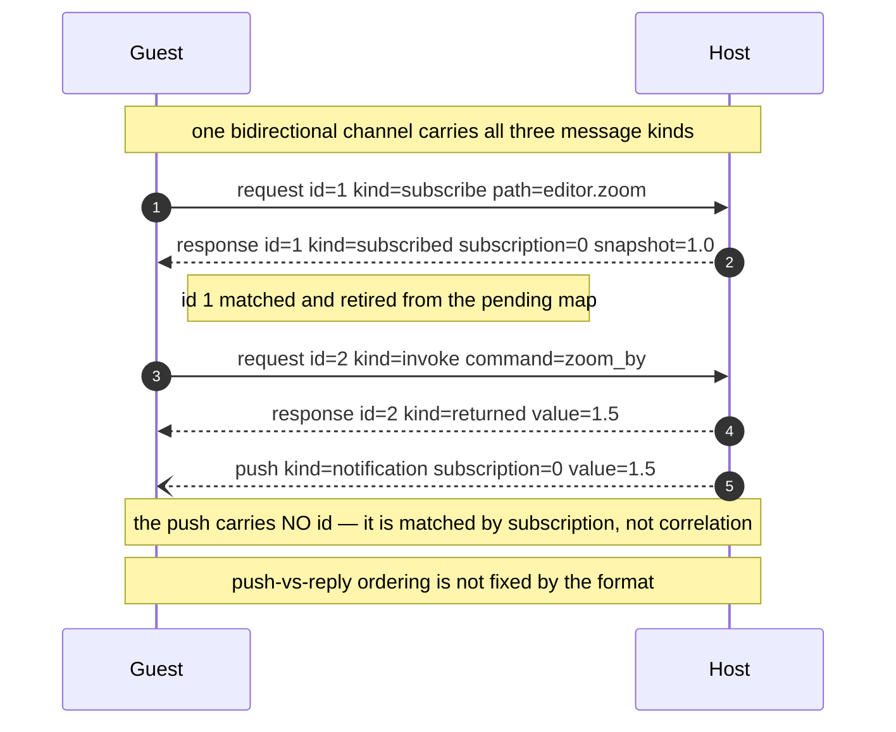
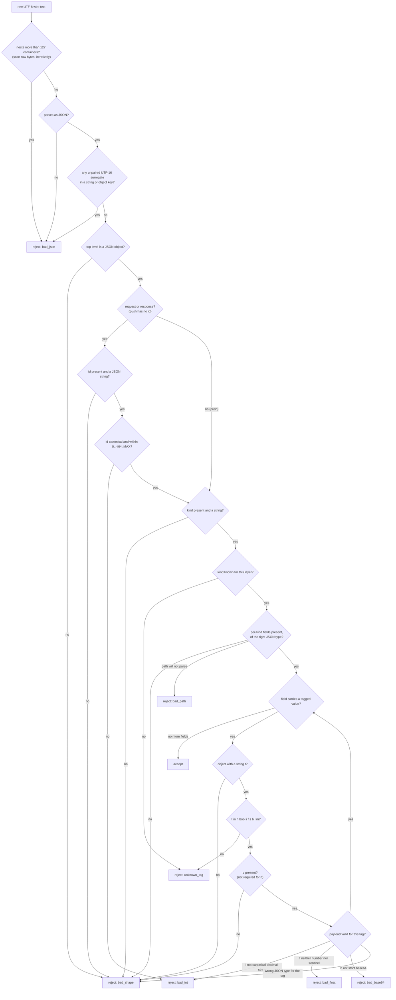
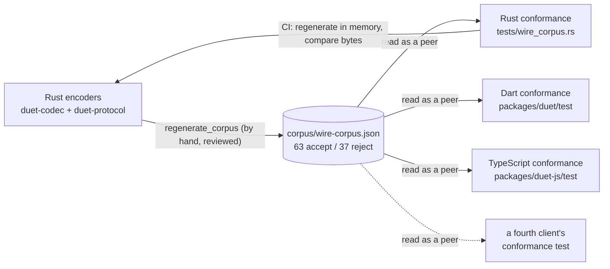

# The wire format

Duet's host and its guests exchange UTF-8 JSON text. This document specifies that text completely: the tagged value encoding, every envelope, the canonical rules a conforming encoder must obey, the rejection rules a conforming decoder must enforce, and the golden corpus that proves an implementation got all of it right.

Three implementations exist today — Rust (`duet-codec` + `duet-protocol`), Dart (`packages/duet`), TypeScript (`packages/duet-js`). Everything below is written so a fourth can be built from this page alone.

## Contents

- [Scope: what is and is not part of the format](#scope-what-is-and-is-not-part-of-the-format)
- [The four layers](#the-four-layers)
- [Tagged values](#tagged-values)
- [Addressed types: path, patch, notification](#addressed-types-path-patch-notification)
- [Envelopes](#envelopes)
- [Correlation, and the message that answers nothing](#correlation-and-the-message-that-answers-nothing)
- [The canonical rules](#the-canonical-rules)
- [Decoding: the pipeline and its rejections](#decoding-the-pipeline-and-its-rejections)
- [The golden corpus](#the-golden-corpus)
- [Conformance checklist for a fourth implementation](#conformance-checklist-for-a-fourth-implementation)
- [Source map](#source-map)

---

## Scope: what is and is not part of the format

**In scope.** The bytes of one message: a `Request`, a `Response`, or a `Push`. Every message is a single JSON *object* serialized as compact UTF-8 text with no surrounding whitespace.

**Out of scope: framing.** How one message is separated from the next is the transport's business, and Duet has three:

| Transport | Framing | Source |
|---|---|---|
| `wry` webview IPC | one message per IPC call; replies pushed back as script | `crates/duet-webview/src/bootstrap.rs` |
| Flutter platform channel | one message per `BasicMessageChannel` message | `crates/duet-backend-macos` (`FlutterSurface`) |
| stdio host (conformance harness) | NDJSON: one message per line, `\n` terminated, ≤ 1 MiB per line | `crates/duet-host-stdio/src/lib.rs:21-35`, `frame.rs:15` |

Line framing is safe for the stdio host only because all three encoders escape every character below U+0020 inside a string, so no `0x0A` byte can reach the wire from inside a payload. That is measured against the real host rather than assumed (`crates/duet-host-stdio/src/lib.rs:37-47`). U+2028 and U+2029 do travel unescaped and are deliberately not treated as terminators by any of the three line readers.

**Also out of scope: ordering.** The format correlates a `Response` to its `Request` by id and nothing else. A `Push` correlates to nothing. Whether a push that a request caused arrives before or after that request's reply is not fixed by the format and is not pinned by the corpus — a client must be able to receive a push at any moment, including between sending a request and receiving its reply.

---

## The four layers

Every Duet message decodes through the same four stages, and a rejection can come from any of them. Keeping them straight is most of the work of writing a client, because each one owns a different set of rules.

| Layer | What it is | Rust entry point |
|---|---|---|
| **Text** | raw UTF-8; nesting bound lives here | `duet_codec::exceeds_max_json_depth` |
| **JSON** | a generic JSON tree | `serde_json::from_str` |
| **Envelope** | `kind` + `id` + per-kind fields | `duet_protocol::decode_request` / `decode_response` / `decode_push` |
| **Value** | one `{"t":…,"v":…}` tagged value | `duet_codec::decode_value` |

The corpus addresses each case to exactly one of these decoders through its `layer` field, which is why a fourth implementation needs all four as separately callable entry points, not only a top-level `handle(text)`.

---

## Tagged values

Every `duet_core::Value` encodes as a JSON object carrying a type tag `t` and (for every tag but one) a payload `v`:

```json
{"t":"<tag>","v":<payload>}
```

### Why tagged at all

Plain JSON cannot represent a `Value` faithfully (`crates/duet-codec/src/lib.rs:7`):

- `Bytes` and `Str` would both become JSON strings and stop being distinguishable.
- `Int(1)` and `Float(1.0)` would both become `1`.
- `NaN` has no JSON literal at all — untagged, it round-trips back as `Null`, changing the *variant* rather than the magnitude.

Verbosity is an accepted cost. Payloads are small patches, and guests reach the format through generated typed clients rather than by hand.

### Every tag

| Tag | Variant | Payload JSON type | Example |
|---|---|---|---|
| `n` | `Null` | *(none — `v` is absent)* | `{"t":"n"}` |
| `bool` | `Bool` | boolean | `{"t":"bool","v":true}` |
| `i` | `Int` (`i64`) | **string**, canonical signed decimal | `{"t":"i","v":"-9223372036854775808"}` |
| `f` | `Float` (`f64`) | number, **or** one of four string sentinels | `{"t":"f","v":0.1}` / `{"t":"f","v":"NaN"}` |
| `s` | `Str` | string | `{"t":"s","v":"café ✓ 😀"}` |
| `b` | `Bytes` | string, standard base64 with padding | `{"t":"b","v":"3q2+7w=="}` |
| `l` | `List` | array of tagged values | `{"t":"l","v":[{"t":"i","v":"1"},{"t":"n"}]}` |
| `m` | `Map` | object; each value is a tagged value | `{"t":"m","v":{"ok":{"t":"bool","v":true}}}` |

`bool` is spelled out where the others are abbreviated; that is simply what the format is (`crates/duet-codec/src/value.rs:30`).

Encoding is defined at `crates/duet-codec/src/value.rs:23`, decoding at `:184`.

### `i` — integers travel as canonical decimal strings

An `Int` is an `i64`. It is carried as a string, never as a JSON number, because **JavaScript numbers are IEEE-754 doubles**: an `i64` above 2^53 loses precision in a webview guest while surviving intact in Dart and Rust. Two guests disagreeing about the same stored value is the worst failure this format could ship.

```json
{"t":"i","v":"9007199254740993"}
```

That is 2^53 + 1 — exact as a string, corrupted as a JSON number. It is corpus case `value/int/above_2_53`.

The string must be the **one canonical spelling** of the integer (`crates/duet-codec/src/canonical.rs:100`):

| Accepted | Rejected | Why rejected |
|---|---|---|
| `"0"` | `""` | not a number |
| `"1"`, `"-1"` | `"+5"` | leading `+` |
| `"9223372036854775807"` | `"007"`, `"-007"` | leading zeros |
| `"-9223372036854775808"` | `"-0"` | `i64` has no negative zero; canonical zero is `"0"` |
| | `"1.0"`, `"1e3"`, `"1_000"`, `" 1"`, `"1 "` | not decimal digits |
| | `"9999999999999999999999"` | overflows `i64` |

Without the canonical rule, `"7"` and `"007"` would decode to the same value and both re-encode as `"7"` — one value with two renderings, and the id fields (next section) make that a live hang rather than an aesthetic complaint.

### `f` — floats, and the four values that need sentinels

Exactly four `f64` values have no portable JSON-number spelling, and all four travel as strings (`crates/duet-codec/src/value.rs:47`):

| Value | Sentinel | Why a JSON number will not do |
|---|---|---|
| NaN | `"NaN"` | JSON has no literal; would decode back as `Null` |
| +∞ | `"Infinity"` | JSON has no literal |
| −∞ | `"-Infinity"` | JSON has no literal |
| −0.0 | `"-0"` | JSON *has* the literal `-0`, but `JSON.stringify(-0)` is `"0"` in JavaScript, so a JS guest cannot emit it |

The first three change the value's *variant* if untagged. The fourth is subtler and is why it was missed for so long: `-0.0 == 0.0` is true, so every equality assertion in every language passes with the sign already lost. The sign is still observable — `1.0 / -0.0` is −∞ — so it must survive the wire. The corpus witnesses floats as **IEEE-754 bits**, not as text, precisely so this case cannot hide (`crates/duet-protocol/tests/corpus/witness.rs:50`).

Every other `f64` is emitted as a JSON number.

**The decoder is deliberately wider than the encoder** (`crates/duet-codec/src/value.rs:213`). It accepts:

- any JSON number, including `1` for `1.0` — a guest hand-building a value cannot force a decimal point, since `JSON.stringify(1.0)` is `"1"`;
- a literal JSON `-0` alongside the `"-0"` sentinel, because a guest that *can* emit it (Rust, Dart) should not be forced to use the sentinel.

Both widenings are pinned by corpus cases that record what re-encoding must normalise them back to:

| Case | `wire` | `reencodes_to` |
|---|---|---|
| `value/float/integer_spelling` | `{"t":"f","v":1}` | `{"t":"f","v":1.0}` |
| `value/float/negative_zero_number_spelling` | `{"t":"f","v":-0.0}` | `{"t":"f","v":"-0"}` |

Anything else in the payload position — a boolean, an unrecognised string like `"huge"` — is `bad_float`.

### `s` — strings

A JSON string. Two rules that a decoder must not skip:

1. **No unpaired UTF-16 surrogate**, in a string payload *or* in a map key *or* in a `path`. A lone surrogate is not a character and has no UTF-8 encoding at all. `serde_json` refuses `"\ud800"` outright, so a Rust `String` can never hold one — but Dart and JavaScript strings are sequences of UTF-16 code units, and both `jsonDecode` and `JSON.parse` accept the escape happily. Encoding the result to UTF-8 then substitutes U+FFFD **silently**. That makes it the worst divergence shape available: not a message accepted in one language and refused in another, but a *value that changes on the way across while every layer reports success*. Five corpus reject cases cover it, in every text-carrying position, because a decoder that checked `Str` payloads but not map keys would pass a one-case corpus and still corrupt data.
2. **Escaping must match** if you want byte-exact re-encoding. `serde_json` and `JSON.stringify` already agree: short escapes for `\b \t \n \f \r`, lowercase `\u00xx` for the remaining C0 controls, no escaping of `/`, and no escaping of non-ASCII. Corpus case `value/str/control_chars` carries U+0000..U+001F and is marked byte-exact, which pins that agreement:

```
{"t":"s","v":" \b\t\n\f\r"}
```

### `b` — bytes as strict base64

Standard base64, RFC 4648, alphabet `A–Z a–z 0–9 + /`, **padding required** (`crates/duet-codec/src/base64.rs:5`). The decoder is deliberately strict (`:53`) and rejects, as `bad_base64`:

| Input | Problem |
|---|---|
| `"Z"`, `"Zm9vY"` | length not a multiple of 4 |
| `"Zg="` , `"Zg==="`, `"===="` | truncated or over-padded |
| `"Zm$v"`, `"こんにちは"` | character outside the alphabet |
| `"=Zm9"`, `"Zm=v"`, `"Zm9v="` | padding that is not a suffix of the final quantum |
| `"Zm9vYmF="`, `"Zh=="` | non-canonical: the bits a padded quantum discards must be zero |

The last row matters: without it, four distinct strings would decode to the same bytes, which is the same one-value-many-spellings hazard the canonical integer rule closes.

The corpus carries one case at each length mod 3 so all three padding cases appear: `AH//` (no padding), `3q2+7w==` (two), `AAH+/4A=` (one).

### `m` — maps, and code-point key order

A map's payload is a JSON object. Its keys must be in **code-point order**, equivalently UTF-8 byte order — the two coincide, because UTF-8 is constructed so that byte-wise comparison of encoded strings matches code-point comparison.

Rust gets this for free and contains no sorting code: `Value::Map` is a `BTreeMap<String, _>`, `String`'s `Ord` compares bytes, and `serde_json::Map` is itself a `BTreeMap` (this workspace does not enable `preserve_order`).

**Every other language has to work for it.** Dart's `String.compareTo` and JavaScript's default `Array.prototype.sort` compare **UTF-16 code units**, and those disagree with code points above the BMP:

- U+1F600 (😀) is UTF-16 `D83D DE00`.
- `0xD83D` is numerically *less than* `0xE000`.
- So the built-ins sort U+1F600 **before** U+E000, while code-point order — and Rust — sorts it **after**.

Below U+D800 every rule agrees, which is exactly how the divergence went unnoticed. The corpus case is built from three keys chosen so the wrong order is visible:

```json
{"t":"m","v":{"\ue000":{"t":"i","v":"1"},"\ufffd":{"t":"i","v":"2"},"\ud83d\ude00":{"t":"i","v":"3"}}}
```

*(the three keys are U+E000, U+FFFD and U+1F600, shown escaped here for legibility; the real wire text carries them raw — non-ASCII is never escaped)*

`packages/duet-js/src/json.ts:191` (`compareDuetMapKeys`) is a reference comparator for a language whose default sort is code-unit based: iterate code points, compare numerically, shorter-is-prefix sorts first.

There is a second JavaScript-shaped trap on the encode side (`packages/duet-js/src/json.ts:116`). ECMAScript property ordering puts **integer-like keys** (`"0"`, `"42"`) first in ascending numeric order whatever the insertion order, and no comparator can override it because no comparator ever runs. A Duet map whose keys look like array indices therefore cannot be emitted in canonical order from a plain JavaScript object at all — the TypeScript client writes the JSON text itself from a `Map` rather than calling `JSON.stringify` on an object. Any language with similar object semantics needs the same treatment.

### One decoder behaviour worth knowing

`{"t":"n"}` carries no `v`, and the `n` arm never reads one — `{"t":"n","v":1}` decodes to `Null` in Rust rather than being refused. Unknown *extra* fields on a tagged object are likewise ignored, because the decoder reads named fields and never enumerates keys. Neither behaviour is pinned by the corpus, so a fourth implementation should not *rely* on it, and should not emit such messages.

---

## Addressed types: path, patch, notification

### Path

A path is a plain JSON string, the `Display` form of `duet_core::Path` (`crates/duet-codec/src/wire.rs:15`). The root path is the **empty string**.

Grammar (`crates/duet-core/src/path.rs:97`):

- a dot-separated sequence of keys, where a key may be followed by one or more bracketed indices: `documents[3][1].title`;
- a key is any run of characters other than `.`, `[`, `]` — whitespace included, not trimmed;
- an index must be a canonical decimal integer: digits only, no `+`/`-`, no leading zero unless the index is exactly `0`. `[007]`, `[+3]` and `[]` are rejected, so that parse and `Display` are mutually inverse;
- an index may not immediately follow a `.` — `a.[0]` is not legal; write `a[0]`. A leading index `[0]` is legal;
- `""` is the root.

Failures are `bad_path`. `duet-core` proves by property test that `parse` and `Display` are mutually inverse, which is why the wire reuses the `Display` string rather than introducing a second structured representation.

### Patch

```json
{"path":"editor.zoom","value":{"t":"f","v":1.5}}
```

Two required fields; `value` is a tagged value, never bare `null` (`crates/duet-codec/src/wire.rs:64`).

### Notification

```json
{"subscriber":"1","subscription":"2","patch":{"path":"editor.zoom","value":{"t":"f","v":1.5}}}
```

Both ids are decimal strings in the wire id domain (`crates/duet-codec/src/wire.rs:89`). `subscriber` names which guest the notification is for; `subscription` names which of that guest's watches it answers. A gap in either is a misroute, so both are validated independently.

---

## Envelopes

Every envelope is a JSON object with a `kind` discriminator. Requests and responses also carry an `id`; a push does not.

### Request — guest to host

| `kind` | Fields beyond `kind` and `id` | Exact bytes |
|---|---|---|
| `get` | `path` | `{"id":"7","kind":"get","path":"editor.zoom"}` |
| `set` | `path`, `value` (tagged) | `{"id":"2","kind":"set","path":"documents[3].title","value":{"t":"s","v":"hi"}}` |
| `subscribe` | `path` | `{"id":"3","kind":"subscribe","path":"a.b"}` |
| `unsubscribe` | `subscription` | `{"id":"4","kind":"unsubscribe","subscription":"9"}` |
| `invoke` | `command` (string), `args` (tagged **map**) | `{"args":{"t":"m","v":{"a":{"t":"i","v":"2"}}},"command":"add","id":"5","kind":"invoke"}` |

Every one of those byte strings is either a corpus `wire` entry or an assertion in `crates/duet-protocol/src/wire.rs:445`.

Three details a client author will hit:

**`args` is a tagged map, not a bare JSON object.** `{"t":"m","v":{…}}`. The most common hand-built mistake is `"args":{"a":{"t":"i","v":"1"}}` — a bare object of tagged values — which is refused for a missing `"t"` before the map-narrowing step is even reached. A command with no arguments sends an empty map, `{"t":"m","v":{}}`; an absent `args` field is `bad_shape`, not an empty call. Four separate corpus reject cases cover the distinct ways `args` can be wrong.

**`subscribe` carries no subscriber, and `invoke` carries no caller identity.** This is a trust boundary, not an omission (`crates/duet-protocol/src/message.rs:107`, `:126`). The host supplies the `SubscriberId` from its own surface mapping. If a guest could name one, the webview could subscribe as the Flutter surface and receive its notifications. For the same reason `invoke` names no caller: which commands a guest can reach is decided by which `CommandHost` its surface was built with, and authorization decided by the party being authorized is not authorization. A fourth client must not add such a field; there is nothing on the host that would read it.

**`command` is arbitrary guest-chosen text.** No grammar. The host treats it as untrusted and bounds it before it appears in any error message (48 characters, `duet_core::MAX_ECHO_CHARS`).

### Response — host to guest

| `kind` | Fields beyond `kind` and `id` | Exact bytes |
|---|---|---|
| `value` | `value`: tagged value **or** JSON `null` | `{"id":"1","kind":"value","value":{"t":"i","v":"42"}}` |
| | | `{"id":"2","kind":"value","value":null}` |
| `done` | — | `{"id":"4","kind":"done"}` |
| `subscribed` | `subscription`, `snapshot`: tagged **or** `null` | `{"id":"5","kind":"subscribed","snapshot":{"t":"bool","v":true},"subscription":"6"}` |
| `failed` | `message` (string) | `{"id":"9","kind":"failed","message":"no such path: café"}` |
| `returned` | `value`: tagged, **never** `null` | `{"id":"5","kind":"returned","value":{"t":"i","v":"5"}}` |
| `raised` | `error`: tagged, **never** `null` | `{"error":{"t":"m","v":{"code":{"t":"s","v":"store"}}},"id":"6","kind":"raised"}` |

#### The two nulls

This is the single easiest thing to get wrong, and the format spends the distinction deliberately (`crates/duet-protocol/src/wire.rs:246`, `:257`).

| Field | Bare JSON `null` | `{"t":"n"}` |
|---|---|---|
| `value` on a `value` response | the path is **absent** | the path holds `Value::Null` |
| `snapshot` on `subscribed` | the path is **absent** | the path holds `Value::Null` |
| `value` on `returned` | **rejected** — `bad_shape` | the command returned nothing |
| `error` on `raised` | **rejected** — `bad_shape` | the error payload is null |

`returned` and `raised` have no absent case to express, so accepting bare `null` there would give one token two meanings on one wire — a context-dependent rule three independent decoders cannot be expected to keep straight. The refusal names the fix inside the message itself:

```
"value" must be tagged; null is {"t":"n"}
```

That wording is short on purpose: `CodecError`'s `Display` runs its detail through the 48-character echo bound, and a friendlier sentence lost the `{"t":"n"}` hint to the ellipsis — the only actionable part of it.

Three corpus accept cases sit side by side to pin the whole rule: `envelope/response/value_absent`, `envelope/response/value_holding_null`, `envelope/response/returned_unit`.

#### `failed` versus `raised`

For an `invoke`, `failed` means the host **refused** — no command by that name, the arguments did not decode, the body panicked. It never means the command ran and returned an error. That is `raised` (`crates/duet-protocol/src/message.rs:212`).

They are different kinds because flattening a developer's typed error into `failed`'s prose is not reversible: a guest that wanted to match on `InsufficientFunds { short_by }` would get a sentence to regex. And they are different *events* — `failed` says the call did not happen, `raised` says it happened and the answer was a failure — so a guest that cannot tell them apart cannot decide whether retrying is safe.

```json
{"error":{"t":"m","v":{"code":{"t":"s","v":"insufficient_funds"},"short_by":{"t":"i","v":"250"}}},"id":"60","kind":"raised"}
```

### Push — host to guest, unsolicited

One kind, `notification`, and no `id`:

```json
{"kind":"notification","notification":{"patch":{"path":"editor.zoom","value":{"t":"f","v":1.5}},"subscriber":"1","subscription":"2"}}
```

A push is a separate top-level shape rather than a `Response` variant because it answers no request; folding it in would force guests to invent a correlation id for it (`crates/duet-protocol/src/message.rs:244`).

One host behaviour a client should know: if a push's encoding would exceed the nesting limit, the host emits the literal text `null` instead (`crates/duet-protocol/src/text.rs:190`). There is no id, so there is no `failed` to send in its place, and every guest's push handler already drops what it cannot decode. With `MAX_VALUE_DEPTH` enforced on every store write this branch is unreachable through any write.

---

## Correlation, and the message that answers nothing



The exact bytes for that exchange:

```
G→H  {"id":"1","kind":"subscribe","path":"editor.zoom"}
H→G  {"id":"1","kind":"subscribed","snapshot":{"t":"f","v":1.0},"subscription":"0"}
G→H  {"args":{"t":"m","v":{"by":{"t":"f","v":0.5}}},"command":"zoom_by","id":"2","kind":"invoke"}
H→G  {"id":"2","kind":"returned","value":{"t":"f","v":1.5}}
H→G  {"kind":"notification","notification":{"patch":{"path":"editor.zoom","value":{"t":"f","v":1.5}},"subscriber":"1","subscription":"0"}}
```

*(the invoke/returned pair is pinned byte-for-byte at `crates/duet-protocol/src/text.rs:382`, with a different id)*

**Who allocates what.** Guests allocate `id` and should treat it as monotonic — reusing one before its response arrives makes the pairing ambiguous. Both shipped clients start at 1 (`packages/duet/lib/src/duet_client.dart:125`, `packages/duet-js/src/client.ts:126`). The host allocates `subscription`, from a counter starting at 0 (`crates/duet-core/src/store.rs:133`), and `subscriber`.

**Id `0` and the uncorrelated reply.** `RequestId(0)` is a legal id, and it is also what a `failed` carries when the host could not read the id of the request it is refusing — because the text was unparseable, nested too deep, or carried an id outside the canonical spelling or the wire domain (`crates/duet-protocol/src/message.rs:82`). It does not mean "request 0"; it means *this reply answers no request you can name*.

The wire cannot tell the two apart, and it does not have to: every Duet client allocates ids from 1 upward precisely so `0` is never one of its own, which makes an unmatched `0` unambiguous *to the guest*.

**A fourth client must handle it.** A client keying pending requests by the id it sent will find nothing for this reply. Dropping it there leaves that request's future or completer unsettled forever — a hang with no error, which is the failure shape this project has found three times. Surface it instead.

The host will not guess an id it cannot trust. In particular it will **not** recover `7` from `"007"`: doing so would reintroduce the exact mismatch the canonical rule exists to prevent, since the reply would then name an id the guest never sent (`crates/duet-protocol/src/text.rs:108`).

**One reply the host emits only if its own serializer fails** (`crates/duet-protocol/src/text.rs:105`) — unreachable for the shapes the encoder produces, present so the entry point can be total without a panic:

```json
{"kind":"failed","id":"0","message":"host could not serialize its response"}
```

Note its keys are not byte-sorted; it is a hand-written literal. A decoder must never depend on JSON object key order anyway.

---

## The canonical rules

Seven rules, each with a reason someone paid for.

### 1. Ids are canonical decimal strings

Applies to `id` (requests and responses), `subscription` (`unsubscribe`, `subscribed`, notifications), and `subscriber` (notifications). Single definition: `duet_codec::parse_wire_id` (`crates/duet-codec/src/canonical.rs:82`).

**String, not number**, for the same reason `Int` is: a `u64` exceeds JavaScript's safe integer range, and an id that differs between two guests misroutes replies and notifications.

**Canonical spelling** — no leading `+`, no leading zeros, no surrounding space, no `_`. A bare `parse::<u64>()` accepts `"007"` and `"+1"`. That is not cosmetic. The host *echoes* every id back in canonical form, so a guest that sent `"007"` receives `"7"`, never matches it against the pending entry it keyed by the string it sent, and **hangs with no error**. There is nothing to log and nothing to catch.

**A JSON number in an id field is `bad_shape`, not `bad_int`** — the type rule fires before the spelling rule. Corpus: `envelope/id/json_number`.

### 2. The id domain is `0..=i64::MAX`

`9223372036854775807`, deliberately **not** `u64::MAX` (`crates/duet-codec/src/canonical.rs:46`).

Dart's native `int` is 64-bit **signed**: `int.tryParse("9223372036854775808")` returns `null`. A host emitting an id above that bound emits one no Dart guest can read — the guest rejects the reply as malformed and the call fails, or hangs. Java, Kotlin and Swift guests hit the same wall.

Narrowing costs nothing measurable: ids are sequential, so reaching the bound needs ~9.2 × 10^18 requests on one connection. In exchange, one id domain holds in every guest language, which is what a cross-language corpus needs in order to assert anything at all. The alternative — widening Dart to `BigInt` — was rejected as putting `BigInt` in a public API for an unreachable range.

The Rust types stay `u64`; **only the decoder narrows**. An encoder emits an id verbatim whatever its magnitude, and every decoder refuses an out-of-domain one, so a violation fails loudly at the first hop instead of being clamped into a *different* id (which would answer the wrong request) or accepted by some guests only. Both halves are pinned: `crates/duet-protocol/src/wire.rs:802` and `crates/duet-codec/src/wire.rs:253`.

### 3. `Int` payloads are canonical signed decimal strings

Same rule with a sign, and `-0` rejected because `i64` has no negative zero. See the table under [`i`](#i--integers-travel-as-canonical-decimal-strings).

### 4. Four float sentinels

`"NaN"`, `"Infinity"`, `"-Infinity"`, `"-0"`. See the table under [`f`](#f--floats-and-the-four-values-that-need-sentinels). `"-0"` is the one that is not about JSON's expressiveness but about JavaScript's serializer.

### 5. Map keys in code-point order

See [`m`](#m--maps-and-code-point-key-order). Also equals UTF-8 byte order.

### 6. JSON object keys are byte-sorted

Not only `Value::Map` keys — **every** JSON object in an encoded message, including envelope field names. `{"id":"7","kind":"get","path":"a"}`, not declaration order.

This is not a stylistic choice of the corpus generator: `serde_json::Map` is a `BTreeMap` in this workspace, so it is what the host actually emits.

Two things follow:

- **Decoders must not care about key order.** Nothing about the format's meaning depends on it.
- **Encoders that want byte-exact conformance must sort.** A guest whose encoder emits insertion order — which is what `JSON.stringify` does in JavaScript, and what a Dart map literal plus `jsonEncode` does — produces equivalent JSON that is not byte-equal, and fails every `reencode_byte_exact` corpus case. The fix belongs in the guest: build the object with keys already sorted, or serialize through a sorting writer. Sort at the single point where text is produced, not at each call site that builds a document, so a field added to an envelope later cannot reintroduce the bug (`packages/duet-js/src/json.ts:378`).

### 7. At most 127 nested JSON containers

A "container" is one `[` or one `{`. `[[1]]` is two. `{"t":"l","v":[]}` is two — the tagged object and its array — which is why a `Value` costs **two containers per level of its own nesting**.

**Why exactly 127.** It is what `serde_json`, the host's parser, actually accepts; it refuses the 128th container. That is measured, not assumed, by `crates/duet-codec/tests/round_trip.rs:242`, which asserts acceptance at 127 and refusal at 128 and fails loudly if a dependency bump ever moves it.

**Why Duet owns the number rather than inheriting it.** `serde_json`'s limit is a constant inside a dependency, not a promise. If a future version raised it, the host would silently start accepting documents the two guests still reject — reopening a cross-language divergence with nothing failing to say so. So the host states 127 itself and enforces it *before* parsing (`crates/duet-codec/src/depth.rs:41`).

**Why the boundary is pinned at exactly 127 and 128.** The Dart and TypeScript clients shipped with 128 here, and this project measured the resulting one-level divergence: a guest whose limit is one higher than the host's accepts a document the host refuses. No "it rejects deep input" test can see that — a 200-level case passes in every implementation whatever the off-by-one is. Only `value/nesting/at_limit` (accept) paired with `value/nesting/over_limit` (reject) can.

**The check must be iterative and must run on raw text.** Nesting is the one rule that cannot be checked after parsing: by the time a recursive-descent parser has discovered how deep a document goes, it has already recursed that far. A *recursive* depth check dies by stack overflow on exactly the input it exists to reject — and in Rust that is an abort, not a catchable error. `duet_codec::exceeds_max_json_depth` (`crates/duet-codec/src/depth.rs:70`) walks bytes with one counter: no recursion, no allocation, early exit.

It has to track string literals and their escapes, or the perfectly legal one-container document `["[[[…"]` would be counted as thousands and refused. Unbalanced closers saturate at zero rather than underflowing. Scanning bytes rather than characters is safe because every byte of a multi-byte UTF-8 sequence is ≥ 0x80 and cannot collide with an ASCII delimiter.

A Dart or JavaScript client cannot borrow its parser's limit, because `jsonDecode` and `JSON.parse` have none — V8 accepted a 100 000-deep document in this project's own measurement. Both packages therefore state 127 explicitly and enforce it themselves (`packages/duet/lib/src/duet_error.dart:184`, `packages/duet-js/src/json.ts:442`). The TypeScript client runs its check on the parsed tree with an explicit stack, iteratively, for the same stack-overflow reason.

#### The derived value bound: `MAX_VALUE_DEPTH = 61`

The 127-container limit is a property of the *text*. `duet_core::MAX_VALUE_DEPTH` is the corresponding bound on a `Value`, and it falls out of the arithmetic (`crates/duet-core/src/value.rs:85`):

- a value of depth `d` encodes to at most `2d + 1` containers — two per level, plus the leaf's own tagged object;
- the deepest envelope carrying a value is a `notification`, which nests it **three** containers down.

```
2d + 1 + 3 <= 127   =>   d <= 61.5   =>   MAX_VALUE_DEPTH = 61
```

An `invoke` nests its `args` exactly three containers down too — the envelope, the `args` tagged object, and that object's `v` map — so the deepest argument the wire admits is the same 61 the store already enforces on every write. That coincidence is load-bearing: had `invoke` nested one container deeper, a command could accept an argument the store cannot hold, or refuse one it can. The corpus pins the boundary rather than trusting the arithmetic, with `envelope/request/invoke_argument_at_value_depth_limit` (accept) against `envelope/request/invoke_argument_past_value_depth_limit` (reject).

The host also depth-checks its own *replies*, not only incoming text (`crates/duet-protocol/src/text.rs:49`). Before that guard existed, a 200-deep `Value` produced a 3,251-byte reply `serde_json` refused to re-parse. The guarantee bought is stated plainly: **`handle_text_with` never returns text it could not decode itself**.

---

## Decoding: the pipeline and its rejections

### Reason codes

Every rejection carries one of seven stable, machine-readable codes. They are part of the cross-language contract, not prose (`crates/duet-codec/src/error.rs:42`): the corpus records one per reject case, so the implementations must agree not merely that a message is bad but on **which rule** it broke. Asserting only "is an error" is close to asserting nothing — a codec mutated anywhere still refuses every reject case, each one for a new and wrong reason.

| Code | Raised for | Corpus reject cases |
|---|---|---|
| `bad_json` | not JSON, past the depth limit, or an unpaired UTF-16 surrogate | 9 |
| `bad_shape` | well-formed JSON in the wrong shape: missing field, wrong JSON type | 13 |
| `bad_int` | an integer payload or id that is not canonical, or outside its domain | 9 |
| `bad_float` | an `f` payload that is neither a number nor a recognised sentinel | 1 |
| `bad_base64` | a `b` payload that is not strict base64 | 1 |
| `bad_path` | a path string that does not match the grammar | 1 |
| `unknown_tag` | a `t` type tag or a `kind` discriminator outside the known set | 3 |

`bad_json` has no `CodecError` variant in Rust and that is deliberate (`crates/duet-codec/src/error.rs:60`): the JSON parser rejects such text before any `CodecError` could be constructed. The other six are the six variants of `CodecError`, and the match that maps them is inside the defining crate so that adding a variant without a code is a compile error.

The same seven appear as `DuetReason` in TypeScript (`packages/duet-js/src/errors.ts:33`) and in Dart (`packages/duet/lib/src/duet_error.dart:25`).

### The pipeline



Three properties of that pipeline a fourth implementation must reproduce:

**The depth scan runs before the parser.** Not after, and not delegated to the parser. Over-deep text never becomes a tree at all, and the number stays Duet's rather than a dependency's.

**The surrogate scan is a walk, not a field check.** It must cover string payloads, map keys, and envelope text fields. In Rust it is inside `serde_json`; in Dart and JavaScript it must be an explicit pass, because both parsers accept the escape.

**`id` is read and validated before `kind` is dispatched on** (`crates/duet-protocol/src/wire.rs:155` then `:163`, and `:300` for responses). An implementation that read them the other way round would report `unknown_tag` where the corpus expects `bad_int` — which is exactly why `envelope/request/invoke_id_non_canonical` exists as its own case rather than trusting a shared helper.

### Errors must be bounded

Both decoders run on untrusted input, so no error message may echo guest text without a bound. `duet_core::truncated` caps at 48 characters, counted in **characters, not bytes** — a byte-indexed cap would turn a log-bloat bug into a host crash on multi-byte input (`crates/duet-codec/src/error.rs:112`, `:146`). Naming a JSON value's *type* rather than rendering its contents is the same rule applied to the tree: rendering an arbitrary guest-supplied value would be an O(n) allocation and walk on the error path, which is a denial-of-service shape on a hot IPC path.

### Totality

Every decode path is total. Malformed bytes produce an error, never a panic, whatever a guest sends. The corpus's reject checks assert this explicitly in TypeScript by catching *everything* and then asserting the caught thing is the package's own error type — so a raw `SyntaxError`, a `TypeError` from an unchecked property access, or a `RangeError` from a blown stack fails the test by name (`packages/duet-js/test/wire-corpus.test.ts:196`).

---

## The golden corpus

`corpus/wire-corpus.json` — **63 accept cases and 37 reject cases**, generated by Rust and consumed as a peer by every implementation. It lives at the repository root, outside every language's tree, because none of them owns it.

### Why it exists

Three implementations of one wire format drift apart silently, because each one's tests are written against its own encoder. A self-inverting round-trip test cannot see an encoder and a decoder that are wrong in the *same* direction.

Four such divergences have already been found and fixed here, and none was visible to any single-language test (`crates/duet-protocol/tests/wire_corpus.rs:1`):

| Divergence | Symptom |
|---|---|
| non-canonical ids accepted | silent hang: reply echoed in a spelling the guest never matched |
| `-0.0` losing its sign in JavaScript | `JSON.stringify(-0)` is `"0"`; `-0.0 == 0.0`, so no assertion could see it |
| id domain wider in Rust than Dart can represent | Dart `int.tryParse` returns null above `i64::MAX` |
| map key order: UTF-8 bytes vs UTF-16 code units | disagreement only above the BMP |



### File shape

```json
{
  "version": 1,
  "generator": "cargo test -p duet-protocol --test wire_corpus -- --ignored regenerate_corpus",
  "accept": [ … ],
  "reject": [ … ]
}
```

An **accept** entry:

```json
{
  "layer": "value",
  "name": "value/float/negative_zero",
  "reencode_byte_exact": true,
  "reencodes_to": null,
  "wire": "{\"t\":\"f\",\"v\":\"-0\"}",
  "witness": { "bits": "8000000000000000", "k": "float" }
}
```

| Field | Meaning |
|---|---|
| `layer` | which decoder the case is addressed to: `value`, `request`, `response`, `push` |
| `name` | hierarchical, unique, e.g. `envelope/id/above_domain` |
| `wire` | the exact JSON text to decode |
| `witness` | what it must decode to, in the deliberately different representation below |
| `reencodes_to` | what re-encoding must produce, or `null` meaning "the same as `wire`" |
| `reencode_byte_exact` | whether that comparison may be made byte-for-byte |

A **reject** entry:

```json
{
  "layer": "request",
  "name": "envelope/id/above_domain",
  "reason": "bad_int",
  "wire": "{\"kind\":\"get\",\"id\":\"9223372036854775808\",\"path\":\"a\"}"
}
```

### The witness, and why it is not just the wire JSON again

If the expectation were JSON of the same shape as the wire, a client could satisfy every accept case by parsing the wire text and echoing it back — never exercising its decoder at all. Every entry would pass in an implementation that has no value type. So the witness is structurally different, and the only way to produce it is to actually decode (`crates/duet-protocol/tests/corpus/witness.rs:1`).

| Duet value | Witness |
|---|---|
| `Null` | `{"k":"null"}` |
| `Bool(b)` | `{"k":"bool","v":b}` |
| `Int(i)` | `{"k":"int","v":"<decimal string>"}` |
| `Float(f)` | `{"k":"float","bits":"<16 lowercase hex digits, IEEE-754>"}` |
| `Str(s)` | `{"k":"str","utf8":[<byte>, …]}` |
| `Bytes(b)` | `{"k":"bytes","hex":"<lowercase hex>"}` |
| `List(items)` | `{"k":"list","items":[…]}` |
| `Map(entries)` | `{"k":"map","entries":[["key", <witness>], …]}` — an **ordered array** |
| absent (`Option::None`) | JSON `null` — distinct from `{"k":"null"}` |

Two choices carry the weight:

**Floats are IEEE-754 bits, never decimal.** Float text is not comparable across languages — Rust renders `1e16` as `1e16` and JavaScript renders the same double as `10000000000000000`. Bits make `-0.0`, `NaN`, subnormals and `0.1` exact. They also make the comparison *stricter than `==`*: `NaN` equals `NaN` under bits (which `==` does not), and `-0.0` differs from `0.0` (which `==` does not). A decoder that dropped the sign bit cannot pass.

**Strings are UTF-8 byte arrays.** Escaping, Unicode normalisation and surrogate handling cannot creep into a comparison between two byte arrays.

**Maps and `invoke` args are ordered entry arrays, never JSON objects**, because it is their *order* that is under test and no JSON parser is obliged to preserve an object's key order. (In JavaScript specifically, a plain object would reorder integer-like keys before the comparison ever ran.)

Map keys and paths stay JSON strings: for keys it is the order that is under test, and for paths `duet-core` already proves parse and `Display` are mutually inverse, so a second representation would be a second thing to keep in sync.

Envelope witnesses follow the same idea — `{"k":"get","id":"7","path":"editor.zoom"}`, with `command` and a `failed` `message` rendered as UTF-8 byte arrays because they are arbitrary free-form text.

### `reencode_byte_exact`, and why Rust computes it

Byte equality is a fair demand only when the canonical encoding contains **no JSON-number float payload**, because float *rendering* legitimately differs between languages while denoting the same double. Rust derives the flag mechanically — "does the canonical encoding contain a JSON number anywhere" (`crates/duet-protocol/tests/corpus/mod.rs:211`) — and a guest obeys it: byte equality when `true`, deep structural equality when `false`.

In this format that predicate is exactly right, because every other numeric field is a decimal *string*: `Int` payloads, `id`, `subscription`, `subscriber`. A document with no JSON number in it has no language-dependent rendering in it either. 53 of the 63 accept cases are byte-exact.

For the 10 that are not, the structural comparison must still normalise numbers to their bit patterns, or it would treat `-0` and `0` as the same document and every `NaN` as unequal to itself (`packages/duet-js/test/wire-corpus.test.ts:418`).

### How it is generated

```
cargo test -p duet-protocol --test wire_corpus -- --ignored regenerate_corpus
```

`#[ignore]`d on purpose: it writes the file, and the diff is meant to be reviewed by a human. Three tests guard it (`crates/duet-protocol/tests/wire_corpus.rs`), all three of which pass on the committed file today:

| Test | What it enforces |
|---|---|
| `corpus_matches_the_committed_file` | regenerate in memory, compare bytes; fails if the codec changed without the corpus being regenerated. Names the first differing line rather than dumping the file |
| `rust_satisfies_its_own_corpus` | runs the guests' own checks against the **committed** file — if Rust cannot pass what Rust produced, every guest is chasing a phantom. Also catches a hand-edited file |
| `the_corpus_covers_every_reason_and_every_layer` | coverage floor: every reason code, every layer, both `reencode_byte_exact` polarities, at least one `reencodes_to` |

Each accept case asserts its own witness at *generation* time, so a case can never be committed claiming something the codec does not do (`crates/duet-protocol/tests/corpus/mod.rs:204`).

One quirk worth knowing if you write a reader: the corpus file itself nests two containers past the limit it describes, because `value/nesting/at_limit`'s witness is a tree at exactly 127 sitting three containers below the document root. Rust reads the file with `serde_json`'s recursion limit disabled *for that read only* (`crates/duet-protocol/tests/wire_corpus.rs:55`). Dart and JavaScript need no equivalent, since `jsonDecode` and `JSON.parse` have no limit of their own — which is precisely why both packages state the wire's limit explicitly instead. Dart's `package:matcher` needs its recursion limit raised for the same reason (`packages/duet/test/wire_corpus_test.dart:47`).

### What the case set covers

Cases are chosen for divergences that have actually bitten this project, not for a tidy cross product (`crates/duet-protocol/tests/corpus/cases.rs:1`).

Accept, 63 cases: 36 `value`, 10 `request`, 16 `response`, 1 `push`.

- every scalar; `i64::MIN`, `i64::MAX`, 2^53 + 1;
- twelve floats including `-0.0`, NaN, both infinities, `f64::MAX`, the smallest subnormal, `1e16` (the case where Rust and JavaScript render differently), and the two deliberately-wider spellings;
- strings: empty, ASCII, multilingual, JSON escapes, all of U+0000–U+001F;
- bytes at every length mod 3;
- the code-point-order map, the nested container case, and a value at exactly 127 containers;
- every request and response variant, id `0` and id `i64::MAX`;
- `invoke` with no args, with seven assorted args inserted out of order, and at the argument depth limit;
- `returned` for a unit return and for each of `int`, `float`, `str`, `bytes`, `list` and `map`; `raised` for a struct error and a unit error.

Reject, 37 cases: 18 `request`, 13 `value`, 5 `response`, 1 `push`.

- seven id cases: leading zero, leading `+`, trailing space, empty, JSON number, above domain, and a response id;
- malformed tagged values: unknown tag, missing tag, missing payload, `Int` as a JSON number, non-canonical `Int`, unknown float sentinel, bad base64;
- five surrogate cases, in `Str`, in a map key, and in `path`;
- malformed envelopes: unknown `kind` on a request and on a push, unparseable path, `set` without `value`;
- eleven `invoke`/`returned`/`raised` cases, including the four distinct ways `args` can be wrong and the four ways `returned`/`raised` can be null-or-absent;
- three parser cases: truncated JSON, one container over the limit, and 400 containers.

That last one is not redundant with the boundary case. At 400 containers a *recursive* depth check dies by stack overflow — an abort, not a catchable error — on exactly the input it exists to reject. An implementation that passes the 127/128 pair with a recursive check still fails here.

### How a fourth implementation uses it

Read the file, then for each case:

**Accept:**
1. Assert `wire` does not exceed 127 containers (a sanity check on the corpus itself).
2. Decode `wire` with the decoder named by `layer`.
3. Build the witness **from the decoded value**, never by re-reading `wire`, and compare to `witness`.
4. Re-encode the decoded value to text. Compare to `reencodes_to ?? wire` — byte-for-byte if `reencode_byte_exact`, structurally (with numbers normalised to bits) otherwise.

**Reject:**
1. If `wire` exceeds 127 containers, assert `reason == "bad_json"` and stop — the depth check must fire before the parser.
2. Decode. Assert it threw or returned an error, that the failure is **your library's own error type** and not something leaking from underneath it, and that its reason code equals `reason`.

**Plus the guards that keep the harness honest**, which both shipped guests implement:

- pin `version` (1) and `generator` as literals;
- pin the case counts as literals — a file truncated to one case would pass every other assertion and prove nothing;
- assert every case name is unique and hierarchical;
- count the cases that actually *ran* and compare to the pinned totals at the end, so a skipped block or a leftover filter fails;
- assert every reason code and every layer was exercised.

---

## Conformance checklist for a fourth implementation

**Encoder**

- [ ] JSON object keys sorted by code point, at the single point where text is produced
- [ ] `Value::Map` keys sorted by code point (not UTF-16 code units)
- [ ] `Int` and every id emitted as canonical decimal strings
- [ ] The four float sentinels emitted for NaN, ±∞ and −0.0; every other float as a JSON number
- [ ] Bytes as standard base64 with padding
- [ ] Strings escaped like `serde_json` / `JSON.stringify`: short escapes for `\b \t \n \f \r`, lowercase `\u00xx` for other C0, `/` and non-ASCII unescaped
- [ ] Ids emitted verbatim, never clamped, even if out of domain
- [ ] Refuse to emit a document past 127 containers, and refuse to emit a string with an unpaired surrogate

**Decoder**

- [ ] Depth pre-scan on raw text, iterative, before parsing — reject as `bad_json`
- [ ] Unpaired-surrogate scan over every string and object key — reject as `bad_json`
- [ ] `id` read and validated *before* dispatching on `kind`
- [ ] Ids: JSON string (else `bad_shape`), canonical spelling and `0..=i64::MAX` (else `bad_int`)
- [ ] Unknown `t` or `kind` → `unknown_tag`, and the tag checked *before* its payload is required
- [ ] `Int` payload: string only, canonical only → `bad_int`
- [ ] Float payload: any JSON number, or one of four sentinels → else `bad_float`
- [ ] Bytes: strict base64 including canonical padding bits → else `bad_base64`
- [ ] `args` decoded as a tagged value first, then narrowed to a map → `bad_shape`
- [ ] Bare JSON `null` accepted on `value`/`snapshot` (means absent), refused on `returned`/`raised`
- [ ] Path parsed by the grammar → `bad_path`
- [ ] Total: never panics, never lets a foreign exception type escape
- [ ] Error text bounded (48 characters) and never renders a whole guest-supplied tree

**Client behaviour**

- [ ] Allocate request ids from 1, monotonically
- [ ] Handle a `failed` carrying id `0` by surfacing it, not by dropping it — dropping it hangs the call
- [ ] Accept a push at any time, including between a request and its reply
- [ ] Never send a `subscriber` or caller identity; the host supplies it

**Conformance**

- [ ] All 63 accept and 37 reject cases pass, with the harness guards above

---

## Source map

| Concern | File |
|---|---|
| Tagged value encode/decode | `crates/duet-codec/src/value.rs` |
| Float sentinels | `crates/duet-codec/src/value.rs:47` (encode), `:213` (decode) |
| Canonical integers, `MAX_WIRE_ID`, `parse_wire_id` | `crates/duet-codec/src/canonical.rs` |
| Base64 | `crates/duet-codec/src/base64.rs` |
| `MAX_JSON_DEPTH`, the pre-scan | `crates/duet-codec/src/depth.rs` |
| `CodecError` and `reason_code` | `crates/duet-codec/src/error.rs` |
| Path / Patch / Notification encoding | `crates/duet-codec/src/wire.rs` |
| Path grammar | `crates/duet-core/src/path.rs:97` |
| `MAX_VALUE_DEPTH` and its derivation | `crates/duet-core/src/value.rs:85` |
| Message types, `RequestId::UNCORRELATED` | `crates/duet-protocol/src/message.rs` |
| Envelope encode/decode | `crates/duet-protocol/src/wire.rs` |
| Text entry points, id recovery, reply depth guard | `crates/duet-protocol/src/text.rs` |
| Corpus model, `reencode_byte_exact` | `crates/duet-protocol/tests/corpus/mod.rs` |
| Corpus witness representation | `crates/duet-protocol/tests/corpus/witness.rs` |
| Corpus case list | `crates/duet-protocol/tests/corpus/cases.rs` |
| Corpus verifier | `crates/duet-protocol/tests/corpus/check.rs` |
| Corpus CI tests and generator | `crates/duet-protocol/tests/wire_corpus.rs` |
| `serde_json` 127/128 measurement | `crates/duet-codec/tests/round_trip.rs:242` |
| Reference non-Rust JSON layer (order, surrogates, depth) | `packages/duet-js/src/json.ts` |
| Reason codes in the guests | `packages/duet-js/src/errors.ts:33`, `packages/duet/lib/src/duet_error.dart:25` |
| Reference corpus harness | `packages/duet-js/test/wire-corpus.test.ts`, `packages/duet/test/wire_corpus_test.dart` |
| NDJSON framing for conformance runs | `crates/duet-host-stdio/src/lib.rs` |
