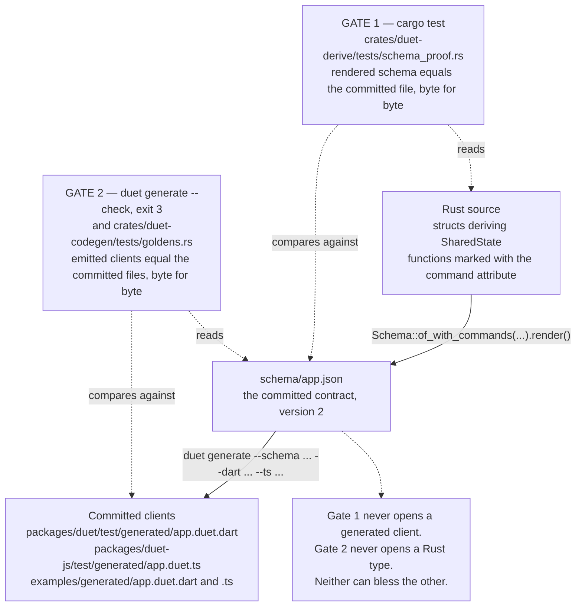
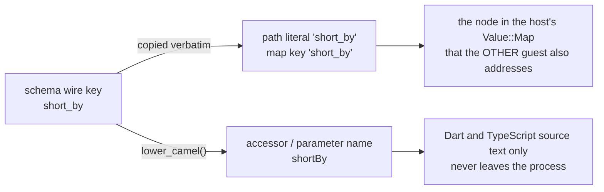
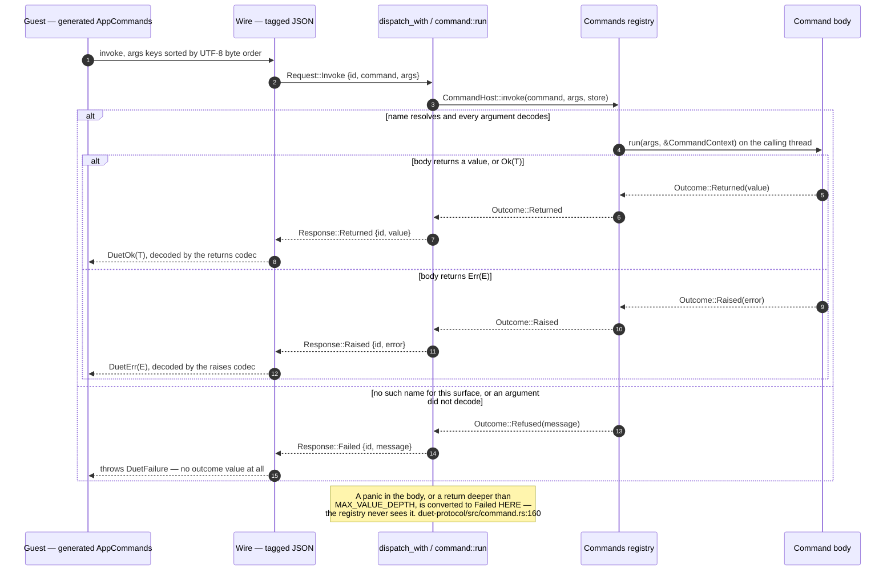

# Typed clients and commands

> One Rust type definition, three agreeing clients — and the reason each of the
> three agrees is a file in the middle that none of them owns.

Duet has two halves of the same story. **State** is a tree the host owns and the
guests read and write by path. **Commands** are host functions a guest asks to
have run. Both are described by one artifact — a schema document — and both come
out the far end as typed Dart and typed TypeScript.

This document covers both halves: how a Rust type becomes a schema, how a schema
becomes a client, what Duet accepts and refuses and why, and what the four wire
variants behind a typed `invoke` actually mean.

---

## 1. The pipeline, and the two gates

There are exactly three artifacts and two automated gates between them.



### Why the contract is a file and not a macro's opinion

The emitters were written **before** the derive macro, deliberately, and
`schema/app.json` was hand-written before either. `crates/duet-codegen/src/lib.rs:12`
states the reason:

> had the derive [come first], the format would have been whatever the macro
> happened to emit, the emitters would have been tested against that, and
> nothing would independently check either side.

So the file in the middle is an *independent target* with two producers — a
human, and `#[derive(SharedState)]` — and Gate 1 is the assertion that the
second reproduces what the first wrote
(`crates/duet-derive/tests/schema_proof.rs:177`).

The independence is built rather than promised. `duet-schema` renders the
document with a **hand-rolled writer** and has no `serde_json` dependency
(`crates/duet-schema/src/render.rs:4`); `duet-codegen` reads it back with a
`serde_json` **reader**. A `render → read → compare` round trip is therefore a
cross-check between two implementations that share no code
(`crates/duet-codegen/tests/round_trip.rs`), not `serde_json` agreeing with
itself.

### Why two gates rather than one

| Gate | What it can see | What it is blind to |
|---|---|---|
| Gate 1: derive → schema (`cargo test`) | a reordered field, a misspelled key, a widened number, a renamed command or parameter | whether any client was ever generated, or generated correctly |
| Gate 2: schema → clients (`--check`, goldens) | a stale committed client, a changed path literal, a changed method name | whether the schema still describes the Rust types |

A single gate comparing Rust types straight to generated Dart would have no
artifact to disagree with — it would be a generator checked against itself.
`crates/duet-derive/tests/mutation.rs` measures the claim rather than asserting
it: it perturbs one thing about the input at a time and records which check
notices, with a control test (`every_check_passes_on_the_unmutated_type`) that
stops the table being fiction.

Golden tests alone are explicitly *not* load-bearing. `crates/duet-codegen/tests/goldens.rs:4`
opens by saying so:

> a golden test proves the emitter still emits **what it emitted before**. It
> does not prove the output is correct. If the emitter minted `'editr.zoom'` on
> its first run, the golden would record the typo and every run afterwards would
> agree with it, forever.

The checks that a golden cannot make are listed in that same file, and the
strongest of them resolves every path literal from the committed goldens against
a real `duet_core::Store` (`crates/duet-codegen/tests/real_host.rs`).

---

## 2. Part A — State

### 2.1 The trait

Everything begins at one trait, `duet_schema::SharedState`
(`crates/duet-schema/src/state.rs:93`). It carries three obligations that must
agree with each other:

| Method | Job |
|---|---|
| `to_value(&self) -> Value` | lower the value onto the store's dynamic tree |
| `from_value(&Value) -> Result<Self, DecodeError>` | read it back — **totally**, for hostile input |
| `schema(&mut Registry) -> Ty` | describe the type so `duet-codegen` can emit Dart and TypeScript |

`from_value` is a decoder, not a deserializer. Another guest can write any value
to any path, so it must answer for a `Value::Bytes` where a struct was expected
just as calmly as for a well-formed map, and it must never panic
(`crates/duet-schema/src/state.rs:106`).

`to_value` must be a **function of the value**: two equal values must produce
byte-identical output. That single requirement is why `HashSet` is refused and
`HashMap<String, V>` is not — a set's iteration order would leak into a
`Value::List`, while a map's keys are collected into a `BTreeMap` that sorts them
(`crates/duet-schema/src/state.rs:96`).

### 2.2 What can be shared

From `crates/duet-schema/src/lib.rs:11`:

| Rust | Schema kind | `Value` |
|---|---|---|
| `bool` | `bool` | `Bool` |
| `i8` `i16` `i32` `i64` `u8` `u16` `u32` | `int` | `Int` |
| `f64` | `float` | `Float` |
| `String` | `string` | `Str` |
| `duet::Bytes` | `bytes` | `Bytes` |
| `duet_core::Value` | `dynamic` | anything |
| `Option<T>` | `optional` | the inner type, or `Null` |
| `Vec<T>` | `list` | `List` |
| `HashMap<String, V>`, `BTreeMap<String, V>` | `map` | `Map` |
| `Box<T>`, `Arc<T>` | the inner type | the inner type |
| a struct with a `SharedState` impl | `named` | `Map` |

Two details that surprise people:

- **Integers narrower than `i64` are range-checked on decode.** The wire has one
  integer type. A guest may write `300` to a `u8` path, and that is a reportable
  mismatch rather than a wrapped number.
- **`Vec<u8>` is accepted and lowers to a list of integers**, not to
  `Value::Bytes`. Use `duet::Bytes` for binary data.

The schema's type language is a *lowered* vocabulary, not a mirror of Rust
(`crates/duet-schema/src/ty.rs:3`). `i8`, `u32` and `i64` all collapse onto
`Ty::Int` because the wire has one integer type and the guests have to agree with
the host about what a path holds — narrowing is a Rust-side decode concern, and
"a `u8`" is not a promise the schema could make to Dart or TypeScript, neither of
which has one.

`Ty` itself (`crates/duet-schema/src/ty.rs:18`) has ten arms, and
`crates/duet-codegen/src/read.rs:64` pins their wire spellings in one list:
`bool`, `int`, `float`, `string`, `bytes`, `dynamic`, `optional`, `list`, `map`,
`named`. A coverage floor (`crates/duet-codegen/tests/coverage.rs`) asserts every
entry appears in a committed fixture, so a new arm cannot reach the emitters
without one.

### 2.3 What cannot, and why

From `crates/duet-schema/src/lib.rs:35`:

| Refused | Because |
|---|---|
| `u64` `u128` `i128` `usize` `isize` | `Value::Int` is an `i64`; `u64 > i64::MAX` has no representation, and `usize`/`isize` are platform-width |
| `f32` | lossless out, **lossy in**; Dart and TypeScript have no 32-bit float, so it buys nothing across the boundary |
| `HashSet<T>` | iteration order is not a function of the value, so `to_value` would not be either, and the output would not be byte-stable |
| `HashMap<K, V>`, `K` != `String` | `Value::Map` is keyed by `String`; lowering to a list of pairs would destroy path addressing |
| `&str`, `&[T]`, any borrow | the store owns a `'static` tree |
| `Rc` `RefCell` `Cell` `Mutex` `RwLock` | two handles to one node become two independent copies once they are values in the tree |
| `PathBuf` `OsString` | `OsString` is WTF-8 on Windows; `Value::Str` is UTF-8 only |
| `Duration` `SystemTime` `Instant` | no canonical wire spelling — choosing one silently is worse than making the developer choose |
| `Option<Option<T>>` | `Some(None)` and `None` both lower to `Null`; the collapse is unrepresentable |

#### Rejection is the absence of an impl, never token inspection

Every row above is refused by there simply being **no `SharedState` impl**. The
derive macro never looks at a field's type. `crates/duet-derive/src/lib.rs:40`
gives the reason, and it is not stylistic:

> A derive sees **syntax**, never resolved types, so a syntactic special case for
> `Vec<u8>` is defeated by `type Blob = Vec<u8>;` — silently, and in the
> direction of accepting what should have been refused. Trait resolution happens
> after type resolution and cannot be fooled that way.

So the compiler produces the rejection, and each refusal carries a
`#[diagnostic::on_unimplemented]` note naming the replacement. This is the
committed output for `crates/duet-derive/tests/ui/u64.rs`, abridged to the parts
that matter:

```text
error[E0277]: `u64` cannot be shared through a Duet store
 --> tests/ui/u64.rs:7:14
  |
7 |     counter: u64,
  |              ^^^ no `SharedState` impl exists for `u64`
  |
  = help: the trait `SharedState` is not implemented for `u64`
  = note: Duet refuses a type by not implementing `SharedState` for it. The usual fixes:
            `u64` `u128` `i128` `usize` `isize`  ->  `i64` (the wire's only integer is `i64`; `u64 > i64::MAX` has no representation)
            ...
```

`Option<Option<T>>` is refused through a second marker trait rather than through
a missing `SharedState` impl, because the collapse is about *nullability*, not
about the inner type being unshareable. `Option<T>` requires `T: NotNullable`
(`crates/duet-schema/src/state.rs:166`), and the resulting message names the
collapse directly (`crates/duet-derive/tests/ui/nested_option.stderr`):

```text
error[E0277]: `Option<i64>` may lower to `Value::Null`, so it cannot go inside an `Option`
 --> tests/ui/nested_option.rs:7:12
  |
7 |     maybe: Option<Option<i64>>,
  |            ^^^^^^^^^^^^^^^^^^^ `Option<Option<i64>>` would collapse `Some(null)` and `None` into one value
```

The same argument rules out `Option<duet_core::Value>`: a `Value` may *be*
`Value::Null`, so `Value` is `SharedState` but deliberately not `NotNullable`.

Two mechanical checks keep this honest, and both exist because a blanket impl
added later could quietly re-admit a refused type:

- `crates/duet-schema/tests/rejections.rs` resolves each `T: SharedState` bound
  to a compile-time `bool` and asserts every row of the table above is `false`.
  It cannot be fooled by a type alias, because `type Blob = Vec<u8>;` resolves
  before the bound is tested. It carries a control test asserting the harness can
  tell the two answers apart.
- `crates/duet-derive/tests/ui/` holds **34** `trybuild` compile-fail cases, each
  with rustc's rendered message committed beside it, so a rejection that stopped
  naming its fix is a diff.

#### The escape hatch

`SharedState` is public and hand-implementable on purpose
(`crates/duet-schema/src/state.rs:26`). That is why there is no
`#[duet(with = ...)]` attribute — an attribute would be a second, weaker way to
say what a hand-written impl already says precisely, and it would have to be
understood by a macro that cannot see types. This is the worked example from the
trait's own documentation (a compiled doctest):

```rust
use duet_core::Value;
use duet_schema::{DecodeError, NotNullable, Registry, SharedState, Ty};

/// A duration the application chose to spell as whole milliseconds.
#[derive(Debug, PartialEq)]
struct Millis(i64);

impl SharedState for Millis {
    fn to_value(&self) -> Value {
        Value::Int(self.0)
    }

    fn from_value(value: &Value) -> Result<Self, DecodeError> {
        match value {
            Value::Int(n) => Ok(Millis(*n)),
            other => Err(DecodeError::wrong_type("Millis", other)),
        }
    }

    fn schema(_registry: &mut Registry) -> Ty {
        Ty::Int
    }
}

// Required only so `Option<Millis>` is expressible; see `NotNullable`.
impl NotNullable for Millis {}
```

This is not a workaround; it is the supported answer for a `SystemTime` newtype,
a domain enum, or a type from a crate you do not own. It is used in anger in
`crates/duet-derive/tests/replaces_handwritten.rs:96`, where a `PathArg` newtype
moves a path-parse failure out of a command body and into argument decoding.

### 2.4 The three `#[duet(...)]` attributes

From `crates/duet-derive/src/lib.rs:56`:

| Attribute | Written on | Effect |
|---|---|---|
| `#[duet(rename = "window_title")]` | a field | changes the **wire key**, not the accessor rule |
| `#[duet(skip)]` | a field | the field is not shared state; requires `Default` |
| `#[duet(crate = ::my_reexport)]` | the struct | redirects every path in the generated code |

`skip` requires `Default` through a third marker trait,
`SkippedDefault` (`crates/duet-schema/src/state.rs:197`), which exists purely so
the requirement arrives as a sentence naming the fix rather than as a bare
"`Default` is not implemented" pointing into generated code.

### 2.5 What the derive generates

Two impls, and nothing else (`crates/duet-derive/src/generate.rs:32`): an
`impl SharedState` calling `<FieldTy as SharedState>::to_value` / `::from_value` /
`::schema` once per field, and an unconditional `impl NotNullable` — sound
because a derived `to_value` always produces a `Value::Map` and so never a
`Value::Null`.

There is no logic in the output. `crates/duet-derive/src/generate.rs:3`:

> There are no branches a reviewer has to simulate, no helper functions hidden in
> a `const _: () = { ... }`, and no control flow beyond "this key was absent" and
> "this field did not decode".

Hygiene is enforced two ways and checked against a module that shadows `Result`,
`Option`, `Ok`, `Err`, `Some`, `None`, `String` and `Vec` and never mentions
`duet` (`crates/duet-derive/tests/hygiene.rs`): every emitted path is absolute
(`::duet::…`, `::core::…`, `::std::…`), and every local binding is minted at
`Span::mixed_site()`.

A refusal expands to `compile_error!` — one per problem, each spanned on the
token that caused it — and **never** to a panic
(`crates/duet-derive/src/lib.rs:110`). A panicking proc macro reports "custom
attribute panicked" with the macro's own backtrace and no span into the user's
file, which is the worst diagnostic in the language to be handed for a misspelled
attribute.

### 2.6 The schema document

`Schema::of::<T>()` derives and validates (`crates/duet-schema/src/schema.rs:43`);
`Schema::of_with_commands::<T>(describe)` does the same with commands described
into **the same `Registry`** (`crates/duet-schema/src/schema.rs:69`). The closure
matters: a command returning or raising a struct must render as
`{"kind": "named", …}` *and* that struct must appear in `types`, whether or not
the root reaches it. A caller handed a finished `Vec<CommandDef>` would have built
it against a registry of its own.

`Schema::render()` (`crates/duet-schema/src/render.rs:65`) writes byte-stable
JSON: object keys sorted, `types` sorted by name, `commands` sorted by name, two-
space indentation, exactly one trailing newline, no floats emitted anywhere.

This is the whole of `schema/app.json` — the committed contract that
`schema_proof.rs` reproduces and every generated client is built from:

```json
{
  "commands": [
    {
      "name": "bump",
      "params": [
        {"key": "path", "type": {"kind": "string"}},
        {"key": "by", "type": {"kind": "int"}}
      ],
      "raises": {"kind": "dynamic"},
      "returns": {"kind": "int"}
    },
    {
      "name": "raise",
      "params": [],
      "raises": {"kind": "named", "name": "Unlucky"}
    },
    {
      "name": "session.ping",
      "params": []
    },
    {
      "name": "subtract",
      "params": [
        {"key": "a", "type": {"kind": "int"}},
        {"key": "b", "type": {"kind": "int"}}
      ],
      "returns": {"kind": "int"}
    }
  ],
  "root": {"kind": "named", "name": "App"},
  "types": [
    {
      "fields": [
        {"key": "counter", "type": {"kind": "int"}},
        {"key": "editor", "type": {"kind": "named", "name": "Editor"}},
        {"key": "title", "type": {"kind": "string"}}
      ],
      "name": "App"
    },
    {
      "fields": [
        {"key": "zoom", "type": {"kind": "float"}},
        {"key": "theme", "type": {"kind": "string"}}
      ],
      "name": "Editor"
    },
    {
      "fields": [
        {"key": "code", "type": {"kind": "string"}},
        {"key": "short_by", "type": {"kind": "int"}}
      ],
      "name": "Unlucky"
    }
  ],
  "version": 2
}
```

**Sorted, except where sorting would be wrong.** `types` and `commands` are
sorted by name because a type and a command are reached by name and never by
position, so registration order carries no meaning and letting it into the file
would make reordering a list a diff. A struct's `fields` and a command's `params`
keep **declaration order**, because generated constructors and argument lists in
Dart and TypeScript take them positionally — so reordering them is a
source-breaking change for every guest and must be a deliberate edit to the Rust
declaration rather than an emergent property of a map's iteration order
(`crates/duet-schema/src/ty.rs:118`, `crates/duet-schema/src/command.rs:56`,
`crates/duet-schema/src/render.rs:177`).

Version 2 adds `commands`; version 1 was `root`, `types`, `version`
(`crates/duet-schema/src/render.rs:35`). The reader accepts both
(`SUPPORTED_VERSIONS = &[1, 2]`, `crates/duet-codegen/src/read.rs:78`).
`"commands"` is emitted even when empty, so that "absent" means exactly one
thing: version 1.

The Rust that produces those exact bytes is
`crates/duet-derive/tests/schema_proof.rs`, and it contains no `FieldDef`, no
`Registry::define`, no `Ty` and no `CommandDef` — four derives, four `#[command]`s
and the declarations they sit on:

```rust
#[derive(Debug, Clone, PartialEq, SharedState)]
struct App {
    counter: i64,
    editor: Editor,
    title: String,
}

#[derive(Debug, Clone, PartialEq, SharedState)]
struct Editor {
    zoom: f64,
    theme: String,
}

#[derive(Debug, Clone, PartialEq, SharedState)]
struct Unlucky {
    code: String,
    short_by: i64,
}

static COMMANDS: [CommandEntry; 4] = commands![subtract, raise, bump, ping];

fn rendered_with_commands<T: SharedState>() -> String {
    Schema::of_with_commands::<T>(|registry| describe(&COMMANDS, registry))
        .unwrap_or_else(|e| panic!("the derived schema should be valid: {e}"))
        .render()
}
```

Note `Unlucky`: it is reached by **no field of `App` at all** — only by a
command's `raises` — and it lands in `types` regardless. That is the whole reason
`of_with_commands` shares one registry, and
`the_derived_schema_registers_exactly_the_types_the_root_reaches` asserts both
directions (`schema_proof.rs:212`).

### 2.7 The casing rule

This is the single most important decision in the emitters, and it is stated once
in `crates/duet-codegen/src/name.rs:5`:

> **A wire key is never rewritten. An accessor name always is.**



#### What breaks without it

Camel-casing the path would give a Dart guest `editor.fontSize` and a Rust host
`editor.font_size` — two names for what everyone believes is one field. There is
no error anywhere: `Value::Map` accepts any key at a path's final segment, so both
writes succeed, both reads succeed, and **each guest sees only its own**
(`crates/duet-codegen/tests/casing.rs:9`). Two guests sharing one store is the
normal arrangement in Duet, not a corner case, which is exactly the situation this
would break in silence.

The rule is pinned from three directions:

| Check | Where | What it proves |
|---|---|---|
| accessor camel, path not | `crates/duet-codegen/tests/casing.rs` | both directions, including the failing spellings |
| encoder/decoder keys too | same file | a struct codec writes and reads map entries by the **wire** key |
| every golden path resolved on a real store | `crates/duet-codegen/tests/real_host.rs` | a camel-cased path fails against the host, not against an assertion |

And it is written into every generated file's header
(`crates/duet-codegen/src/emit.rs:100`):

```text
// Every path below is a string literal minted and validated when this
// file was generated. Nothing here builds a path out of a runtime
// value, and every path segment is the schema's own wire key, never a
// camel-cased one — the accessor names are camel-cased and the paths
// are not, deliberately, because two guests that disagree about a wire
// key silently stop seeing each other's writes.
```

`lower_camel` (`crates/duet-codegen/src/name.rs:195`) treats underscores as
separators that disappear, and leaves the rest of each part alone so `httpURL`
survives as `httpURL` rather than being flattened. It is deliberately lossy:
`font_size` and `fontSize` land on the same accessor. That is a **collision the
emitter reports rather than resolves**, because nothing in the toolchain can know
which of the two nodes the developer meant to reach.

### 2.8 Where each mistake is caught

Three different layers can refuse, and each refuses a different class of problem.
This matters in practice: a Rust host may legitimately share a type it never
generates a guest client for, so the emitters' rules must not be imposed on
`cargo check`.

| Refused at | Rule | Example | Cited at |
|---|---|---|---|
| `cargo check` (derive) | a key is not exactly one path segment | `#[duet(rename = "editor.zoom")]` | `crates/duet-derive/src/keys.rs:153` |
| `cargo check` (derive) | two fields on one wire key | two `rename`s onto `title` | `crates/duet-derive/src/keys.rs:174` |
| `cargo check` (derive) | two keys that camel-case alike | `font_size` and `fontSize` | `crates/duet-derive/src/keys.rs:197` |
| `Schema::of` (runtime) | duplicate key, name collision, dangling `Ty::Named`, cycle, declared depth past `MAX_VALUE_DEPTH` (61) | recursive `struct Node { next: Option<Box<Node>> }` | `crates/duet-schema/src/schema.rs:161` |
| `duet generate` (emitters) | a key that is not ASCII alphanumeric-or-underscore | `café` | `crates/duet-codegen/src/plan.rs:157` |
| `duet generate` | a key whose accessor is a Dart reserved word or an emitter-owned name | `class`, `router`, `self`, `toString` | `crates/duet-codegen/src/name.rs:51,128` |
| `duet generate` | a non-struct root | `{"kind": "int"}` at the root | `crates/duet-codegen/src/plan.rs:130` |
| `duet generate` | an `optional` anywhere but a field's own type | `Vec<Option<T>>` | `crates/duet-codegen/src/plan.rs:196` |
| `duet generate` | two generated declarations wanting one name | schema type `AppEditorClient` | `crates/duet-codegen/src/plan.rs:391` |
| `duet generate` | more than `MAX_CLASSES` (256) struct-typed paths | a diamond-shaped schema | `crates/duet-codegen/src/plan.rs:27` |

The split is explained at `crates/duet-derive/src/keys.rs:14`. The derive checks
only the two hazards that make two **distinct Rust fields indistinguishable
downstream**; everything else is a property of the two target languages, belongs
where that knowledge lives, and gets its own committed fixture under
`schema/unemittable/` (10 valid schemas the emitters refuse) beside
`schema/negative/` (35 documents `Schema::build` refuses).

Two of these are worth spelling out.

**`Option` inside a container.** `DuetCodec`'s type argument is non-nullable by
design, and that bound is what keeps "decoded to null" from colliding with
"refused" — so there is no codec for an optional list element. Lift the option to
the field, where the runtime has a second handle for it (`DuetOptionalField`
beside `DuetField`), or give the inner type a struct of its own
(`crates/duet-codegen/src/error.rs:181`).

**Path round-tripping.** Every minted path is run through the *real* parser and
checked to come back as the keys it was built from
(`crates/duet-codegen/src/plan.rs:369`). `Path::from_segments` only
`debug_assert!`s this, and a key that renders into a string parsing back as a
different path — one segment in, two out — is exactly the hazard. The schema
builder makes the same check with the same parser
(`crates/duet-schema/src/schema.rs:458`), and so does the derive
(`crates/duet-derive/src/keys.rs:145`). Three call sites, one parser, no
re-derived grammar.

### 2.9 Real generated state code

Both emitters read one language-neutral `Plan` (`crates/duet-codegen/src/plan.rs`)
and neither decides anything — a naming rule that lived in one emitter could
differ in the other, and the difference would show up only as two guests
addressing different nodes.

There are **no algorithms in the output**. Every decode, merge, push route and
absent/null/mismatch distinction lives in the hand-written guest runtime the
generated code delegates to, so a reviewer can check a whole generated diff by
reading it.

#### Dart — a nested accessor class

`packages/duet/test/generated/app.duet.dart:219-240`:

```dart
/// Typed accessors for `Editor` at `editor`.
///
/// Every path here is a literal; see this file's header.
final class AppEditorClient {
  /// Binds these accessors to [router].
  const AppEditorClient(this.router);

  /// The router every accessor below is bound to.
  final DuetRouter router;

  /// `Editor` itself, as one value at `editor`.
  DuetField<Editor> get self =>
      DuetField<Editor>(router, 'editor', const EditorCodec());

  /// `Editor.zoom` at `editor.zoom`.
  DuetField<double> get zoom =>
      DuetField<double>(router, 'editor.zoom', duetFloatCodec);

  /// `Editor.theme` at `editor.theme`.
  DuetField<String> get theme =>
      DuetField<String>(router, 'editor.theme', duetStringCodec);
}
```

Every struct-typed path gets a class of its own, which is what makes
`client.editor.zoom` a compile-time literal rather than a runtime join.

#### TypeScript — the same class

`packages/duet-js/test/generated/app.duet.ts:187-215`:

```typescript
/**
 * Typed accessors for `Editor` at `editor`.
 *
 * Every path here is a literal; see this file's header.
 */
export class AppEditorClient {
  /** The router every accessor below is bound to. */
  readonly router: DuetRouter;

  /** Binds these accessors to `router`. */
  constructor(router: DuetRouter) {
    this.router = router;
  }

  /** `Editor` itself, as one value at `editor`. */
  get self(): DuetField<Editor> {
    return new DuetField<Editor>(this.router, 'editor', editorCodec);
  }

  /** `Editor.zoom` at `editor.zoom`. */
  get zoom(): DuetField<number> {
    return new DuetField<number>(this.router, 'editor.zoom', duetFloatCodec);
  }

  /** `Editor.theme` at `editor.theme`. */
  get theme(): DuetField<string> {
    return new DuetField<string>(this.router, 'editor.theme', duetStringCodec);
  }
}
```

#### The casing rule, visible

`Unlucky.short_by` is the field that makes the rule concrete. Dart data class
(`app.duet.dart:139-149`):

```dart
/// `Unlucky`, as the schema describes it.
final class Unlucky {
  /// Creates an `Unlucky`.
  const Unlucky({required this.code, required this.shortBy});

  /// The `code` field.
  final String code;

  /// The `short_by` field.
  final int shortBy;
```

and its codec (`app.duet.dart:169-190`):

```dart
  @override
  DuetValue encode(Unlucky value) {
    return DuetMap(<String, DuetValue>{
      'code': duetStringCodec.encode(value.code),
      'short_by': duetIntCodec.encode(value.shortBy),
    });
  }

  @override
  Unlucky? decode(DuetValue value) {
    if (value is! DuetMap) return null;
    final DuetReading<String> code =
        duetRequiredReading<String>(duetStringCodec, value.entries['code']);
    if (code is! DuetPresent<String>) return null;
    final DuetReading<int> shortBy =
        duetRequiredReading<int>(duetIntCodec, value.entries['short_by']);
    if (shortBy is! DuetPresent<int>) return null;
    return Unlucky(code: code.value, shortBy: shortBy.value);
  }
```

The member is `shortBy`; the map key is `'short_by'`, in both the encoder and the
decoder. TypeScript agrees (`app.duet.ts:118-124`):

```typescript
/** `Unlucky`, as the schema describes it. */
export interface Unlucky {
  /** The `code` field. */
  readonly code: string;
  /** The `short_by` field. */
  readonly shortBy: bigint;
}
```

#### The scalar mappings

`crates/duet-codegen/src/dart.rs:398` and `crates/duet-codegen/src/ts.rs:425`:

| `Ty` | Dart | TypeScript | Dart codec |
|---|---|---|---|
| `Bool` | `bool` | `boolean` | `duetBoolCodec` |
| `Int` | `int` | `bigint` | `duetIntCodec` |
| `Float` | `double` | `number` | `duetFloatCodec` |
| `Str` | `String` | `string` | `duetStringCodec` |
| `Bytes` | `List<int>` | `Uint8Array` | `duetBytesCodec` |
| `Dynamic` | `DuetValue` | `DuetValue` | `duetDynamicCodec` |
| `List(T)` | `List<T>` | `T[]` | `duetListCodec<T>(…)` |
| `Map(V)` | `Map<String, V>` | `Map<string, V>` | `duetMapCodec<V>(…)` |
| `Named(N)` | `N` | `N` | `const NCodec()` |

`bigint`, not `number`, and `packages/duet-js/src/value.ts:44` says why it is not
negotiable: the wire's integer domain is `i64`, and the golden corpus pins
`9007199254740993` — one above 2^53, where a JavaScript `number` starts skipping
odd integers. A `number`-backed client reads that as `9007199254740992` and
re-emits it wrong, with no error anywhere. The same argument is why the wire
carries integers as decimal *strings* in the first place.

An optional field gets the other handle. From
`packages/duet/test/generated/wide.duet.dart:412-417`:

```dart
  DuetOptionalField<String> get maybeLabel =>
      DuetOptionalField<String>(router, 'maybe_label', duetStringCodec);

  /// `Wide.maybe_ratios` at `maybe_ratios`.
  DuetOptionalField<List<double>> get maybeRatios =>
      DuetOptionalField<List<double>>(router, 'maybe_ratios', duetListCodec<double>(duetFloatCodec));
```

---

## 3. Part B — Commands

### 3.1 Why commands exist at all

Reading and writing state is not enough on its own. Some things a guest needs
done are *logic* — validate this, then write three paths; call a platform API the
renderer cannot reach. `Request::Invoke` is how a guest asks
(`crates/duet-protocol/src/command.rs:1`).

### 3.2 `#[command]` on a function

```rust
#[command]
fn subtract(a: i64, b: i64) -> i64 {
    a.saturating_sub(b)
}

#[command]
fn raise() -> Result<(), Unlucky> {
    Err(Unlucky {
        code: "unlucky".to_string(),
        short_by: 42,
    })
}

#[command]
fn bump(ctx: &CommandContext, path: String, by: i64) -> Result<i64, Value> {
    let parsed = duet::Path::parse(&path).map_err(|e| Value::Str(e.to_string()))?;
    let current = match ctx.store().get(&parsed) {
        Ok(Some(Value::Int(n))) => n,
        _ => return Err(Value::map([("code", Value::Str("absent".into()))])),
    };
    let next = current.saturating_add(by);
    ctx.store()
        .set(&parsed, Value::Int(next))
        .map_err(|e| Value::Str(e.to_string()))?;
    Ok(next)
}

#[command(rename = "session.ping")]
fn ping() {}
```

(`crates/duet-derive/tests/schema_proof.rs:69-109` — these four are the commands
`schema/app.json` declares.)

The macro emits **the function unchanged**, plus a hidden braced struct of the
same name carrying an `impl duet::Command`
(`crates/duet-derive/src/command/generate.rs:45`). Braced rather than unit,
deliberately: a unit struct would occupy the value namespace too and collide with
the function it is named after, whereas a braced one exists only as a type — so
`add` is the function in expression position and the command in type position,
and one `use` brings both.

The function stays callable from Rust exactly as it was. The macro adds a
description of it beside it rather than replacing it, and it re-emits the item
even when it refuses the model — because a `#[command]` that erased the item
would turn one mistake into a page of "cannot find function" at every call site
(`crates/duet-derive/src/command.rs:23`).

#### Arguments by value, the context by reference

This is the one decision made from syntax, and it has to be — a macro sees
tokens, never resolved types (`crates/duet-derive/src/command/model.rs:182`).

| Written | Treated as | Bound checked |
|---|---|---|
| `a: i64` (by value) | an argument, decoded from `args` under key `"a"` | `i64: CommandParam` (i.e. `SharedState`) |
| `ctx: &CommandContext` (by reference) | the invocation's context | `&CommandContext: FromContext` |

*What* either one is remains a question for trait resolution, which makes every
wrong spelling fail closed at `cargo check`
(`crates/duet-command/src/context.rs:80`):

- `type Ctx = CommandContext; fn f(c: &Ctx)` — the alias resolves, the impl
  applies, the command works. Token inspection would have refused it.
- `fn f(s: &str)` — no `FromContext` impl, so it is a compile error naming the
  trait.
- `type CtxRef<'a> = &'a CommandContext; fn f(c: CtxRef<'_>)` — not *written* as
  a reference, so it is treated as an argument, and `CtxRef` is not
  `SharedState`. Also a compile error.

`crates/duet-derive/tests/ui/command_borrowed_argument.stderr` is the committed
message for the second case:

```text
error[E0277]: a `#[command]` parameter written as a reference must be `&CommandContext`
 --> tests/ui/command_borrowed_argument.rs:7:17
  |
7 | fn label(title: &str) -> String {
  |                 ^^^^ `&str` is not how a command receives its context
  |
  = help: the trait `FromContext<'_>` is not implemented for `&str`
```

Argument types are refused by exactly the same mechanism state fields are. There
is one impl and no special cases (`crates/duet-command/src/param.rs:56`):

```rust
impl<T: SharedState> CommandParam for T {
```

so `u64` in an argument position produces the same `SharedState` diagnostic it
produces in a struct field, and `type Blob = Vec<u8>;` behaves exactly as
`Vec<u8>` does.

#### Argument keys go through the identical checks fields do

`crates/duet-derive/src/command/model.rs:245` calls the very same
`keys::check_all` a struct's fields go through
(`crates/duet-derive/src/keys.rs:126`) — one path segment, no duplicates, no
camel-case collisions — with only the *wording* specialised, because a message
offering `#[duet(skip)]` to someone writing a command offers an attribute that
does not exist there. An argument occupies a key in a `Value::Map` exactly as a
field does and is named in a generated client exactly as a field is; a second
copy of the rules would be a second thing to keep in step.

#### Signature shapes the macro refuses

`crates/duet-derive/src/command/model.rs:116` and `attr.rs`:

| Refused | Reason |
|---|---|
| `async fn` | a body runs synchronously on the thread that called `dispatch_with`, and there is no async runtime anywhere in Duet. On macOS that thread also drives the UI. |
| `unsafe fn` | the generated body calls it, and a macro cannot assert a safety contract on a caller's behalf |
| generic `fn` | the schema names a command once; every instantiation would claim that one name with a different argument shape |
| variadic `fn` | the schema records a fixed list of named arguments, and there is no wire spelling for "and then some more" |
| a method (`self` receiver) | a command is reached by name from a guest, with no receiver to resolve |
| a pattern, `ref` binding or `_` parameter | an argument key is a parameter *name*, and these have none |
| `#[command(skip)]` | a command's arguments are the whole of its input, so a skipped one would be an argument the guest cannot supply and the body still requires |
| `#[duet(rename)]` on the context | the context occupies no key to rename |
| an illegal `rename` | checked against the real `duet_schema::is_legal_command_name`, not a re-derived grammar |

The `async` refusal is worth quoting in full, because it explains a design
constraint rather than a missing feature
(`crates/duet-derive/tests/ui/command_async.stderr`):

```text
error: `#[command]` cannot describe an `async fn`: a command body runs synchronously, on the thread that called `dispatch_with`, and there is no async runtime anywhere in Duet to hand a future to.
       That is deliberate rather than unimplemented — on macOS that thread also drives the UI, so a command that waits freezes the window it was called from.
       Fixes: make the body synchronous, or spawn a thread of your own, return immediately, and write the result into the store when it arrives — a subscription will deliver it.
```

`is_legal_command_name` (`crates/duet-schema/src/command.rs:135`) is the one
predicate in `duet-schema` that is `pub` specifically so the derive can call it:
`Schema::of_with_commands` would refuse the same name at startup, but that is a
runtime failure of a program that compiled, and it names a schema entry rather
than the Rust function that produced it. A name is a dot-separated sequence of
identifiers — `subtract` and `documents.rename` are names; `.rename`,
`documents.` and `2fast` are not.

### 3.3 What a command's return type says

`CommandDef` carries `returns` and `raises` separately, and both are `Option`
(`crates/duet-schema/src/command.rs:51`). The mapping from a Rust signature is
one trait with four impls, `CommandReturn`
(`crates/duet-command/src/returns.rs:81`):

| Rust return | `returns` | `raises` | `Outcome` | Impl |
|---|---|---|---|---|
| `T: SharedState` | `T` | absent | `Returned(T)` | `returns.rs:92` |
| `()` or no `->` | absent | absent | `Returned(Null)` | `returns.rs:106` |
| `Result<T, E>` | `T` | `E` | `Returned(T)` / `Raised(E)` | `returns.rs:123` |
| `Result<(), E>` | absent | `E` | `Returned(Null)` / `Raised(E)` | `returns.rs:140` |

Absence is spelled by **omitting the key** — not by a JSON `null`, and not by a
`{"kind": "unit"}`. A `Ty` describes a value that can exist in the store, and
inventing an arm for "no value" would make it expressible as a struct field,
where it would mean nothing and every emitter would need an opinion about it
(`crates/duet-schema/src/command.rs:40`). Compare `session.ping` in the schema
above: `"params": []` and neither key.

A command with no `returns` still *answers*: the wire carries `Value::Null`.
`returns` describes the type, and there is none.

#### The marker parameter

`CommandReturn<Marker>` carries a type parameter nobody ever names, because
Rust's coherence rules have no negative reasoning
(`crates/duet-command/src/returns.rs:9`): the compiler cannot use "`()` does not
implement `SharedState`" to rule out `impl<T: SharedState> CommandReturn for T` as
a candidate for `()`, so the four impls would be a "conflicting implementations"
error before any user wrote any command. The macro writes `_` for the marker and
the compiler infers it.

That inference is unambiguous only while at most one impl applies to each return
type — which is a property of `duet-schema`, not of this module: it holds because
neither `()` nor `Result<T, E>` implements `SharedState`.
`crates/duet-schema/tests/rejections.rs` asserts both mechanically for exactly
this reason.

#### `Refused` is not in that table, on purpose

A `#[command]` body **cannot** produce an `Outcome::Refused`
(`crates/duet-command/src/returns.rs:63`). Refusal means the host would not run
the call at all, and by the time a body is running, that has already succeeded. A
body that wants to report failure returns `Err`, which the guest receives as
`raised`.

This is a real constraint, and it is documented as one: a hand-written
`CommandHost` can refuse from inside a body and a `#[command]` cannot. The
`#[command]` spelling of the same thing is a parameter type whose
`SharedState::from_value` rejects the input — which is a refusal, produced by
`CommandParam` at the point the argument arrives.
`crates/duet-derive/tests/replaces_handwritten.rs` re-expresses the hand-written
stdio host's four commands with `#[command]` and records exactly where the
behaviour differs, including this one.

### 3.4 What `#[command]` generates

Two things (`crates/duet-derive/src/command/generate.rs:30`): the hidden marker
type, and an `impl Command` with a `describe` and a `run`. Keeping both on one
trait is deliberate (`crates/duet-command/src/entry.rs:14`) — a generated Dart
client is built against `describe` and talks to `run`, so a command whose two
halves disagreed would be a client that compiles and cannot call anything.

`describe` is one `FieldDef` per argument plus the two reply types
(`generate.rs:73`); `run` binds each parameter, calls the function, and lowers
what it returned (`generate.rs:105`). The single interesting line in `run` is the
argument-decode arm (`generate.rs:145`):

```rust
let #binding = match <#ty as #krate::CommandParam>::from_args(#key, &#args) {
    ::core::result::Result::Ok(#binding) => #binding,
    // An argument that is missing or is not this type means the
    // call never got as far as doing anything, which is a
    // `failed` and not a `raised`.
    ::core::result::Result::Err(#why) => {
        return #krate::Outcome::Refused(#why);
    }
};
```

The wording of that refusal lives in `CommandParam`
(`crates/duet-command/src/param.rs:61`), not in the expansion, so every command
composes it identically and it is tested in one place. It names the argument and
the *kind* that arrived, never the value: arguments are guest-chosen and
unbounded, and a one-megabyte string argument must not become a one-megabyte
reply.

### 3.5 Registering commands — and why that is the authorization boundary

```rust
static COMMANDS: [CommandEntry; 3] = commands![subtract, raise, bump];
```

(`crates/duet-backend-macos/examples/webview_commands.rs:144`.)

`CommandEntry::of::<C>()` is a `const fn` and everything it reads is
`const`-evaluable, so that line is a table in the binary's read-only data
(`crates/duet-command/src/entry.rs:42`). No initialization order to reason about,
no `OnceLock`, no allocation, and no way for the table to be assembled twice or
not at all. The macro names the *functions* because the hidden type shares their
names and lives in the other namespace
(`crates/duet-command/src/entry.rs:127`).

The table feeds two things:

```rust
// the schema
Schema::of_with_commands::<App>(|registry| describe(&COMMANDS, registry))
// the running registry
let commands = Commands::from_entries(&COMMANDS);
```

`Commands` (`crates/duet-command/src/lib.rs:100`) **is** the authorization
boundary, and the reason is structural:

> A guest names a command; it does not name a permission, a role, or itself.
> Whether the name resolves is decided entirely by what the embedder put in the
> `Commands` it built the surface with — so a webview running untrusted content
> and a trusted Flutter surface can be given two different registries over the
> same store, and the webview has no vocabulary for the commands it was not
> given.

This is the same shape as `Request::Subscribe`, which carries no `SubscriberId`
because the host supplies it: a guest that could name its own caller identity
could name another guest's, and authorization decided by the party being
authorized is not authorization
(`crates/duet-protocol/src/message.rs:126`). `Request::Invoke` accordingly carries
no caller identity at all — only `id`, `command` and `args`.

That is why the schema deliberately does **not** carry a permission field
(`crates/duet-schema/src/command.rs:8`): a permission in the schema would be a
claim about a decision made somewhere the schema cannot see.

An unregistered name is an `Outcome::Refused`, never an `Outcome::Raised`, and
the refusal names only the command that was asked for
(`crates/duet-command/src/lib.rs:221`) — no registry listing, no near-match
suggestion. A message that helpfully suggested `secret.rotate_keys` when asked
for `secret.rotate_key` would hand a guest a map of the host's API one typo at a
time. `Commands::names()` exists for diagnostics and is deliberately not exposed
to guests.

### 3.6 Where a handler runs, and what it may not do

`crates/duet-protocol/src/command.rs:82` is the contract, and it names a thread
rather than saying "any thread":

`CommandHost::invoke` runs **synchronously, on the thread that called
`dispatch_with`**, inside that call's stack frame. In Duet's shipped macOS backend
that is the **platform (main) thread**: `wry`'s IPC handler and Flutter's
binary-messenger handler are both invoked there, and both call `dispatch_with`
inline. It is **never** the runtime's core thread.

| A handler may | A handler must not |
|---|---|
| `get` / `set` / `subscribe` through the `StoreHandle` | block, sleep, or wait on I/O |
| compute for microseconds | wait for anything the main thread must produce |
| return a `Value` within `MAX_VALUE_DEPTH` (61) | assume it runs on a thread of its own |

Being off the core thread is precisely *why* a handler may use its `StoreHandle`
freely — `a_command_body_may_call_back_into_the_store`
(`crates/duet-protocol/src/command.rs:517`) is the proof, asserting both the
returned value and what landed in the store, because a body whose `set` silently
failed would still return the right number.

Blocking is the prohibition that matters, and Duet has no async runtime to hand
slow work to — there is no tokio anywhere in the workspace, deliberately. An
embedder that needs a slow command should spawn its own thread, return
immediately, and publish the result into the store, where a subscription will
deliver it.

One hazard the runtime's own guard cannot see: `duet_runtime`'s `ON_CORE_THREAD`
check is a **same-thread** check. An embedder that calls `dispatch_with` from
inside a `Sink::deliver` gets `RuntimeError::ReentrantCall` from every
`StoreHandle` call in the handler — ugly, but reported rather than hung
(`a_command_body_called_on_the_core_thread_is_refused_rather_than_deadlocked`,
`crates/duet-protocol/src/command.rs:570`). A cycle through *two* threads is
invisible to it. Hence: do not block.

#### Two guarantees enforced at the choke point

`duet_protocol::command::run` (`crates/duet-protocol/src/command.rs:160`) is the
single place every `invoke` passes through, including hand-written
`CommandHost`s. So:

- **A panic becomes a `failed` reply**, not a process abort and not an unanswered
  guest call. The caught payload is deliberately not echoed — it is arbitrary user
  text of arbitrary length, a guest can do nothing with it, and Rust has already
  printed it and its backtrace to stderr.
- **An over-deep return becomes a `failed` reply.** A command return is the first
  value a host holds that never passed through the store, so it is the first place
  the depth bound is reachable through a new door. The offending value is then
  taken apart **iteratively** before being dropped
  (`dismantle`, `crates/duet-protocol/src/command.rs:251`) — `Value`'s derived
  `Drop` is recursive, and letting a 100 000-deep value fall out of scope
  overflows the stack, which in Rust is an abort rather than a catchable error.
  Rejecting a value would be pointless if the rejection crashed on the way out.

`duet-command` deliberately duplicates neither guard
(`crates/duet-command/src/lib.rs:46`), and pins that decision with a test
(`a_panicking_handler_is_caught_by_the_protocol_not_by_this_crate`) so a future
"defensive" `catch_unwind` is recognised as redundant rather than as the thing
keeping the suite green.

### 3.7 The wire

| Direction | Variant | Carries | Meaning |
|---|---|---|---|
| guest → host | `Request::Invoke` | `id`, `command`, `args` | run this command |
| host → guest | `Response::Returned` | `id`, `value` | the command **ran** and returned |
| host → guest | `Response::Raised` | `id`, `error` | the command **ran** and returned `Err` |
| host → guest | `Response::Failed` | `id`, `message` | the host **refused**: no such name, an argument did not decode, the body panicked, or the return was too deep |

(`crates/duet-protocol/src/message.rs:135,190,205,222`.)

Real bytes, from `crates/duet-command/src/lib.rs:407` — a registry driven the way
a transport drives it, guest text in and wire text out:

```text
in : {"kind":"invoke","id":"8","command":"double","args":{"t":"m","v":{"n":{"t":"i","v":"21"}}}}
out: {"id":"8","kind":"returned","value":{"t":"i","v":"42"}}

in : {"kind":"invoke","id":"9","command":"double","args":{"t":"m","v":{}}}
out: {"error":{"t":"m","v":{"code":{"t":"s","v":"bad_args"}}},"id":"9","kind":"raised"}
```

And from `corpus/wire-corpus.json`, the committed cases every language decodes:

```text
{"error":{"t":"m","v":{"code":{"t":"s","v":"insufficient_funds"},"short_by":{"t":"i","v":"250"}}},"id":"60","kind":"raised"}
{"id":"53","kind":"returned","value":{"t":"n"}}
{"args":{"t":"m","v":{}},"command":"documents.reset","id":"50","kind":"invoke"}
```

Note the wire rules on display: ids and integers are canonical decimal *strings*,
JSON object keys are byte-sorted, `args` is a tagged map, and a command with no
result answers `{"t":"n"}` — `Value::Null`.

`Response::Returned` carries a `Value` and not an `Option<Value>`, deliberately
(`crates/duet-protocol/src/message.rs:196`): JSON `null` already means "the path
is absent" everywhere else in this format, and spending that distinction twice on
two different questions is how a format ends up with a value nobody can interpret
without knowing which field they are looking at.

#### `raised` versus `failed` — the distinction the wire pays for

`Outcome` has three arms, not two (`crates/duet-protocol/src/command.rs:42`):

> a command that *ran* and returned an error (`Outcome::Raised`) is a different
> event from one the host would not run at all (`Outcome::Refused`). A guest that
> cannot tell them apart cannot decide whether retrying is safe.

And `Response::Raised` is not a `Response::Failed`
(`crates/duet-protocol/src/message.rs:214`) because `failed` carries a `String`,
and flattening a developer's typed error into prose is **not reversible**: a guest
that wanted to match on `InsufficientFunds { short_by }` gets a sentence to regex
instead.

`a_refusal_answers_failed_not_raised` (`crates/duet-protocol/src/command.rs:356`)
carries the comment that makes the point best: *a host that collapsed them would
pass every other test in this file.*

### 3.8 One invocation, end to end



The three outcomes are three distinct events. `returned` and `raised` both mean
the body executed; `failed` means it did not.

### 3.9 The guest result types

There are two sealed types, layered.

#### `DuetInvocation` — the untyped answer, two arms

`packages/duet/lib/src/duet_client.dart:60` (TypeScript equivalent at
`packages/duet-js/src/client.ts:99`):

```dart
sealed class DuetInvocation { const DuetInvocation(); }
final class DuetReturned extends DuetInvocation { … final DuetValue value; }
final class DuetRaised   extends DuetInvocation { … final DuetValue error; }
```

**Why two arms and not four.** The rustdoc answers directly
(`duet_client.dart:44`): this is `DuetReading`'s argument applied to a narrower
question. `DuetReading` has **four** arms — `DuetPresent`, `DuetNone`,
`DuetAbsent`, `DuetMismatch` (`packages/duet/lib/src/typed/duet_reading.dart:50-110`)
— because the host has four states a *path* can be in and the wire spends a
distinct spelling on each; collapsing any two would delete a distinction the
protocol pays for. An `invoke` that ran has exactly **two** states, and the wire
spends `returned` and `raised` on them.

**Why `failed` is not a third arm.** Because the two types differ in what they do
with failure, and the reason is structural rather than stylistic
(`duet_client.dart:48`):

> a `DuetReading` is also produced by a push, which has no call stack to throw
> into, so `get` may not throw either. An `invoke` is only ever a reply to a call
> this guest made, so there is a stack, and a refusal is free to use it.

So `failed` stays a thrown `DuetFailure`, alongside every other host refusal the
client throws. Both hierarchies are `sealed`, so a caller that handles only
`DuetReturned` fails to compile rather than silently treating a command's error
as a success — which is the failure this type exists to make impossible, and
which an `invoke` returning a bare `DuetValue` would invite.

#### `DuetOutcome` — the typed answer, three arms

`packages/duet/lib/src/typed/duet_outcome.dart:37`
(`packages/duet-js/src/typed/outcome.ts:89`): the same two arms with the values
decoded through the schema's codecs, **plus** one for an answer that did not
decode at all.

| Arm | Meaning |
|---|---|
| `DuetOk<T, E>` / `{kind: 'ok'}` | the command returned, and this client decoded it |
| `DuetErr<T, E>` / `{kind: 'err'}` | the command returned `Err`, and this client decoded it |
| `DuetUndecodable<T, E>` / `{kind: 'undecodable'}` | the command answered, and the codec its schema calls for refused the answer |

The third arm exists because a generated client binds the codecs the *schema*
declares, and the host is a separate process that may be older, newer, or simply
wrong (`duet_outcome.dart:25`). Collapsing that into a thrown exception would make
an ordinary version skew look like a bug in the caller; collapsing it into `null`
would make it indistinguishable from a command that returned nothing. It carries
a `raised: bool` flag, because a `returned` that did not decode and a `raised`
that did not decode are different events — and only the first means the call may
have succeeded.

The whole algorithm behind every generated command method is this one function
(`packages/duet/lib/src/typed/duet_outcome.dart:120`):

```dart
DuetOutcome<T, E> duetDecodeOutcome<T extends Object, E extends Object>(
  DuetInvocation invocation,
  DuetCodec<T> returns,
  DuetCodec<E> raises,
) {
  switch (invocation) {
    case DuetReturned(:final DuetValue value):
      final T? decoded = returns.decode(value);
      return decoded == null
          ? DuetUndecodable<T, E>(value: value, raised: false)
          : DuetOk<T, E>(decoded);
    case DuetRaised(:final DuetValue error):
      final E? decoded = raises.decode(error);
      return decoded == null
          ? DuetUndecodable<T, E>(value: error, raised: true)
          : DuetErr<T, E>(decoded);
  }
}
```

`returns` decodes a `returned` and `raises` decodes a `raised`; neither is ever
applied to the other's arm. A command that declares no `returns` (or no `raises`)
is generated with `duetDynamicCodec` there, which decodes anything — so the
`DuetUndecodable` arm cannot fire for a type the schema never described.

The TypeScript version diverges in exactly one way, and says why
(`packages/duet-js/src/typed/outcome.ts:74`): Dart's sealed hierarchy carries both
type arguments on every arm, whereas TypeScript's unions are structural, so
`DuetOk` needs only `T` and `DuetErr` only `E`. Same arms, same tags, same
semantics.

### 3.10 Real generated command code

#### Dart

`packages/duet/test/generated/app.duet.dart:242-266`:

```dart
/// The commands `App` declares, as typed methods.
///
/// Every command name and every argument key here is a literal; see this
/// file's header. A method returns what the command *answered*; a host that
/// refused to run it throws [DuetFailure] out of [DuetClient.invoke].
final class AppCommands {
  /// Binds these commands to [client].
  const AppCommands(this.client);

  /// The client every command below is invoked through.
  final DuetClient client;

  /// Invokes `bump`.
  ///
  /// Returns `int`.
  /// Raises `DuetValue`.
  Future<DuetOutcome<int, DuetValue>> bump({required String path, required int by}) async =>
      duetDecodeOutcome<int, DuetValue>(
        await client.invoke('bump', <String, DuetValue>{
          'by': duetIntCodec.encode(by),
          'path': duetStringCodec.encode(path),
        }),
        duetIntCodec,
        duetDynamicCodec,
      );
```

and the dotted name (`app.duet.dart:279-288`):

```dart
  /// Invokes `session.ping`.
  ///
  /// Returns nothing; the schema declares no type, so this is the raw value.
  /// Raises nothing; the schema declares no type, so this is the raw value.
  Future<DuetOutcome<DuetValue, DuetValue>> sessionPing() async =>
      duetDecodeOutcome<DuetValue, DuetValue>(
        await client.invoke('session.ping'),
        duetDynamicCodec,
        duetDynamicCodec,
      );
```

#### TypeScript

`packages/duet-js/test/generated/app.duet.ts:234-252`:

```typescript
  /**
   * Invokes `bump`.
   *
   * Returns `bigint`.
   * Raises `DuetValue`.
   */
  async bump(params: {
    readonly path: string;
    readonly by: bigint;
  }): Promise<DuetOutcome<bigint, DuetValue>> {
    return duetDecodeOutcome<bigint, DuetValue>(
      await this.client.invoke('bump', new Map<string, DuetValue>([
        ['by', duetIntCodec.encode(params.by)],
        ['path', duetStringCodec.encode(params.path)],
      ])),
      duetIntCodec,
      duetDynamicCodec,
    );
  }
```

#### Three things to read out of those

**The signature order and the args order differ, on purpose.** `bump`'s Rust
signature — and therefore the schema's `params` — is `path`, then `by`. The
generated *parameter list* keeps that declaration order. The generated *args
literal* is sorted by the wire keys' UTF-8 bytes, so `by` comes before `path`
(`PlannedCommand::sorted_params`, `crates/duet-codegen/src/command.rs:75`). The
reason is that the wire format orders a map's keys by their bytes, and a literal
written in declaration order would rely on every guest runtime sorting on the way
out — which two of the three do, and which no test of the *generated* code would
notice the day one stopped.

**The wire name is untouched.** `session.ping` becomes the method `sessionPing`
via `command_method` (`crates/duet-codegen/src/name.rs:184`), which collapses a
dot exactly as it collapses an underscore — but the string passed to
`client.invoke` is `'session.ping'`. `crates/duet-codegen/src/command.rs:5`
states the hazard: a client that camel-cased it would produce
`client.invoke('documentsClose')` against a host holding `documents.close` — no
compile error, no runtime error, just a refusal at the far end of a call the
developer believed was typed.

**An undeclared position becomes `dynamic`.** `subtract` declares no `raises`, so
its generated signature is `DuetOutcome<int, DuetValue>` with `duetDynamicCodec`
in the raises slot (`crates/duet-codegen/src/command.rs:50`). The wire still
answers; `dynamic` is the one type that describes "whatever arrives" without
inventing an arm for it.

The emitters own one extra identifier inside the commands class:
`COMMANDS_OWNED = ["client"]` (`crates/duet-codegen/src/name.rs:140`). It is kept
separate from `EMITTER_OWNED = ["router", "self"]` because a schema *field* called
`client` is perfectly emittable, and refusing it would impose a rule on state that
only commands need. Inside the commands class, though, `client` is the field every
method body reads and — in Dart, where a named parameter shadows a field for the
whole body — a name a parameter would silently steal.

An `optional` anywhere in a command's signature is refused by name rather than
lifted (`crates/duet-codegen/src/command.rs:174`). A struct field has a second
handle for optionality; a command signature does not — an argument is encoded
through one codec and a result decoded through one codec, and `DuetCodec`'s type
argument is non-nullable by design.

### 3.11 The generated client against a live host

The check a golden comparison cannot make. From
`packages/duet/test/live_host_test.dart:557`:

> `client.invoke('sessionPing')` is not a syntax error, not a type error and not
> a decode error; it is a refusal at run time, and a byte comparison would have
> recorded the camel-cased spelling as the truth forever.

Real assertions from that file, driving `AppCommands` over a pipe to
`duet-host-stdio`:

```dart
// arguments bind by key, not by position — subtraction is not commutative
expect(await commands().subtract(a: 10, b: 3), const DuetOk<int, DuetValue>(7));
expect(await commands().subtract(a: 3, b: 10), const DuetOk<int, DuetValue>(-7));

// a raised error arrives decoded into its schema type
final DuetOutcome<DuetValue, app.Unlucky> outcome = await commands().raise();
expect(outcome, isA<DuetErr<DuetValue, app.Unlucky>>());
final app.Unlucky error = (outcome as DuetErr<DuetValue, app.Unlucky>).error;
expect(error.code, 'unlucky');
expect(error.shortBy, 42,
    reason: 'the accessor is camel-cased and the wire key is not');

// a dotted name reaches the host uncamel-cased
expect(
  await commands().sessionPing(),
  const DuetOk<DuetValue, DuetValue>(DuetNull()),
  reason: 'a command with no declared result answers null',
);

// a command writes the store the generated accessors read
final app.AppClient state = app.AppClient(router);
expect(await state.counter.get(), const DuetPresent<int>(0));
expect(await commands().bump(path: 'counter', by: 5),
       const DuetOk<int, DuetValue>(5));
expect(await state.counter.get(), const DuetPresent<int>(5));

// a name the host does not register throws; it never becomes a DuetErr
await expectLater(
  client.invoke('sessionPing'),
  throwsA(isA<DuetFailure>()),
  reason: 'the camel-cased spelling must not resolve on the host',
);
```

The TypeScript suite makes the same assertions against the same host
(`packages/duet-js/test/live-host.test.ts:891` onwards), with `{kind: 'ok'}` /
`{kind: 'err'}` in place of the sealed classes.

The transport half is proved separately, because stdio is not the transport a
shipped application uses. `crates/duet-backend-macos/examples/webview_commands.rs`
drives a live `wry` `WebView` running real JavaScript against real `#[command]`
functions, and `flutter_commands.rs` does the same through a Flutter engine's
binary messenger. Both are examples rather than tests, because `tao`'s event loop
must be built on the process's main thread, which `cargo test`'s harness does not
provide. Neither claims anything visual: this machine has no reachable on-screen
WindowServer for spawned processes.

---

## 4. Running the generator

```text
duet generate --schema <path> [--dart <path>] [--ts <path>] [--check]
```

| Exit code | Meaning |
|---|---|
| 0 | the files were written, or `--check` found them up to date |
| 1 | the schema could not be read, or a file could not be written |
| 2 | the command line was wrong |
| 3 | `--check` found a file that differs from what would be generated |

(`crates/duet-cli/src/help.rs`.)

At least one of `--dart` and `--ts` is required: a run that generated nothing
would exit 0 and look exactly like a run that succeeded. Missing parent
directories are created. Each file is written to a temporary name in its own
directory and renamed into place only after **every** file has been staged, so a
failure part-way through leaves the previous contents intact.

`--check` is the gate a user outside this workspace can reproduce
(`crates/duet-cli/src/lib.rs:28`): the `cargo test` staleness checks are stronger,
but they are unavailable to somebody who has `duet` installed and a schema of
their own. This is the exact CI step, from `.github/workflows/duet.yml:206-213`:

```yaml
      - name: Assert the committed example clients are what duet generates
        run: |
          set -euo pipefail
          cargo run -p duet-cli --locked --quiet -- generate \
            --schema schema/app.json \
            --dart examples/generated/app.duet.dart \
            --ts examples/generated/app.duet.ts \
            --check
```

It is pointed at `examples/generated/` rather than at the committed goldens under
`packages/*/test/generated/`, and the workflow says why so nobody "fixes" it
later: those goldens are generated with the TypeScript import specifiers
overridden to reach into `packages/duet-js/src`, because they live inside that
package and it cannot import itself by name before a build.
`examples/generated/` is generated with the **defaults** — the published
`duet-protocol` specifiers a third party gets — so this step exercises the path
nothing else does.

The CLI is deliberately thin (`crates/duet-cli/src/lib.rs:5`): every
transformation is a call into `duet-codegen`, which the goldens, the round-trip
cross-check, the real-host path check and both guest conformance suites already
gate. What the CLI adds is a command line, a file system, and exit codes.

Getting a schema in the first place: a Rust type deriving `SharedState` renders
one with `duet::Schema::of::<App>()?.render()`. Or write the JSON by hand — the
format is the contract, and nothing about it assumes a Rust producer.

---

## 5. Where every claim in this document is checked

| Claim | Check | File |
|---|---|---|
| the derive reproduces the hand-written schema, byte for byte | `cargo test` | `crates/duet-derive/tests/schema_proof.rs` |
| that comparison can actually fail | mutation testing with a control | `crates/duet-derive/tests/mutation.rs`, `mutation_commands.rs` |
| refused types genuinely have no impl | compile-time trait resolution, with a control | `crates/duet-schema/tests/rejections.rs` |
| each rejection still names its fix | 34 committed `trybuild` cases | `crates/duet-derive/tests/ui/` |
| generated clients are not stale | goldens + `duet generate --check` | `crates/duet-codegen/tests/goldens.rs`, CI step |
| the schema format means one thing | `render → read → compare` across two independent implementations | `crates/duet-codegen/tests/round_trip.rs` |
| every golden path addresses a real node | resolved against a live `Store` | `crates/duet-codegen/tests/real_host.rs` |
| accessors are camel and paths are not | both directions, plus the failing spellings | `crates/duet-codegen/tests/casing.rs` |
| every `Ty` arm is reached by a fixture | coverage floor | `crates/duet-codegen/tests/coverage.rs` |
| a valid schema the emitters must refuse is refused | 10 committed schemas | `schema/unemittable/` |
| an invalid document is refused | 35 committed schemas | `schema/negative/` |
| generated command names resolve on a live registry | schema ↔ registry cross-check | `crates/duet-host-stdio/tests/commands.rs` |
| the generated clients work against a real host | live-host conformance, both languages | `packages/duet/test/live_host_test.dart`, `packages/duet-js/test/live-host.test.ts` |
| an `invoke` survives the real transports | macOS examples over `wry` IPC and Flutter's messenger | `crates/duet-backend-macos/examples/webview_commands.rs`, `flutter_commands.rs` |
| the wire bytes are the same in three languages | 63 accept / 37 reject cases read by Rust, Dart and TypeScript | `corpus/wire-corpus.json` |
| the schema seed and every bound path agree across languages | read by both guest packages | `corpus/schema-corpus.json` |
