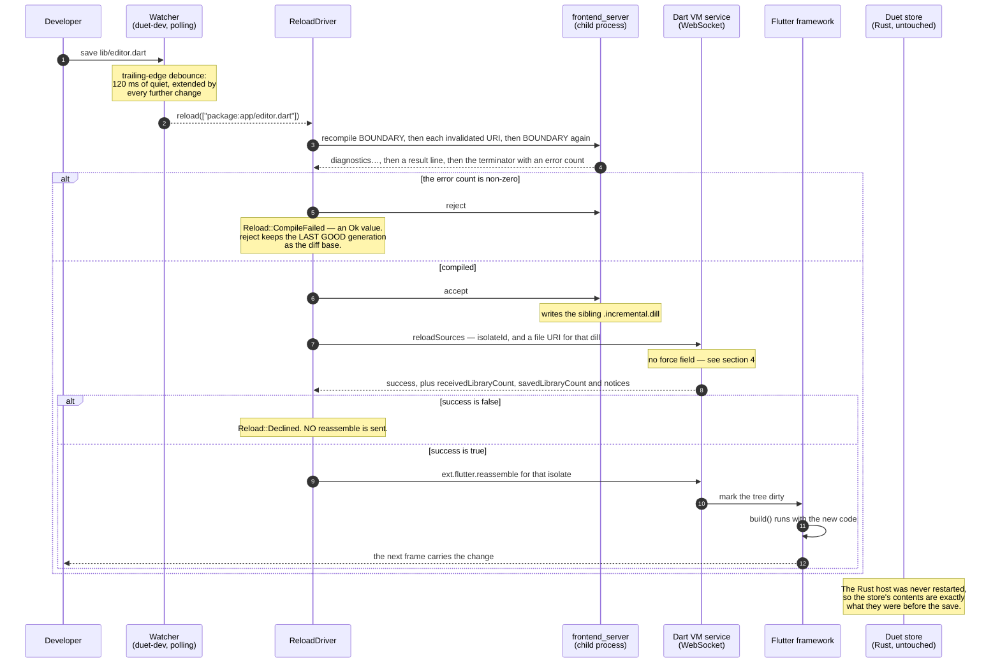

# Hot reload

`duet dev` edits a running application. You save a `.dart` file; roughly 43 ms
later the change is in a rendered frame, the Rust host has never restarted, and
the shared store still holds everything it held before.

That last clause is the part specific to Duet. Hot reload in Flutter is not new;
what is new here is that the *host* owns the state, so a reload cannot lose it
even in principle — and that a Rust program with no `flutter_tools` anywhere in
it drives the whole cycle itself.

This chapter covers what the cycle is, which process does which part, the two
traps that cost real time to find (`force: true`, and the fd-1 redirect), and
exactly what has been measured.

Everything here is `crates/duet-dev` (the driver, platform-independent),
`crates/duet-cli/src/dev.rs` (the `duet dev` command) and
`crates/duet-backend-macos/examples/hot_reload.rs` (the proof against a real
engine).

---

## 1. What a developer runs

```console
$ duet dev --flutter ./flutter -- cargo run -p my-host
```

`--flutter` names the Flutter project directory — the one with `pubspec.yaml`
and `.dart_tool/`. Everything after `--` is the host command, kept as a `Vec`
and never split on whitespace, because a host path routinely contains a space
and no quoting the developer tried would survive a split
(`crates/duet-cli/src/args.rs:87-92`). `--flutter-root` selects the SDK, falling
back to `FLUTTER_ROOT`; `--entrypoint` overrides the `package:` URI, which is
otherwise derived from the project's own package name.

A session prints its configuration, then one line per reload
(`crates/duet-cli/src/dev.rs:302-317`):

```
[duet dev] reloaded in 43 ms (recompile 7 ms, reload 21 ms, reassemble 13 ms) — 4 librar(y/ies) reloaded, 544 kept
```

**The host must be a debug/JIT build.** A release/AOT engine has no Dart VM
service, so there is nothing to reload through. That is the single most likely
way for a new user to fail, and `duet dev --help` says so — with a test asserting
the help text still says it (`the_dev_help_says_the_host_must_be_a_debug_build`,
`crates/duet-cli/src/help.rs:173`).

### The two things that are not failures

A `duet dev` session survives both of the ordinary things that go wrong while
editing code, and the design treats each as an outcome rather than an error.

| Event | Modelled as | What the developer sees |
|---|---|---|
| the Dart does not compile | `Reload::CompileFailed` — an `Ok` value | the compiler's own diagnostics, untruncated, then `The host is still running; fix it and save again.` |
| the VM declines the reload | `Reload::Declined` — also `Ok` | the VM's own `notices`, then `Restart the host to pick it up. (Hot reload cannot change a class's shape, an enum's values, or a const class's fields.)` |

(`crates/duet-dev/src/reload.rs:88-114`; the reporting at
`crates/duet-cli/src/dev.rs:318-347`.)

A compile error is the single most common thing that happens in a hot-reload
loop, and it is not a failure *of the driver* — the driver worked perfectly and
its answer is "this does not compile, here is why"
(`crates/duet-dev/src/frontend_server.rs:20-27`). The crate's stated rule is that
a dev tool which panics on a syntax error is worse than useless, because the
developer now has to restart the session as well as fix the typo
(`crates/duet-dev/src/lib.rs:34-37`). There is no `unwrap`, `expect` or `panic!`
in `duet-dev` outside tests.

Only a genuine driver failure ends the session — the compiler process is gone, or
the VM service is unreachable — because every subsequent save would fail the same
way and printing the same error on every keystroke helps nobody
(`crates/duet-cli/src/dev.rs:180-186`).

---

## 2. The cycle

Four legs, and each one is a separate deadline.



The pipeline is stated the same way in the crate root
(`crates/duet-dev/src/lib.rs:11-25`) and implemented in one function,
`ReloadDriver::reload` (`crates/duet-dev/src/reload.rs:213-275`).

Two of those arrows are easy to get wrong, and both are load-bearing
(`crates/duet-dev/src/reload.rs:22-29`):

- **`reject` after a failed compile.** Without it the failed generation stays as
  the incremental baseline, so the *next* recompile diffs against broken code and
  produces a diff that does not describe the fix.
- **No `reassemble` after a declined reload.** Rebuilding the widget tree when no
  new code was loaded is at best pointless work on the UI thread, and at worst
  hides the decline behind a UI that visibly did something.

### `Timings`, and what the number does *not* include

`Reload::Applied` carries a `Timings` with `recompile`, `reload`, `reassemble`
and `total` (`crates/duet-dev/src/reload.rs:68-86`). `total` spans
`ReloadDriver::reload`'s own entry and exit — not the gap between the developer
saving the file and the driver being called, and not the gap between the driver
returning and the change appearing in a frame. Neither of those is observable
from inside the driver. The doc comment says so explicitly and names what does
measure end-to-end: `duet-backend-macos`'s `hot_reload` example, which is §7.

---

## 3. The three pieces

### 3.1 `frontend_server`, as a managed child

`duet-dev` launches the Dart SDK's `frontend_server` snapshot under
`dartaotruntime` and keeps it alive for the whole session
(`crates/duet-dev/src/frontend_server.rs:115-149`). The flags mirror
`flutter_tools`' own resident compiler for a debug build:

| Flag | Why |
|---|---|
| `--sdk-root <patched sdk>` | the Flutter-patched Dart SDK |
| `--incremental` | keep state between compiles; this is the whole point |
| `--target=flutter` | |
| `--track-widget-creation` | debug builds default this on, and the kernel the engine booted from was built with it. A mismatch means the diff and the running program disagree about widget constructors. |
| `--experimental-emit-debug-metadata` | parity with `flutter_tools` |
| `--no-print-incremental-dependencies` | **load-bearing for parsing**, not performance: without it every compile also prints 150–600 `+file://…` lines that the line protocol has no way to distinguish from diagnostics |
| `--packages <package_config.json>` | |
| `--output-dill <path>` | the baseline; the sibling `<path>.incremental.dill` is what each recompile writes |

The protocol is line-based over the child's stdin and stdout. A recompile is a
boundary key, the invalidated `package:` URIs one per line, then the boundary
again (`crates/duet-dev/src/compiler_protocol.rs:178-188`):

```text
recompile duet-dev-7
package:app/editor.dart
duet-dev-7
```

Spike C only ever invalidated the entrypoint, because it only ever edited
`main.dart`. A real watcher sees edits anywhere in the project, so every changed
URI is listed — listing only the entrypoint would make the compiler miss them.
An empty invalidation list falls back to the entrypoint, which is what a caller
meaning "reload whatever changed, I do not know what" should pass: the compiler
re-reads the whole import graph from there
(`crates/duet-dev/src/reload.rs:202-221`).

`<output>.incremental.dill` is documented nowhere. Spike C found it by looking in
the working directory after a successful recompile
(`crates/duet-dev/src/frontend_server.rs:182-190`). The driver nonetheless
*prefers* whatever path the compiler reports on its `result` line, so an SDK that
moves the file keeps working (`crates/duet-dev/src/reload.rs:236-242`).

Everything that makes a child process survivable is handled explicitly
(`crates/duet-dev/src/frontend_server.rs:4-18`):

| Hazard | Handling |
|---|---|
| the child dies | its stdout closing is an ordinary EOF, indistinguishable from a clean end of stream unless you look. Every read distinguishes them and reports `DevError::CompilerExited` with the exit status and the tail of stderr. |
| the child hangs | `BufRead::read_line` on a pipe waits forever, so reads go through a reader thread and a channel and every one carries a deadline and a `Stage`. |
| the child writes to stderr | captured into a bounded tail of 40 lines (a compiler stuck in a loop outruns any reader, and an unbounded buffer in a long session is a leak) and surfaced in the error that needs it. Spike C let it inherit the terminal, which scrambles a tool's own output. |
| the child emits garbage | a future SDK changing the line protocol surfaces as `DevError::CompilerProtocol`, not as a hang. |

`accept` deliberately does not wait for a reply
(`crates/duet-dev/src/frontend_server.rs:232-246`): the confirmation it sometimes
emits arrives interleaved with the *next* command's output, where the result
parser discards it as stray. Waiting for something that may never come is a hang.

### 3.2 The Dart VM service client

Three RPCs, and no more (`crates/duet-dev/src/vm_service.rs`):

| RPC | Purpose | Stage |
|---|---|---|
| `getVM` | find the isolate to reload | `find-isolate` |
| `reloadSources` | apply the incremental kernel diff | `reload-sources` |
| `ext.flutter.reassemble` | make Flutter rebuild the widget tree with the new code | `reassemble` |

The WebSocket, its handshake and its framing are hand-written in this crate
(`ws.rs`, `frame.rs`, `sha1.rs`, `base64.rs`), so `duet-dev` needs no HTTP or
WebSocket dependency.

`main_isolate` takes the **first** isolate `getVM` reports, which is the main
isolate in every configuration this project boots: one `FlutterEngine`, one
`runWithEntrypoint`, no `Isolate.spawn` in any guest. If a guest ever spawns one,
this becomes wrong quietly — so the isolate count is reported in the error when
there are none, and callers log which id was chosen
(`crates/duet-dev/src/vm_service.rs:141-152`).

`ReloadReport` keeps the two library counts, and they are not decoration
(`crates/duet-dev/src/vm_service.rs:39-44`):

> Spike C measured `savedLibraryCount: 752` against `receivedLibraryCount: 2` on
> a one-line edit, and a driver that stopped at `success: true` could not tell
> [an incremental reload and a full one] apart.

`reassemble` is sent after every successful `reloadSources`, matching
`flutter_tools`. Spike C could not isolate whether it is strictly required — its
fixture had a `Ticker` requesting frames anyway — so this keeps parity rather
than betting on it (`crates/duet-dev/src/vm_service.rs:207-212`).

**Every wait has a deadline and every failure names a stage**
(`crates/duet-dev/src/lib.rs:39-42`). A reload involves a child process's pipe, a
TCP connect and two JSON-RPC round trips, any of which can hang forever, so
`Stage` is on every `DevError` and "it hung" is always "it hung at
`reload-sources`". The twelve stages are `locate-sdk`, `spawn-compiler`,
`baseline-compile`, `locate-vm-service`, `connect`, `find-isolate`, `recompile`,
`accept`, `reload-sources`, `reassemble`, `observe`, `watch`
(`crates/duet-dev/src/error.rs:34-60`) — and those strings are written out by
hand (`error.rs:62-88`) rather than derived from `Debug`, because they are what a developer greps
for and what a future `--json` mode would emit.

The defaults (`crates/duet-dev/src/reload.rs:57-66`) are far above anything
measured, because a deadline's job is to turn a hang into a report, not to police
performance:

| Leg | Default |
|---|---|
| `baseline` (the one-off full compile) | 120 s |
| `connect` | 20 s |
| `rpc` (any single JSON-RPC round trip) | 30 s |
| `recompile` | 60 s |

A first compile of a large app genuinely takes seconds — Spike C's took 3.8 s —
which is why the baseline gets its own, much longer budget.

One deadline detail worth copying: `VmServiceClient::call` sets **one deadline
for the whole exchange, not per frame**, so an event storm cannot extend the wait
for the driver's own reply (`crates/duet-dev/src/vm_service.rs:120-123`).

### 3.3 The file watcher

`Watcher` polls `stat` rather than using `notify`, and the crate argues the
choice rather than assuming it (`crates/duet-dev/src/watch.rs:3-24`): `notify`
wraps three genuinely different OS mechanisms with three genuinely different sets
of quirks — FSEvents reports directory-granular events with a coalescing latency,
inotify needs one watch descriptor per directory and silently stops at a per-user
limit, and all three can drop events under load and leave a watcher permanently
stale. Polling cannot miss a change, behaves identically everywhere, and its
state is a map this crate owns and can test with an injected clock. The cost is
about a millisecond of `stat` calls every quarter second for a few hundred files.

Where that stops being right is stated too: tens of thousands of files, or
sub-10 ms detection. Neither describes a Dart source tree — and the watcher does
not descend into `.dart_tool`, `build`, `.git`, `.idea`, `.dart` or `ios`
(`watch.rs:47`). The first two are not noise-filtering: they hold generated
output *including the very dill this crate writes*, so watching them would make
the driver retrigger on its own compiler's output, forever.

Three details:

- **Debounce is trailing-edge.** A batch is released only after 120 ms of quiet,
  and every change seen during the wait extends it. An editor saving a file often
  produces several filesystem operations, and format-on-save produces a second
  write milliseconds after the first; recompiling on the first one means compiling
  a half-written file. The batch that comes out is the union of everything that
  changed — exactly the invalidated-file list `recompile` wants
  (`watch.rs:26-34`). `duet dev` polls every 60 ms against that 120 ms debounce,
  so a save is noticed within one debounce period rather than one poll period
  after it (`crates/duet-cli/src/dev.rs:69-73`).
- **A file's identity is mtime *and* size.** Filesystems vary in mtime
  resolution, and a formatter running immediately after a save can carry an
  identical timestamp; comparing the length too catches the overwhelmingly common
  case of that edit also changing the file's size (`watch.rs:83-94`).
- **The first `poll` reports nothing.** `Watcher::new` takes a baseline scan, so
  every file already present is *known*, not *changed* — otherwise every `duet
  dev` start would trigger a full recompile (`watch.rs:107-118`).

---

## 4. `force: true` is not a parameter you can pass

Spike C's most expensive finding, and the reason the `reloadSources` request in
this crate is a struct with no such field.

Passing `"force": true` on `reloadSources` **aborts the Dart VM**, inside its own
C++ runtime, with:

```
Unable to use class Library:'package:flutter/src/widgets/framework.dart'
Class: StatelessWidget which is not loaded yet
```

It is not a recoverable RPC error; the process dies. The cause is coherent once
you see it: `force` asks the VM to reload every library, but an incremental diff
only *contains* the changed one, so the VM is told to re-finalize declarations it
was not given. `flutter_tools`' own call in `run_hot.dart` never passes it.
(`crates/duet-dev/src/vm_service.rs:9-24`.)

The defence is structural rather than a comment
(`crates/duet-dev/src/vm_service.rs:59-75`):

```rust
/// The one shape a `reloadSources` request may take here. See this module's
/// docs: the absence of a `force` field is the point.
#[derive(Debug, Clone)]
struct ReloadSources<'a> {
    isolate: &'a IsolateId,
    /// A `file://` URI pointing at the incremental dill `frontend_server`
    /// just wrote.
    root_lib_uri: &'a str,
}

impl ReloadSources<'_> {
    fn params(&self) -> Value {
        json!({
            "isolateId": self.isolate.0,
            "rootLibUri": self.root_lib_uri,
        })
    }
}
```

`ReloadSources` has no `force` field, `reload_sources` builds its params from that
struct alone, and a test asserts the encoded request has no such key.
Reintroducing the crash takes editing a struct definition *and* deleting a test —
not forgetting a default.

This is worth generalising. The finding was a single wrong JSON field, discovered
after two false starts down structural blind alleys, and Spike C's own writeup
says the false-starts section is arguably the most useful part of it. The way it
is prevented from recurring is by making the wrong value unrepresentable, not by
writing it down.

---

## 5. The fd-1 problem, and the two ways it was retired

Spike C recovered the VM service URI by `dup2`-ing its own file descriptor 1 onto
a pipe and scanning it. It had little choice: the engine prints
`The Dart VM service is listening on http://127.0.0.1:PORT/AUTHCODE/` from native
code with a raw write to fd 1, and Spike C hosted the engine *inside the same
process* as the reload driver.

The cost is real, and `crates/duet-dev/src/locate.rs:1-23` states it:

- fd 1 is fd 1. Once redirected, **everything** the process writes to stdout
  disappears into the same pipe — the host's own `println!`, any library's, any
  `dbg!`. Spike C coped by moving all of its own output to stderr, which is a rule
  every future line of code in the process has to keep, forever, with nothing to
  enforce it.
- It makes the process's stdout unusable for its actual purpose. `duet-host-stdio`
  speaks a *protocol* on stdout, so a Duet host that adopted this trick could not
  also be a stdio host.

Two replacements, neither of which touches a file descriptor.

### Route 1 — a child process's piped stdout (`duet dev`'s default)

`duet dev` starts the host itself, with `Stdio::piped()` stdout. The engine's
fd 1 is the *child's* fd 1, an ordinary pipe. The parent reads it, scans each line
for the announcement, and **echoes every line through to its own stdout** so the
developer still sees their app's output
(`crates/duet-cli/src/dev.rs:3-20`, `spawn_host` at `:205`, `await_announcement`
at `:252`).

Nothing is redirected, the parent's stdout is untouched, and the VM service keeps
its authentication code. This is not a workaround: it falls out of the
architecture the design already describes, where `duet dev` and the host are
separate processes.

Echoing is not a nicety either — this process owns the pipe, so a line it
swallowed is a line the developer never sees, and during startup those are
exactly the lines that explain why the host is taking so long
(`crates/duet-cli/src/dev.rs:249-251`). stderr is deliberately **inherited**
rather than piped, so a panic message reaches the terminal immediately and in the
right order relative to everything else on stderr (`:202-205`).

`Announcement::read` matches on the URL shape rather than on the sentence around
it (`crates/duet-dev/src/locate.rs:137-160`), because the engine's wording has
changed before ("Observatory listening on…" became "The Dart VM service is
listening on…") and the line may arrive with a `flutter: ` prefix. A line is only
accepted if it also mentions listening, so a developer's own `print` of an
unrelated URL cannot be mistaken for the announcement.

### Route 2 — engine switches (a host that reloads itself in-process)

The macOS embedder reads engine switches from the environment, so the VM service
can be *told* which port to use before it starts — making its URI known without
observing any output at all (`crates/duet-dev/src/locate.rs:81-93`):

```rust
pub fn engine_switches(port: u16) -> Vec<(String, String)> {
    vec![
        ("FLUTTER_ENGINE_SWITCHES".to_string(), "2".to_string()),
        ("FLUTTER_ENGINE_SWITCH_1".to_string(), format!("vm-service-port={port}")),
        ("FLUTTER_ENGINE_SWITCH_2".to_string(), "disable-service-auth-codes".to_string()),
    ]
}
```

The embedder reads `FLUTTER_ENGINE_SWITCHES` for a count and then
`FLUTTER_ENGINE_SWITCH_1…N`, prepending `--` to each value itself, which is why
the values carry no leading dashes. Measured on this machine: with
`vm-service-port=45671` and `disable-service-auth-codes`, the engine announced
exactly `http://127.0.0.1:45671/` (`crates/duet-backend-macos/FINDINGS.md`, F26).

The cost is stated rather than hidden, and it is why this is *not* the default
(`locate.rs:66-80`). `disable-service-auth-codes` removes the random path
component that otherwise guards the VM service. The VM service binds `127.0.0.1`
and exists **only in debug and profile builds**, so this cannot weaken a shipped
application — but within a debug session it does mean any process on the machine
that can reach that loopback port can drive the Dart VM: read memory, evaluate
expressions, load code. Route 1 gives the same result with the auth code left on,
so nothing has to be given up wherever a child process exists.

`free_port` (`locate.rs:109-125`) binds port 0, reads what the OS assigned, and
closes it. There is an unavoidable race between closing and the engine binding —
nothing in the sockets API can hand a port from one owner to another — but the
window is microseconds. If it is lost, the engine fails to start its VM service
and a `Timeout` at `locate-vm-service` reports it, rather than anything silently
connecting to the wrong process: a different service on that port would fail the
WebSocket handshake's accept check.

### The dead end, recorded

`write-service-info=<path>` would have given a known URI *with* the auth code.
The string is present in `FlutterMacOS.framework`'s binary, and the switch was
passed both as a plain path and as a `file://` URI. **No file ever appeared.** It
is not wired up in this embedder. Recorded in both the code
(`locate.rs:47-51`) and `FINDINGS.md` F26 so the next person does not spend the
same twenty minutes.

---

## 6. Where the pieces run

`crates/duet-backend-macos/examples/hot_reload.rs` is the only place in this
repository where a reload driver and a Flutter engine live in one process, and
its threading is Spike C's arrangement for Spike C's reasons
(`hot_reload.rs:72-80`):

- The reload driver blocks on a child process's pipes and a TCP socket.
- The Flutter engine runs its UI and platform work merged onto the **main**
  thread, which is also the thread `tao` pumps.

So all blocking I/O happens on a background thread that touches no Objective-C at
all — it holds only a `StoreHandle`, which is `Send + Sync` — while the main
thread keeps turning the run loop, which is what lets Flutter actually apply the
reload when it arrives.

The example polls the store rather than subscribing, and says why
(`hot_reload.rs:577-581`): the driver thread must not hold a notification sink,
because this process's sink marshals onto the `tao` event loop that the main
thread owns.

Under `duet dev` the separation is a process boundary instead, and the question
does not arise.

---

## 7. What has been measured

`crates/duet-backend-macos/examples/hot_reload.rs` boots a real engine with a real
attached view, writes into the Duet store, edits
`fixtures/duet_guest/lib/reload_driver.dart` on disk, and drives the real
`duet_dev::ReloadDriver`. **Ten iterations, three independent runs, all PASS**
(`crates/duet-backend-macos/FINDINGS.md`, F25).

| Claim | Evidence |
|---|---|
| every reload applied | 10/10 `reloadSources` reported `success: true` |
| each was incremental, not a full reload | **4 libraries received against 544 kept**, every iteration |
| the Dart change reached a rendered frame | 10/10 new markers came back out of the store after `build()` put them in a frame |
| **the Duet store's contents survived** | `hostWitness` written as `Int(4242)` before the first reload, reads back `Int(4242)` after the tenth |
| reload, not restart | the guest's `initState`-assigned nonce identical across all ten; its frame counter climbed 1 → 3 → 5 → … → 21, never resetting |

### The latency, and precisely what it spans

The clock starts at the driver's `std::fs::write` of the Dart source and stops
when the **new marker value is readable from the Rust store**
(`hot_reload.rs:40-51`). In between:

```text
fs::write -> frontend_server recompile -> reloadSources -> ext.flutter.reassemble
  -> Flutter rebuilds the tree -> build() puts the new marker in the frame
  -> the frame is produced -> addPostFrameCallback fires
  -> the guest writes it over duet/rpc -> duet-protocol decodes it
  -> the runtime's core thread applies it -> this thread reads it back
```

| Run | n | min | median | max | mean |
|---|---:|---:|---:|---:|---:|
| 1 | 10 | 38.1 ms | 40.0 ms | 59.1 ms | 42.2 ms |
| 2 | 10 | 39.7 ms | 43.0 ms | 58.6 ms | 43.6 ms |
| 3 | 10 | 39.3 ms | 43.0 ms | 57.5 ms | 44.6 ms |

`README.md:264-268` summarises these thirty samples as a **median of 43 ms**.

**This is not a camera.** This machine has no reachable on-screen WindowServer for
spawned processes, so "rendered" means Flutter produced the frame in-process —
the same thing Spike C measured, and the same thing the example's evidence PNG is
rasterized from with `cacheDisplayInRect:toBitmapImageRep:`. Nothing here observes
a monitor and nothing here claims to.

**It is faster than Spike C's 123.3 ms median, and that is not a speedup.** Spike
C's fixture rebuilt a whole `MaterialApp` with a `Ticker` running; this one
rebuilds three widgets, so the rebuild-and-paint leg is far cheaper. The leg
`duet-dev` actually controls — the incremental recompile — is comparable at
6–19 ms here against Spike C's 8.8–21.8 ms. Read the number as "the productionised
driver adds no measurable overhead to Spike C's recipe". This measurement is also
strictly *more* work than Spike C's: Spike C stopped when a bespoke
platform-channel handler saw the marker, and this continues through
`duet-protocol`'s decode and the runtime's core thread into the store.

### Why the nonce and the frame counter prove it was a reload

A hot **restart** re-runs `main()`, rebuilding the whole widget tree and
constructing a fresh `State`. A hot **reload** keeps both and only replaces code.
The fixture exploits exactly that
(`fixtures/duet_guest/lib/reload_driver.dart:32-44`):

- `_nonce` is assigned once, in `initState`, which a reload never re-runs. If it
  ever changed across a reload, the isolate was recreated.
- `_frames` counts every frame this `State` has ever produced, incremented from
  an `addPostFrameCallback`. It must climb monotonically; a reset means a new
  `State`.

Both are published into the shared store on every marker change, and the Rust side
asserts on them (`hot_reload.rs:739-769`). Spike C used a tap count for the same
purpose, and reported it identical (`tapCount: 3`) across all reloads.

The marker itself is a top-level `const String` alone on its line, so each edit is
a single-token change for the incremental compiler and the whole diff is one
library. It is read inside `build()`, which is what makes a changed value
observable only *after* a real rebuild. Anything reformatting that declaration
would silently break the proof, so the driver reports a clear failure instead of a
wrong reload if it cannot find the exact prefix
(`hot_reload.rs:605-616`), and the Dart side pins the prefix's spelling and its
occurring exactly once from its own tests.

The example edits a git-tracked file and restores `MARKER_V1` on **every** exit
path, including a panic in the driver thread — which is why the restore also runs
from the main thread at the end (`hot_reload.rs:826-844`).

### Why the store survives at all

Two independent reasons, and the framework only needs the first:

1. **The Rust host is never restarted.** `duet dev` starts it once and leaves it
   running; the store lives on the runtime's core thread in that process. A
   reload is an operation on the Dart isolate and never touches it.
2. **`reloadSources` patches the isolate in place**, so even the Dart heap keeps
   its `State` objects.

Governing principle, applied: a reload is a far weaker event than a teardown, and
Duet already promises that state survives a teardown. If state did not survive a
reload, nothing else in the framework would be trustworthy
(`hot_reload.rs:5-11`).

---

## 8. Limits, and what is not covered

- **Debug/JIT only.** A release/AOT engine has no Dart VM service. Every
  measurement in this project is from a debug build.
- **The web half of `duet dev` does not exist.** A Vite dev server for HMR in the
  webview guest is not wired in; the scope here is the Dart half of the design's
  §8.2 diagram (`crates/duet-dev/src/lib.rs:49-54`).
- **Rust-side restart-on-change is not here** either, deliberately: it is a plain
  rebuild-and-restart with no protocol to it.
- **Changes hot reload cannot express** — a class's shape, an enum's values, a
  const class's fields — come back as `Reload::Declined` with the VM's own
  notices, and need a restart. They are reported rather than silently not taking
  effect.
- **One isolate.** `main_isolate` takes the first one `getVM` reports; a guest
  that spawns isolates would need more than that.
- **Nothing visual has been observed.** See the note in §7, and
  `crates/duet-backend-macos/src/lib.rs:25-35`.
- `duet-dev` itself is platform-independent — it drives a child process, a TCP
  socket and the filesystem — and only `locate::engine_switches` is documented
  against a specific embedder, where it is inert on any other
  (`crates/duet-dev/src/lib.rs:56-58`).

---

## Source map

| Concern | File |
|---|---|
| The cycle, `Reload`, `Timings`, `Timeouts` | `crates/duet-dev/src/reload.rs` |
| The managed compiler and its line protocol | `crates/duet-dev/src/frontend_server.rs`, `compiler_protocol.rs` |
| The VM service client, and the absent `force` field | `crates/duet-dev/src/vm_service.rs` |
| The hand-written WebSocket | `crates/duet-dev/src/ws.rs`, `frame.rs`, `sha1.rs`, `base64.rs` |
| Finding the VM service without touching fd 1 | `crates/duet-dev/src/locate.rs` |
| The polling, debounced watcher | `crates/duet-dev/src/watch.rs` |
| `Stage` and `DevError` | `crates/duet-dev/src/error.rs` |
| SDK and `package_config.json` resolution | `crates/duet-dev/src/sdk.rs`, `packages.rs`, `url.rs` |
| The `duet dev` command and its session loop | `crates/duet-cli/src/dev.rs` |
| The end-to-end proof against a real engine | `crates/duet-backend-macos/examples/hot_reload.rs` |
| The Dart half of that proof | `fixtures/duet_guest/lib/reload_driver.dart` |
| Every measurement quoted here | `crates/duet-backend-macos/FINDINGS.md` (F25, F26), `spikes/spike-c-macos/FINDINGS.md` |
