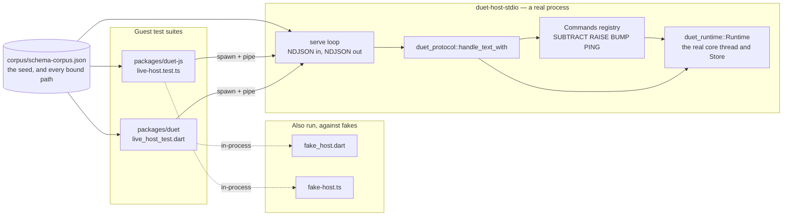

# How this project proves things

Duet makes claims that are easy to state and hard to check: three independent
implementations of one wire format agree byte for byte; two guests sharing a
store cannot disturb each other; a generated Dart client addresses the same node
a Rust host writes. None of those survive a test suite that merely runs green.

This chapter is about the checking. It covers the artifacts that make
cross-language agreement testable, why a hand-written fake host was not good
enough, how mutation testing is used as a review tool rather than a metric, and
the one failure mode this codebase has hit over and over — a structurally correct
test paired with input that cannot reach the failure.

The house rule everything else follows from is stated in
`crates/duet-backend-macos/FINDINGS.md:25`:

> **Never verify a pass you did not observe.**

---

## 1. The layers of evidence

| Layer | What it can see | Where |
|---|---|---|
| Unit and property tests | one crate's semantics | in-crate `#[cfg(test)]` modules and `tests/` |
| Compile-fail fixtures | that a rejection still names its fix | `crates/duet-derive/tests/ui/` — 34 cases |
| Committed negative schemas | that an invalid or unemittable document is refused | `schema/negative/` (35), `schema/unemittable/` (10) |
| Goldens | that generated output has not changed | `crates/duet-codegen/tests/goldens.rs` |
| **Cross-language corpora** | that Rust, Dart and TypeScript agree on the same bytes | `corpus/wire-corpus.json`, `corpus/schema-corpus.json` |
| **Live-host conformance** | that a guest agrees with the *real host* across a process boundary | `crates/duet-host-stdio` + both guest suites |
| **Mutation testing** | that a check can actually fail | `crates/duet-derive/tests/mutation.rs`, `mutation_commands.rs` |
| macOS example programs | that a real engine and a real webview behave as claimed | `crates/duet-backend-macos/examples/` — 7 programs |

Re-run while writing this document, on this machine:

```console
$ cargo test --workspace --exclude duet-backend-macos     # 1481 passed
$ cd packages/duet && dart test                           #  469 passed
$ cd packages/duet-js && npm test                         #  518 passed
```

CI adds `cargo llvm-cov --workspace --exclude duet-backend-macos --locked
--fail-under-lines 90` (`.github/workflows/duet.yml:145`), plus `cargo clippy
--all-targets -- -D warnings` and `cargo doc` with `RUSTDOCFLAGS: -D warnings`.

`duet-backend-macos` is excluded from every one of those steps. It links
`FlutterMacOS.framework` and needs a window server, and the workspace's only
runner is `ubuntu-latest`. Its evidence is the seven example programs, run by
hand on real macOS hardware and recorded in `FINDINGS.md`. The coverage gate was
not lowered to accommodate the exclusion; it still applies to every other crate.

---

## 2. The golden corpus: one file, three consumers

`corpus/wire-corpus.json` holds **63 accept cases and 37 reject cases**. Rust
generates it; Rust, Dart and TypeScript all read it as a peer. It lives at the
repository root, outside every language's tree, because none of them owns it.

### The problem it solves

Three implementations of one wire format drift apart silently, because each one's
tests are written against its own encoder. A self-inverting round-trip test
cannot see an encoder and a decoder that are wrong in the *same* direction.

Four such divergences were found and fixed here, and **none was visible to any
single-language test** (`crates/duet-protocol/tests/wire_corpus.rs:1-14`):

| Divergence | Why nothing local could see it |
|---|---|
| non-canonical request ids accepted | the host echoed `"7"` for a guest's `"007"`; the guest never matched its own pending entry and hung, with nothing to log |
| `-0.0` losing its sign in JavaScript | `JSON.stringify(-0)` is `"0"`, and `-0.0 == 0.0`, so every equality assertion in every language passed |
| the id domain wider in Rust than Dart can represent | `int.tryParse` returns null above `i64::MAX`; Rust never noticed |
| map key order: UTF-8 bytes against UTF-16 code units | the two agree below U+D800, so an ASCII-keyed test cannot tell them apart |

### What makes the corpus more than a fixture file

Three design decisions, each closing a way a conformance harness can be
vacuously green.

**The expectation is written in a deliberately different shape.** An accept case
carries a `witness` — `{"k":"float","bits":"8000000000000000"}`,
`{"k":"str","utf8":[…]}`, a map as an *ordered array of pairs*. If the expectation
were JSON of the same shape as the `wire` field, a client could satisfy every case
by parsing the input and echoing it back, never exercising its decoder at all
(`crates/duet-protocol/tests/corpus/witness.rs:1`). Floats as IEEE-754 bits also
make the comparison *stricter* than `==`: `NaN` equals `NaN` under bits, and
`-0.0` differs from `0.0`.

**Each case names the rule it breaks, not merely that it breaks one.** A reject
case carries one of seven stable reason codes. Asserting only "is an error" is
close to asserting nothing — a codec mutated anywhere still refuses every reject
case, each one for a new and wrong reason.

**Boundaries are pinned at the boundary, in both directions.** `value/nesting/at_limit`
(127 containers, accept) sits beside `value/nesting/over_limit` (128, reject). A
single "it rejects deep input" case at 200 levels passes against *any* limit, and
the Dart and TypeScript clients had actually shipped with 128 where the host had
127 — a one-level divergence no such test could see.

Three tests guard the file itself (`crates/duet-protocol/tests/wire_corpus.rs`):

| Test | Enforces |
|---|---|
| `corpus_matches_the_committed_file` | regenerate in memory, compare bytes — a codec change without a corpus regeneration fails, naming the first differing line rather than dumping the file |
| `rust_satisfies_its_own_corpus` | Rust runs the *guests'* checks against the **committed** file. If Rust cannot pass what Rust produced, every guest is chasing a phantom — and a hand-edited file is caught here |
| `the_corpus_covers_every_reason_and_every_layer` | a coverage floor: every reason code, every layer, both `reencode_byte_exact` polarities, at least one `reencodes_to` |

That third test exists because "a corpus that silently lost half its cases would
still pass the two tests above — they check what is there, not what is missing"
(`wire_corpus.rs:112-114`). Both guest harnesses add the same guard from their
side: they pin `version` and `generator` as literals, pin the case counts as
literals, assert every case name is unique, and **count the cases that actually
ran** against those totals at the end, so a skipped block or a leftover `.only`
filter fails rather than silently emptying the run.

The generator is `#[ignore]`d on purpose — it writes the file, and the diff is
meant to be read by a human:

```console
$ cargo test -p duet-protocol --test wire_corpus -- --ignored regenerate_corpus
```

`corpus/schema-corpus.json` does the same job one layer up: it states, per schema,
the seed `duet-host-stdio` starts from and every path a generated client binds,
and both guest packages read it — the no-host codec checks and the live-host runs
alike.

---

## 3. The live host, and why a fake was not enough

### The gap

Both guest packages carry a fake host — `packages/duet/test/typed/fake_host.dart`
and `packages/duet-js/test/typed/fake-host.ts` — transcribed by hand from
`crates/duet-core/src/value.rs`, refusal messages included. That covers the codecs
and the wire text.

It cannot cover the one thing a transcription can get wrong, which is the
transcription. `packages/duet/test/live_host_test.dart:3-15` puts it plainly:

> a fake that refuses a write the real host accepts, or accepts one it refuses,
> passes its own tests forever.

### The answer: a real host, as a process

`crates/duet-host-stdio` wraps `duet_protocol::handle_text_with` in a process that
speaks newline-delimited JSON on stdin and stdout. `handle_text_with` is the
complete host conversation and needs no window, no Flutter engine and no webview —
so a Dart or JavaScript guest can be driven against the **real** host, across a
real process boundary, on any machine CI can run
(`crates/duet-host-stdio/src/lib.rs:1-11`).



### What the first run found

The transcription *was* faithfully wrong, and CI records exactly how
(`.github/workflows/duet.yml:351-355`):

> Both guest packages otherwise drive their generated clients against fake hosts
> transcribed by hand from `crates/duet-core/src/value.rs`, and a transcription
> can be faithfully wrong — the first run of this job found that it was, in the
> refusal message a guest sees for a rejected write.

The real message a guest receives for a refused write is:

```
store rejected the write: path "maybe_editor.zoom" addresses the wrong kind of node
```

The prefix `store rejected the write: ` is `duet_runtime::RuntimeError::Store`'s
own `Display` (`crates/duet-runtime/src/error.rs:32`) — a layer the transcription
never looked at, because it was transcribed from `duet-core`, where the sentence
after the colon is written. The fake omitted the prefix. The consequence is
recorded at the assertion that now pins the whole string
(`packages/duet/test/live_host_test.dart:828-836`):

> until this run existed `test/typed/fake_host.dart` omitted it — so every
> exact-message assertion in this package was written against a string the real
> host never sends.

Note the shape of this failure. Every one of those assertions was *structurally*
correct — right matcher, right field, exact expected value, no `isNotNull`
hand-waving. They were exact assertions about a string that did not exist. That
is the failure mode §5 is about, arriving from a new direction.

The fix was not only to correct the fake. The fake now carries its own
conformance group — `the fake host matches what the real host was measured to do`
(`packages/duet/test/typed/duet_option_test.dart:33`, mirrored at
`packages/duet-js/test/typed/option.test.ts:68`) — asserting the three measured
`Option<Editor> = None` behaviours. "If the fake ever drifts from the host, this
group fails here rather than silently blessing a typed layer built on a wrong
assumption."

### What the live host covers that nothing else does

Everything that is a property of `duet-core`'s **write rules** rather than of a
value: whether a generated path resolves on a real store, whether a `set` at it is
accepted or refused and with exactly which message, whether a subscription pushes
the value that was written, and the three measured `Option<Struct>` behaviours
(`get` answers null, `subscribe` succeeds, `set` fails).

It also carries a real command registry — `subtract`, `raise`, `bump`,
`session.ping` — so a guest's `invoke` has something real to reach. `bump` reads
and writes the **same store** a guest reads through `get`, "which is the property
command RPC exists to have and the one a fake host cannot honestly demonstrate"
(`crates/duet-host-stdio/src/lib.rs:13-19`).

### Three details of the harness that are themselves defences

**Determinism needs a fence.** `StoreHandle::set` returns once the write is
applied — *before* the core thread hands the batch to the `Sink`. So the reply to a
`set` and the pushes it caused are produced by two threads with no ordering
between them, and a naive loop would emit a different transcript on different
runs. The host closes that with one extra round trip to the core thread after
`handle_text_with` returns, which cannot be answered until delivery has finished
(`crates/duet-host-stdio/src/serve.rs:26-45`). The crate is explicit that **a real
transport does not fence and no guest may require it** — both guest packages
already handle a push arriving before the reply naming its subscription. The fence
buys a byte-identical transcript for a test harness, nothing more.

**Line framing is checked, not assumed.** `tests/framing.rs` round-trips a string
holding every code point from U+0000 to U+001F plus U+007F, U+2028 and U+2029, and
asserts the reply and the push carry no `0x0A` and no `0x0D` — the latter because
Dart's `LineSplitter` splits on a lone `\r` too, which is the one place the three
line readers involved disagree (`crates/duet-host-stdio/src/lib.rs:37-56`).

**A skip is never silent.** Without a `duet-host-stdio` binary the live-host tests
skip, loudly, naming the build command — but when `DUET_HOST_STDIO` is set they may
**not** skip: a binary that cannot be found is a *failure*. CI sets it explicitly,
so a typo in the path fails the job instead of turning the entire suite into
silence that still exits zero (`packages/duet-js/test/support/live-host.ts:44-51`).
A separate CI smoke step drives one `get` through the binary and compares the
exact reply before either guest suite starts, so "the binary is broken" fails with
the host's own diagnostic rather than as a timeout inside a test runner
(`.github/workflows/duet.yml:369-382`).

`node --test` has **no default per-test timeout**, so an unresolved promise wedges
the whole run rather than failing one case — "this project has been bitten by
exactly that." The transport therefore bounds every `send`, rejects every pending
call when the child exits (naming its exit code and stderr), and records a reply
whose id matches nothing in an `unmatched` list rather than dropping it, so a test
can assert the stream held no surprises
(`packages/duet-js/test/support/live-host.ts:20-32`).

---

## 4. Mutation testing, used as a review tool

Two files perturb one thing at a time about a correct input and **record which
check notices**: `crates/duet-derive/tests/mutation.rs` for state, and
`mutation_commands.rs` for commands. Each mutation is a plausible developer edit —
a reordered field, a misspelled key, a widened number, a renamed command, a
renamed parameter.

The point is not a score. It is to know *which* check is load-bearing for *which*
mistake, and the result is a table
(`crates/duet-derive/tests/mutation.rs:19-31`):

| Check | What it compares | What it can see |
|---|---|---|
| `schema_bytes` | the rendered schema against `schema/app.json` | everything, and so localises nothing |
| `generated_clients` | `duet-codegen`'s output against the committed Dart golden | what a guest developer would compile against |
| `wire_shape` | `to_value` against the seed the schema installs | what a *second guest* would find in the store |

The results, as assertions:

| Mutation | Caught by |
|---|---|
| a reordered field | `schema_bytes`, `generated_clients` — **not** the wire |
| a misspelled key | all three |
| a widened number (`i64` → a narrower int) | all three |
| a key misspelled one level down | all three |
| a misspelled command name | `schema_bytes`, `generated_clients` — **not** the wire |
| two keys that camel-case alike | **neither** — it is a compile-time check |

The field-order row is the interesting one. It changes the schema and the
generated positional constructors, and it changes **nothing** about the wire,
because a `Value::Map` sorts its keys. That is measured here rather than reasoned
about, and it is why `TypeDef` documents field order as part of the contract —
nothing downstream of the wire would have caught it.

The camel-collision row is the other one: two keys that camel-case alike are two
perfectly good wire keys, and the collision exists only in a generated Dart or
TypeScript client. Nothing behavioural can see it, which is why that check lives
at compile time and why removing it would leave every runtime test in this
workspace green (`mutation_commands.rs:25-30`).

**Every table has a control.** `every_check_passes_on_the_unmutated_type`
(`mutation.rs:311-320`) asserts the unmutated input is caught by *nothing*:

> The measurement that makes the table below mean anything. Without it a check
> that always fires would look like the most sensitive one here.

Mutation is also used ad hoc, outside these files, to establish that a *specific*
claim can fail. `crates/duet-backend-macos/FINDINGS.md:1085-1098` records two
deliberate mutations of the two-guest isolation example, each reverted immediately
after, to demonstrate that its post-teardown-delivery and cross-unsubscribe
assertions are not in the "could not actually fail" category. And
`crates/duet-supervisor`'s `refresh_if_live` exists because mutation testing
exposed the gap — where the real gap turned out to be worse than the mutant
(`a_freshly_started_surface_is_not_immediately_idle`).

---

## 5. The recurring failure mode

**A structurally correct test paired with input that cannot reach the failure.**

Right matcher, exact expected value, no tautology — and an input over which the
correct implementation and the broken one behave identically. The test passes.
It would also pass if you deleted the code it is testing.

This project keeps a running tally of how many times it has hit this, in the doc
comments of the tests written to prevent the next one. The count rises with each
phase: **three** at `docs/superpowers/plans/2026-08-04-phase2b1-duet-supervisor.md:89`,
**five** at `…phase2b2-duet-host.md:85`, **six** at `…phase2b4-duet-protocol.md:72`,
and **ten** in the most recently written sources —
`crates/duet-derive/tests/mutation.rs:9`, `mutation_commands.rs:9` and
`crates/duet-host-stdio/src/commands.rs:30-31`, all three of which say the same
sentence:

> This project has been bitten ten times by exactly that. The only way to know a
> check works is to have watched it fail on purpose.

Three concrete instances.

### 5.1 Single-character keys make `starts_with` identical to `==`

`Path::overlaps` compares paths **by `Segment` equality**. An implementation that
used `str::starts_with` on the rendered path would be wrong: a subscriber at
`edit` would be notified about a write to `editor`, which is a cross-guest
information leak.

The property tests for `overlaps` run over a generated corpus of every path up to
depth 3 over a fixed alphabet. With an alphabet of single characters — `a`, `b`,
`[0]`, `[1]` — every key is the same length, so `a == b` and `a.starts_with(b)`
agree on **every pair in the corpus**. Symmetry, reflexivity, transitivity and
antisymmetry all hold for the broken implementation. Four algebraic property
tests, all green, against a bug that leaks state.

The fix is one character in the alphabet, and the corpus builder carries a comment
forbidding its removal (`crates/duet-core/src/path.rs:700-720`):

```rust
// `"a"` and `"ab"` deliberately share a string prefix — do not
// collapse `"ab"` back to a single character like `"b"`. A future
// edit that does so would silently reopen the string-prefix-vs-
// equality gap described in the doc comment above, since a corpus
// of single-character keys can't distinguish `==` from
// `starts_with`.
let alphabet: [Segment; 4] = [
    Segment::Key("a".to_string()),
    Segment::Key("ab".to_string()),
    Segment::Index(0),
    Segment::Index(1),
];
```

The same plan entry records two siblings of this: a one-element list made "slot
*i*" indistinguishable from "slot 0", and six short-decimal floats hid a bug
corrupting 30 % of `f64` values.

### 5.2 An in-memory round trip cannot see a text-serialization bug

`duet-codec` had a round-trip test: encode a `Value`, decode it, assert equality.
It passed. Roughly **30 % of finite `f64` values were being corrupted**.

The reason is that the round trip went `Value → serde_json::Value → Value`, and
the real path is `Rust → text → guest → text → Rust`. The in-memory hop skips
escaping, number formatting and precision entirely — and `serde_json`'s default
float parser is best-effort rather than correctly-rounded, so the corruption
happens in exactly the step the test omitted.

Two changes closed it. The workspace enables `serde_json`'s `float_roundtrip`
feature, and the test now goes through serialized text and compares **bits**
(`crates/duet-codec/tests/round_trip.rs:157-175`):

```rust
#[test]
fn every_float_survives_the_text_hop_bit_exactly() {
    // serde_json's default float parser is best-effort, not correctly-rounded.
    // The `float_roundtrip` feature in Cargo.toml is what makes this pass;
    // without it roughly 30% of finite f64 values change bits here.
    let mut state = 0x2545_F491_4F6C_DD1Du64;
    // … 20,000 xorshift64-generated doubles, encoded to text, re-parsed, compared by bits
```

The generalisation became a standing rule for later phases: *close the loop the
real system closes*. Round-trip through **text**, not through an in-memory tree
(`docs/superpowers/plans/2026-08-04-phase2b4-duet-protocol.md:72`).

### 5.3 A policy test that stops after the first action cannot see an infinite loop

`Supervisor::tick` returns at most one `SurfaceAction` per surface. Two separate
bugs in the resume decision — using `open_windows > 0` where the policy's own
suspend condition should have been consulted — produced infinite oscillations:
under `OnHidden`, a surface that resumed and immediately re-suspended forever
(never reclaiming memory), and a cold surface that booted, suspended and tore down
forever, **paying a real ~180 ms engine boot every cycle**.

A test that asserted the first action was correct passed against both. The first
action *was* correct. So was the second. The bug is that there is always another
one.

The fix is a harness, `run_host_loop` (`crates/duet-supervisor/src/supervisor.rs:355`),
that runs the realistic loop for 40 ticks and returns *every* action emitted, so
tests pin exact totals:

```rust
let actions = run_host_loop(&mut s, id, 40, 100);
assert_eq!(
    actions,
    vec![],
    "a surface OnHidden would immediately re-suspend must never be started"
);
```

It pins **zero actions**, not a loose upper bound — a slow oscillation would
satisfy a bound.

### 5.4 The same shape, in three more places

- **The oracle that made every property test vacuous.** `Store`'s notification
  tests compare against an oracle written in a deliberately different formulation.
  An earlier draft of that oracle tested *intersection* of prefix closures, and
  since the root is in every path's closure, it reported every pair of paths as
  overlapping — which would have made every property test built on it vacuous.
  What caught it is a cross-check of the oracle against `Path::overlaps` itself,
  which exists for precisely that reason
  (`crates/duet-core/src/store.rs:660-696`).
- **A positive control inside an attack test.** The two-guest example's
  cross-unsubscribe attack sweeps a range of subscription ids and asserts guest A
  still receives its next push. On its own that would pass against a host that
  simply never removed any subscription. So the swept range deliberately covers the
  **attacker's own** subscriptions too, and the sequence then checks the webview
  stopped receiving *its* pushes (`crates/duet-backend-macos/examples/two_guests.rs:74-78`).
  The attack is also asserted on **delivery, not on a count** — a test that only
  checked "guest A still has N subscriptions" could pass because nothing was ever
  written.
- **An absolute floor inside the range of legitimate values.** `examples/lifecycle.rs`
  asserted teardown reclaimed at least 81,920 kB. That looked flaky — values on both
  sides were observed on the same machine. It was not flaky; it was **bimodal**, and
  the mode was selected by which Flutter app the example booted (spread *within*
  each cluster: 0.4 %). Widening the floor until both clusters passed would have put
  it below 71 MB, where it could no longer fail for the reason it exists. It was
  replaced by two *shares* — and the second of them, `by_detach / reclaimed <= 20 %`,
  exists because a single total-drop assertion would still have passed if detach had
  started doing all the work and teardown none, which would mean the framework's
  central distinction had silently inverted
  (`crates/duet-backend-macos/FINDINGS.md`, F24).

### 5.5 The habits this produced

Collected from the plan documents' shared review checklists, each traceable to an
instance above:

- **Check a fixture can express the distinctions it polices.** Not "does the test
  assert the right thing", but "could this input tell the two implementations
  apart".
- **Pin exact counts, not loose bounds.** `assert_eq!(actions, vec![])`, not
  `assert!(actions.len() < 5)`. `assert_eq!(checked, 35)`, not "we checked some".
- **Run past the first action, and feed responses back.** Assert exact totals over
  a realistic loop.
- **Close the loop the real system closes.** Through text, through a process
  boundary, through the real host.
- **Property tests pin structure; example tests pin semantics. Include both.**
  Four algebraic property tests once passed against a mutant only a concrete
  example caught.
- **State the failing spelling too**, so the assertion cannot pass vacuously —
  `crates/duet-codegen/tests/casing.rs:78` asserts both that the emitted path is
  `'editor_state.is_dirty'` *and* that `'fontSize'` never reaches the output.
- **Every table of results needs a control.** A check that fires on everything
  scores a perfect catch rate while measuring nothing.
- **Verify each test genuinely fails before the implementation exists**, and where
  that is not possible, watch it fail on purpose by mutation.
- **Never assert on wall-clock timing.** All lifecycle time is caller-supplied
  `Instant(u64)`; there is no clock to race. Where a wait genuinely could hang,
  bound it and fail loudly — `duet-runtime`'s `tests/threading.rs` routes every such
  wait through a helper that fails after 30 seconds, "because this crate's entire
  risk surface is 'does anything hang'".

---

## 6. Staleness: four checks, because generated artifacts rot silently

Committed generated code is the quietest failure in the project: the guests keep
compiling and testing against a shape the host no longer has. Four checks compare
a committed artifact against a fresh regeneration — the first three inside one
`cargo test` step (`.github/workflows/duet.yml:151-166`), the fourth a shell step
of its own (`:206-213`):

| Artifact | Check | Where |
|---|---|---|
| `corpus/wire-corpus.json` | `corpus_matches_the_committed_file` | `duet-protocol` |
| `packages/*/test/generated/*` | `the_goldens_match_what_the_emitters_produce_now` | `duet-codegen` |
| `corpus/schema-corpus.json` | `corpus_matches_the_committed_file` | `duet-codegen` |
| `examples/generated/*` | `duet generate --check`, exit 3 | the CLI, from a shell |

The fourth is the only one a user outside this workspace can reproduce. The other
three are stronger gates — they compare against fixtures, negative corpora and a
real host — but they are unavailable to somebody who has `duet` installed and a
schema of their own, and they say nothing about whether the CLI can be driven from
a shell at all. It also exercises the one path nothing else does: the committed
goldens are generated with TypeScript import specifiers overridden to reach into
`packages/duet-js/src`, whereas `examples/generated/` uses the published defaults a
third party gets.

Exit codes are separated so CI can tell the two failure modes apart: `3` means
stale, `1` means the run failed.

A fifth check has the same shape but guards a *transcription* rather than a
generated file. `crates/duet-host-stdio/tests/fixtures.rs` asserts that the
schemas this host can be seeded from are exactly the schemas `duet-codegen`
generates goldens for — in **both** directions, because a schema the generator
uses and the host cannot serve would leave a corpus entry no live-host run can
exercise, "and the run would still pass, having quietly skipped it". Since
`duet-codegen`'s own fixture list is in a private test module, the list is
transcribed — and a second test reads `duet-codegen`'s source to check the
transcription has not drifted, including the *count*, because a transcription that
drifts is exactly what the first assertion is for.

---

## 7. Golden tests are not load-bearing, and the file says so

`crates/duet-codegen/tests/goldens.rs:4` opens by disclaiming itself:

> a golden test proves the emitter still emits **what it emitted before**. It does
> not prove the output is correct. If the emitter minted `'editr.zoom'` on its
> first run, the golden would record the typo and every run afterwards would agree
> with it, forever.

What covers the gap, in the same crate:

| Check | What it establishes |
|---|---|
| `tests/real_host.rs` | every path literal in the committed goldens **resolves against a live `duet_core::Store`** |
| `tests/round_trip.rs` | `render → read → compare` between two implementations sharing no code — a hand-rolled writer in `duet-schema`, a `serde_json` reader in `duet-codegen` |
| `tests/casing.rs` | accessors are camel-cased, paths are not — in both directions, including the failing spellings |
| `tests/coverage.rs` | every `Ty` arm is reached by a committed fixture, so a new arm cannot reach the emitters untested |
| `schema/unemittable/`, `schema/negative/` | 10 valid-but-unemittable and 35 invalid documents, each refused |

And what covers the gap *outside* the crate: the live-host command run. From
`packages/duet/test/live_host_test.dart:557`:

> `client.invoke('sessionPing')` is not a syntax error, not a type error and not a
> decode error; it is a refusal at run time, and a byte comparison would have
> recorded the camel-cased spelling as the truth forever.

---

## 8. The macOS examples, and what they do not claim

Seven programs under `crates/duet-backend-macos/examples/`, run by hand on real
macOS hardware:

| Example | Claim |
|---|---|
| `lifecycle` | the RSS proof: teardown reclaims, detach does not |
| `webview_state`, `flutter_state` | shared state over each real transport |
| `webview_commands`, `flutter_commands` | command RPC over each real transport |
| `two_guests` | two live guests, one store, no cross-delivery |
| `hot_reload` | a real edit reaches a rendered frame; the store survives |

They are examples rather than tests because `tao`'s `EventLoop` must be built on
the process's main thread, which the default `cargo test` harness does not
provide. `ProxySink`'s closed-loop test is `#[ignore]`d for the same reason, with
the exact panic location recorded — "marked `#[ignore]` rather than deleted or
weakened […] this is a real constraint, not a gap in coverage we chose not to
fill" (`crates/duet-backend-macos/src/sink.rs:92-104`).

**Nothing visual has ever been observed.** This machine has no reachable
on-screen WindowServer for spawned processes: windows are created and rendered
into, but nothing appears on a display and no human interacts with them
(`crates/duet-backend-macos/src/lib.rs:25-35`). "Rendered" throughout means
rendered in-process, proven by `cacheDisplayInRect:toBitmapImageRep:`
rasterization to a PNG. Real keyboard and mouse input are unproven.

`FINDINGS.md` records "cannot verify here" verdicts in the same table as the
passes — see its own opening summary, which declines to claim the 80 MB floor was
cleared because the run never reached teardown at the time it was written
(`FINDINGS.md:18-30`). That habit is why the numbers elsewhere in these documents
can be quoted with a straight face.

Two failures of test *hygiene* the same file records, worth knowing about:
`WebviewSurface` and `FlutterSurface` have no unit tests of their own and cannot —
`new`, `push`, `eval` and `Drop` all need a live `WebView` or `FlutterEngine`.
What is tested is everything deliberately factored out of the handler closures so
it is reachable without one: the 1 MiB cap boundary, the inbound UTF-8 decode, the
subscriber filter, the two const failure replies. "Tests that merely assert the
struct has fields are worse than no test, so there are none."

---

## 9. Running it yourself

```console
# Rust: everything but the platform backend
cargo test --workspace --exclude duet-backend-macos
cargo clippy --workspace --exclude duet-backend-macos --all-targets -- -D warnings
cargo llvm-cov --workspace --exclude duet-backend-macos --fail-under-lines 90

# duet-core must stay dependency-free; CI asserts it rather than trusting it
cargo tree -p duet-core --all-features --edges all --locked   # exactly one line

# Guests, against fakes and the corpora
cd packages/duet    && dart pub get && dart analyze --fatal-infos && dart test
cd packages/duet-js && npm ci && npm run build && npm test
cd packages/duet-js && npm ls --omit=dev --all                  # zero runtime deps

# Guests, against the real host
cargo build -p duet-host-stdio
DUET_HOST_STDIO=$PWD/target/debug/duet-host-stdio dart test     # in packages/duet
DUET_HOST_STDIO=$PWD/target/debug/duet-host-stdio npm test      # in packages/duet-js

# The host, by hand
printf '%s\n' '{"kind":"get","id":"1","path":"editor.zoom"}' | ./target/debug/duet-host-stdio app
# {"id":"1","kind":"value","value":{"t":"f","v":0.0}}

# Regenerate a corpus (writes a file; review the diff)
cargo test -p duet-protocol --test wire_corpus -- --ignored regenerate_corpus

# Re-render trybuild's committed stderr after a toolchain bump, then READ the diff
TRYBUILD=overwrite cargo test -p duet-derive --test compile_fail

# macOS only: a real engine and a real webview
(cd fixtures/duet_guest && flutter build macos --debug)
DUET_APP_FRAMEWORK_PATH=fixtures/duet_guest/build/macos/Build/Products/Debug/App.framework \
  cargo run -p duet-backend-macos --example two_guests
```

`TRYBUILD=overwrite` deserves the warning attached to it. The `.stderr` files under
`crates/duet-derive/tests/ui/` record **rustc's** rendering of each rejection, not
only Duet's own text, so a compiler release that reformats a trait error moves them
with nothing being wrong. A blind regeneration would quietly empty the check — which
is why `every_committed_message_still_names_the_fix` reads the regenerated text with
no compiler involved and fails if the guidance naming the fix stopped reaching the
user (`.github/workflows/duet.yml:168-179`).

---

## Source map

| Concern | File |
|---|---|
| The wire corpus, its three guard tests and its generator | `crates/duet-protocol/tests/wire_corpus.rs` |
| Corpus model, witness representation, case list, verifier | `crates/duet-protocol/tests/corpus/` |
| The corpus, as consumed by the guests | `packages/duet/test/wire_corpus_test.dart`, `packages/duet-js/test/wire-corpus.test.ts` |
| The NDJSON host: framing, fence, totality, commands | `crates/duet-host-stdio/src/lib.rs`, `serve.rs`, `frame.rs`, `commands.rs` |
| Its schema/registry and fixture cross-checks | `crates/duet-host-stdio/tests/commands.rs`, `tests/fixtures.rs`, `tests/framing.rs` |
| Live-host conformance, both languages | `packages/duet/test/live_host_test.dart`, `packages/duet-js/test/live-host.test.ts` |
| The transports that spawn it, and their anti-hang guards | `packages/duet/test/support/live_host.dart`, `packages/duet-js/test/support/live-host.ts` |
| The fakes, and the group that pins them to the real host | `packages/duet/test/typed/fake_host.dart`, `duet_option_test.dart` |
| Mutation tables and their controls | `crates/duet-derive/tests/mutation.rs`, `mutation_commands.rs` |
| Compile-fail fixtures | `crates/duet-derive/tests/ui/` |
| What a golden cannot prove, and what does | `crates/duet-codegen/tests/goldens.rs`, `real_host.rs`, `round_trip.rs`, `casing.rs`, `coverage.rs` |
| The `starts_with` corpus | `crates/duet-core/src/path.rs:700` |
| The oracle cross-check | `crates/duet-core/src/store.rs:660` |
| The text-hop float test | `crates/duet-codec/tests/round_trip.rs:157` |
| `run_host_loop` and the oscillation tests | `crates/duet-supervisor/src/supervisor.rs:355` |
| Bounded waits in a concurrency suite | `crates/duet-runtime/tests/threading.rs` |
| Measured results, including the "cannot verify here" verdicts | `crates/duet-backend-macos/FINDINGS.md`, `spikes/spike-*/FINDINGS.md` |
| Every CI job, and the reasoning inside its comments | `.github/workflows/duet.yml` |
